# Chravel Code Wiki — Single-File Grounding Corpus

This file concatenates every wiki section for LLM retrieval-augmented Q&A. Section boundaries are marked with HTML comments `<!-- BEGIN: path -->` and `<!-- END: path -->`.


<!-- BEGIN: overview/01-what-is-chravel.md -->

# What is Chravel

## In one line
A multi-platform group-trip coordination layer — chat, calendar, places, payments, media, polls, tasks, and an AI travel concierge — for consumer travelers and professional tour / event / sports teams.

## What it is NOT
**Not an OTA, not a booking engine, not a metasearch.** Chravel does not sell flights, hotels, cars, or activities. It coordinates the trip that already exists, regardless of where it was booked.

## Product surfaces

| Surface | Where it ships | Notes |
|---|---|---|
| Web app | `chravel.app` (Vercel SPA) | Primary surface for desktop + mobile web |
| PWA | Same domain, installable | Service worker via `workbox-build` |
| iOS native | `chravel-mobile` sister repo | Capacitor v8 shell wrapping this same React app |
| Android native | `chravel-mobile` sister repo | Same Capacitor shell, Play Store distribution |
| Marketing site | Same domain, `/teams` `/recs` `/advertiser` routes | Public-route subset of the SPA |

This wiki documents **the web / PWA shell only**. The native shell, its native plugins, and platform-specific behavior live in `chravel-mobile`.

## User types

| Type | Tier | Entry point | Source ref |
|---|---|---|---|
| Consumer traveler | Free → Explorer → Frequent Chraveler | `/` (`Index.tsx`) | `src/App.tsx:329-335` |
| Pro/Enterprise team member | Org-seat billed | `/tour/pro/:proTripId` | `src/App.tsx:425-431` |
| Event organizer / attendee | Event-tier | `/event/:eventId` | `src/App.tsx:441-447` |
| Organization admin | B2B seat billing | `/organization/:orgId` | `src/App.tsx:570-578` |
| Advertiser | Campaign dashboard | `/advertiser` | `src/App.tsx:464-471` |
| Internal admin | Email-gated | `/admin/scheduled-messages` | `src/App.tsx:550-559` |

## Top 10 product systems (with subsystem doc)

1. Trip management (create, join, archive) — covered across `architecture/02-routing.md` and `subsystems/*`
2. [Chat & Broadcasts](../subsystems/chat-broadcasts.md) — Stream Chat 9.40 hybrid
3. [AI Concierge](../subsystems/ai-concierge.md) — Gemini text + Vertex/LiveKit voice
4. [Calendar](../subsystems/calendar.md) — Google Calendar bi-sync
5. [Payments](../subsystems/payments.md) — Stripe (web) + RevenueCat (iOS)
6. Smart Import — Gmail OAuth + receipt OCR (lives in `src/features/smart-import/`)
7. [Media](../subsystems/media.md) — upload pipeline + AI tagging
8. [Places & Links](../subsystems/places-and-links.md) — Google Maps + OG link previews
9. Organizations & Teams — [`subsystems/pro-enterprise-tiers.md`](../subsystems/pro-enterprise-tiers.md)
10. Notifications & Realtime — `architecture/07-realtime-channels.md`

## Business model

| Tier | Billed via | Capability gate |
|---|---|---|
| Free (Consumer) | n/a | Default. Throttled concierge, basic features. |
| Explorer | Stripe (web) / RevenueCat (iOS) | Entitlement: `EXPLORER_ENTITLEMENT_ID` (`VITE_REVENUECAT_EXPLORER_ENTITLEMENT_ID`) |
| Frequent Chraveler | Stripe / RevenueCat | Entitlement: `FREQUENT_CHRAVELER_ENTITLEMENT_ID` |
| Pro / Enterprise | Org seat billing | Per-organization seats, role-based channels |
| Advertiser | Campaign-based | Separate dashboard surface |

Single source of truth for tier state: `src/store/entitlementsStore.ts` (Zustand store) — `plan`, `status`, `source`, `isPro`, `isExplorer`, `isFrequentChraveler`, `isOrgPro`, `isSuperAdmin`.

## Viral loop (events)

```
public event link  →  /event/:eventId (guest renders)
                  →  guest creates trip / joins existing
                  →  guest converts to authenticated user
                  →  invited to chat / channels / agenda
```

Trip preview short-circuits this: `/t/:tripId` (or `/trip/:tripId/preview`) is a public preview surface used to onboard guests before login. See `src/App.tsx:352-367`.

## Demo mode (sacred)

Demo mode is a first-class product surface, not a developer mode. It powers:
- Marketing landing page interactivity (`demoView === 'marketing'`)
- App preview without sign-up (`demoView === 'app-preview'`)
- Mock data fed from `src/mockData/` and `src/services/UniversalMockDataService.ts`

Single source: `src/store/demoModeStore.ts`. Never mutate mock data — `agent_memory.jsonl` entry #27 (Mock-ID tier gate) is the recurring regression class. See `subsystems/*` "Demo vs Authenticated" sections.

## Critical paths (zero-tolerance from `CLAUDE.md`)

In priority order:
1. Auth (`src/hooks/useAuth.tsx`)
2. Trips (`src/pages/TripDetail.tsx`, `src/pages/ProTripDetail.tsx`)
3. Chat (`src/features/chat/`)
4. Payments (`src/billing/`, `src/services/paymentProcessors/`)
5. AI Concierge (`src/features/concierge/`)
6. Calendar (`src/features/calendar/`)
7. Permissions (RLS + role propagation)
8. Notifications (push + email + in-app + Stream system messages)

Regressions on any of these are launch blockers per `CLAUDE.md`.

## Source Refs

- `src/App.tsx:1-618` — single composition root, all 33 lazy routes
- `package.json:1-156` — pinned deps, scripts
- `tsconfig.app.json:1-25` — TS config (note: `strict: false`, `noImplicitAny: false`)
- `vite.config.ts:1-102` — Vite build pipeline
- `src/store/entitlementsStore.ts` — tier state of truth
- `src/store/demoModeStore.ts` — demo mode state of truth
- [`README.md`](../../../README.md) — Lovable-flavored project description
- [`CLAUDE.md`](../../../CLAUDE.md) — engineering manifesto, critical-path designations

<!-- END: overview/01-what-is-chravel.md -->


<!-- BEGIN: overview/02-stack-at-a-glance.md -->

# Stack at a Glance

All versions verified from `package.json` at SHA `1e833665`. Adjust this section in any regen pass — these are caret ranges, not pins.

## Runtime / Engine

| Item | Value | Source |
|---|---|---|
| Node engine | `>=20.0.0` | `package.json:6-8` |
| Module type | `"type": "module"` (ESM) | `package.json:5` |
| Package manager | not declared (use `npm`) | `package.json` (no `packageManager` field) |
| TypeScript | 5.9.3 | `package.json:153` |
| TS strict | **OFF** (`"strict": false`, `"noImplicitAny": false`) | `tsconfig.app.json:13,20` |
| Path alias | `@/* → ./src/*` | `tsconfig.app.json:16-18` |
| Target | ES2020 | `tsconfig.app.json:21` |

## Frontend framework

| Item | Version | Source |
|---|---|---|
| React | 18.3.1 | `package.json:124` |
| React DOM | 18.3.1 | `package.json:126` |
| React Router DOM | 6.26.2 | `package.json:131` |
| Vite | 5.4.21 | `package.json:140` |
| Vite React plugin | `@vitejs/plugin-react-swc` 3.5 | `package.json:94` |

## State management

| Item | Version | Source |
|---|---|---|
| TanStack Query | 5.56.2 | `package.json:83` |
| Zustand | 5.0.6 | `package.json:142` |
| TanStack Virtual | 3.13.18 | `package.json:84` |

## UI primitives & styling

| Item | Version | Source |
|---|---|---|
| Tailwind CSS | 3.4.11 | `package.json:136` |
| tailwindcss-animate | 1.0.7 | `package.json:137` |
| Tailwind typography | 0.5.15 | `package.json:82` |
| Radix UI primitives | 23 packages, `^1.x` or `^2.x` | `package.json:57-78` |
| `lucide-react` icons | 0.462.0 | `package.json:119` |
| `framer-motion` | 10.18.0 | `package.json:108` |
| `cmdk` | 1.1.1 | `package.json:99` |
| `vaul` (drawer) | 0.9.3 | `package.json:139` |
| `sonner` (toasts) | 2.0.6 | `package.json:133` |
| `next-themes` | 0.3.0 | `package.json:120` |
| `react-day-picker` | 8.10.1 | `package.json:125` |
| `embla-carousel-react` | 8.3.0 | `package.json:102` |
| `react-dropzone` | 14.3.8 | `package.json:127` |
| `recharts` | 2.12.7 | `package.json:132` |

## Backend / data

| Item | Version | Source |
|---|---|---|
| Supabase JS | 2.53.0 | `package.json:81` |
| Stream Chat JS | 9.40.0 | `package.json:134` |
| LiveKit Client | 2.18.1 | `package.json:117` |

## Integrations (client side)

| Item | Version | Source |
|---|---|---|
| RevenueCat web | 1.23.0 | `package.json:79` |
| Sentry React | 10.43.0 | `package.json:80` |
| PostHog JS | 1.360.2 | `package.json:122` |
| Google Maps loader | 1.16.10 | `package.json:55` |

## Build / dev / lint / test

| Item | Version | Source |
|---|---|---|
| ESLint | 9.9.0 | `package.json:103` |
| Prettier | 3.1.0 | `package.json:123` |
| Husky | 8.0.3 | `package.json:112` |
| lint-staged | 15.2.0 | `package.json:116` |
| Vitest | 4.0.18 | `package.json:154` |
| Vitest coverage (v8) | 4.0.18 | `package.json:147` |
| `happy-dom` | 20.0.11 | `package.json:110` |
| `jsdom` | 27.4.0 | `package.json:149` |
| Playwright | 1.58.2 | `package.json:56` |
| `knip` (dead code) | 6.3.0 | `package.json:150` |
| `ts-prune` | 0.10.3 | `package.json:151` |
| `tsx` | 4.21.0 | `package.json:152` |
| `workbox-build` (SW) | 7.4.0 | `package.json:141` |

## Utility libs

| Item | Version | Source |
|---|---|---|
| `date-fns` | 3.6.0 | `package.json:100` |
| `clsx` | 2.1.1 | `package.json:98` |
| `tailwind-merge` | 2.5.2 | `package.json:135` |
| `class-variance-authority` | 0.7.1 | `package.json:97` |
| `react-markdown` | 10.1.0 | `package.json:130` |
| `react-intersection-observer` | 10.0.3 | `package.json:129` |
| `react-image-crop` | 11.0.10 | `package.json:128` |
| `browser-image-compression` | 2.0.2 | `package.json:96` |
| `jspdf` + `jspdf-autotable` | 4.2.0 + 5.0.2 | `package.json:114-115` |
| `html2canvas` | 1.4.1 | `package.json:111` |
| `exceljs` | 4.4.0 | `package.json:106` |
| `idb` (IndexedDB wrapper) | 8.0.3 | `package.json:113` |
| `fake-indexeddb` (test) | 6.2.5 | `package.json:107` |
| `dotenv` | 17.2.3 | `package.json:101` |
| `@dnd-kit/*` | 6.3.1 / 10.0.0 / 3.2.2 | `package.json:49-51` |
| `@emoji-mart/*` | 1.2.1 / 1.1.1 | `package.json:52-53` |
| `lovable-tagger` (dev only) | 1.1.7 | `package.json:118` |

## Scripts (from `package.json:9-47`)

| Script | What it does |
|---|---|
| `npm run dev` | `vite` |
| `npm run build` | `vite build && node scripts/build-sw.cjs` |
| `npm run build:dev` | `vite build --mode development` |
| `npm run preview` | `vite preview` |
| `npm run lint` | `eslint . --fix` |
| `npm run lint:check` | `eslint .` |
| `npm run lint:budget` | `node scripts/eslint-warning-budget.cjs` |
| `npm run typecheck` | `tsc --noEmit` |
| `npm run format` | `prettier --write ...` |
| `npm run format:check` | `prettier --check ...` |
| `npm run validate` | lint:check + typecheck + format:check |
| `npm run test` | `vitest` |
| `npm run test:run` | `vitest run` |
| `npm run test:run:ci` | `vitest run --reporter=dot --coverage` |
| `npm run test:e2e` | `playwright test` |
| `npm run test:e2e:smoke` | `playwright test e2e/tests/pwa-smoke.spec.ts --project=chromium` |
| `npm run doctor` | `bash scripts/doctor.sh` |
| `npm run validate-env` | `npx tsx scripts/validate-env.ts` |
| `npm run qa:tier0` | tier-0 QA gate |
| `npm run qa:guardrails` | tier0 + skip-policy + e2e-docs + voice-model-guard |
| `npm run qa:chat-production-readiness` | chat readiness gate |
| `npm run screenshots:appstore[:iphone|:ipad|:all]` | App Store screenshot capture |
| `npm run optimize` | optimizer CLI |
| `npm run ops:check-stream-parity` | Stream Chat config parity check |

## Build pipeline (from `vite.config.ts`)

| Aspect | Value | Source |
|---|---|---|
| Base path | `/` (P0 fix: relative base broke `/join/:code` deep links) | `vite.config.ts:21-23` |
| Dev server | host `0.0.0.0`, port `8080` | `vite.config.ts:24-27` |
| Build version | `Date.now().toString(36)` injected as `__BUILD_VERSION__` in `index.html` | `vite.config.ts:7,10-15` |
| Inject `VITE_BUILD_ID` | Falls back to `RENDER_GIT_COMMIT` or buildVersion | `vite.config.ts:38-40` |
| Inject `VITE_DEPLOY_SHA` | From `VERCEL_GIT_COMMIT_SHA` or `RENDER_GIT_COMMIT` or `'local'` | `vite.config.ts:42-44` |
| Inject `VITE_DEPLOY_TIMESTAMP` | ISO timestamp at build time | `vite.config.ts:45` |
| Minifier | esbuild | `vite.config.ts:86` |
| Source maps | enabled when `mode !== 'production'` | `vite.config.ts:92` |
| Chunk size warn | 1000 KB | `vite.config.ts:90` |
| Assets inline | ≤ 4096 B | `vite.config.ts:94` |
| Excluded from deps optimize | `@sentry/react`, `posthog-js` | `vite.config.ts:100` |

### Manual chunks (`vite.config.ts:52-67`)

- `react-vendor` — react, react-dom, react-router-dom
- `ui-vendor` — Radix dialog/dropdown/select/tabs
- `supabase` — @supabase/supabase-js
- `utils` — date-fns, clsx, tailwind-merge
- `charts` — recharts
- `pdf` — jspdf, jspdf-autotable, html2canvas
- `revenuecat-web` — @revenuecat/purchases-js (808 KB — only loaded at paywall)

## What is NOT in this repo

- React Native — Chravel uses Capacitor instead. See `chravel-mobile` sister repo.
- Capacitor — wrapper config is in `chravel-mobile`, not here.
- Python — except `appstore/scripts/generate_marketing_screenshots.py` for one screenshot script.
- A traditional Node/Express server — Supabase Edge Functions cover backend logic.
- GraphQL — direct Supabase JS client + RPC calls only.
- OpenAI SDK on the client — `openai-chat` edge function exists as legacy; AI traffic is Gemini.

## Source Refs

- `package.json:1-156`
- `tsconfig.app.json:1-25`
- `tsconfig.json:1-22`
- `vite.config.ts:1-102`

<!-- END: overview/02-stack-at-a-glance.md -->


<!-- BEGIN: overview/03-repo-map.md -->

# Repo Map

Top-level directories at SHA `1e833665`. One line each. Cross-link target docs where applicable.

## Top-level

| Dir | Purpose | Notes |
|---|---|---|
| `src/` | Frontend source — 1,105 .ts/.tsx files | See `architecture/02-routing.md`, `architecture/03-state-management.md` |
| `supabase/` | Edge functions + migrations | 88 functions, 358 migrations, 215 tables, 824 RLS policies |
| `public/` | Static assets served as-is by Vite | manifest.json, icons, robots.txt, etc. |
| `e2e/` | Playwright end-to-end tests | See `testing/e2e-strategy.md` |
| `docs/` | All product/engineering docs | This wiki lives at `docs/wiki/`. Existing `docs/ACTIVE/`, `docs/ADRs/`, `docs/ios/` are cross-linked, not duplicated. |
| `scripts/` | Build, QA, env, screenshot, dead-code scripts | `build-sw.cjs`, `validate-env.ts`, `doctor.sh`, `qa/*.cjs`, etc. |
| `api/` | Vercel Edge Functions for OG link previews | Small surface — 4 functions |
| `unfurl/` | Render-hosted unfurl proxy for branded OG previews | Lives separately for `p.chravel.app` host |
| `migrations/` | (legacy) | Modern migrations live under `supabase/migrations/` |
| `.github/workflows/` | 13 CI workflows | See `architecture/08-deployment-topology.md` |
| `agent/`, `tasks/`, `optimizer/`, `qa/` | Misc tooling and notes | Not part of the runtime build |
| `remotion/` | Video / motion graphics tooling | Optional artifact pipeline |
| `appstore/`, `playstore/` | Store metadata + screenshot scripts | App Store / Play Store assets |
| `macos/`, `ios-release/` | Native release scaffolding | iOS app shell lives in `chravel-mobile`; this dir holds adjacent assets |
| `.husky/` | Git hooks | `prepare` script installs |
| `.claude/`, `.cursor/`, `.lovable/`, `.agents/`, `.ai/` | AI agent harness configs | Not runtime |
| `test-results/`, `tmp/`, `optimizer_knowledge/` | Generated / scratch | gitignored or transient |

## `src/` (one level down)

Source: directory listing under `/home/user/chravel-web/src/` plus file-count counts verified via `find`.

| Path | Files | Purpose |
|---|---|---|
| `src/App.tsx` | 1 | Composition root + 33 lazy routes |
| `src/main.tsx` | 1 | Vite entry, renders `<App />` |
| `src/components/` | ~365 | Shared components (flat; some debt — see `RISKS.md`) |
| `src/features/` | 6 modules | `broadcasts/`, `calendar/`, `chat/`, `concierge/`, `smart-import/`, `trips/` |
| `src/hooks/` | 107 | Custom hooks (flat) |
| `src/services/` | 80 | Domain services (flat) |
| `src/pages/` | 36 | Page-level route targets |
| `src/store/` + `src/stores/` | 6 stores total | Zustand state. See `architecture/03-state-management.md` |
| `src/integrations/` | — | `supabase/client.ts`, `revenuecat/*` |
| `src/billing/` | — | Subscription tier config + types + providers + tests |
| `src/lib/` | — | `queryKeys.ts`, `queryClient.ts`, utilities |
| `src/types/` | — | TypeScript domain types |
| `src/utils/` | — | Pure utilities |
| `src/contexts/` | — | React contexts (consumer subscription provider, etc.) |
| `src/config/` | — | App config constants |
| `src/constants/` | — | Hard-coded constants (RevenueCat entitlement IDs, etc.) |
| `src/data/` | — | Static data (curated lists, etc.) |
| `src/mockData/` | — | Demo mode data — **never mutate** (see memory #27) |
| `src/offline/` | — | IndexedDB cache + offline queue |
| `src/platform/` | — | Platform-specific shims (Capacitor bridge surface lives here when present) |
| `src/voice/` | — | Voice concierge client-side state |
| `src/telemetry/` | — | PostHog + Sentry event helpers |
| `src/assets/` | — | Bundled assets (app screenshots, landing imagery, etc.) |
| `src/__tests__/` | — | Vitest specs at root level (`security_audit_structured_objects.test.ts` etc.) |

## `supabase/` (one level down)

| Path | Count | Purpose |
|---|---|---|
| `supabase/functions/` | 88 functions + `_shared/` | Edge functions (Deno). See `architecture/06-edge-functions.md` |
| `supabase/functions/_shared/` | ~40 utilities | Shared auth, CORS, AI gateway, validation, feature flags |
| `supabase/migrations/` | 358 .sql files | Append-only schema history. See `architecture/04-data-model-er.md` |
| `supabase/config.toml` | 1 | Project ID + per-function `verify_jwt` flags |

## `docs/` (one level down)

| Path | Purpose |
|---|---|
| `docs/wiki/` | **This wiki** — auto-generated, regeneratable |
| `docs/ACTIVE/` | Live reference docs (35+ files): handbook, auth setup, environment guide, schema audit, security findings |
| `docs/ADRs/` | Architecture Decision Records: 002 (Supabase over Firebase), 003 (Google Maps over Mapbox), 004 (TanStack Query over Redux) |
| `docs/ios/` | iOS-specific feature guides — companion docs to `chravel-mobile` repo |
| `docs/mobile/` | Mobile/Capacitor guides |
| `docs/ops/` | Incident response, reliability runbooks |
| `docs/audits/` | Forensic audits (stream coherence, data evolution, launch readiness) |
| `docs/_archive/` | Archived docs (~300+ files) |
| (root level) | 124+ MD files: README, design system, AI concierge notes, Gemini Live notes, security audits |

## `scripts/` (highlights)

| Script | Purpose |
|---|---|
| `scripts/build-sw.cjs` | Build the service worker (runs after `vite build`) |
| `scripts/doctor.sh` | Health check for local dev env |
| `scripts/validate-env.ts` | Ensure env vars are configured |
| `scripts/check-env-coverage.ts` | CI: validate env var coverage |
| `scripts/lint-migrations.ts` | Validate new migration safety |
| `scripts/eslint-warning-budget.cjs` | Budget-tracked ESLint warning count |
| `scripts/qa/validate-tier0-gate.cjs` | Tier-0 QA gate |
| `scripts/qa/check-skipped-tests.cjs` | Block skipped tests in critical paths |
| `scripts/qa/voice-model-guard.cjs` | Pin voice model version |
| `scripts/qa/run-chat-production-readiness-gate.cjs` | Chat readiness gate |
| `scripts/check-stream-config-parity.cjs` | Stream Chat config parity |
| `scripts/capture-appstore-screenshots.ts` | App Store screenshot capture |

## Source Refs

- Top-level `ls` at SHA `1e833665`
- `package.json:9-47` — script names confirm presence
- `tsconfig.app.json:24` — `include: ["src"]` confirms src is the TS root
- `supabase/config.toml` — confirms Supabase project structure
- Existing `docs/ACTIVE/CODEBASE_MAP.md` — supplementary mapping with deeper detail per module

<!-- END: overview/03-repo-map.md -->


<!-- BEGIN: overview/04-onboarding-day-one.md -->

# Day-One Onboarding

A fresh contributor lands here. Goal: from `git clone` to a passing local build in under 30 minutes, then a first reviewable PR.

> **Read first:** [`CLAUDE.md`](../../../CLAUDE.md) (engineering manifesto) and [`docs/ACTIVE/DEVELOPER_HANDBOOK.md`](../../ACTIVE/DEVELOPER_HANDBOOK.md). This page bootstraps the environment; those documents explain the rules.

## 0. Prereqs

- **Node `>=20.0.0`** (`package.json:6-8`). Use `nvm` and `nvm install 20`.
- **npm** (no `packageManager` field declared — npm assumed).
- Git, a terminal, an editor.
- Access to the Supabase project (URL `https://jmjiyekmxwsxkfnqwyaa.supabase.co`) — request `VITE_SUPABASE_URL` + a publishable key from a teammate.
- Optional: Google Maps API key for Places features.

## 1. Clone and install

```bash
git clone <repo>
cd chravel-web
npm install
```

`npm install` runs `husky install` via the `prepare` script (`package.json:30`). This wires git hooks under `.husky/`.

## 2. Env vars

```bash
cp .env.example .env
# Fill in at minimum:
#   VITE_SUPABASE_URL
#   VITE_SUPABASE_PUBLISHABLE_KEY (or VITE_SUPABASE_ANON_KEY)
```

Full env reference: `.env.example` at repo root. ~94 vars referenced from code via `import.meta.env`. The minimum for `npm run dev` to load the app is the two Supabase vars above.

Validate completeness with:
```bash
npm run validate-env
```
which runs `npx tsx scripts/validate-env.ts`.

## 3. Run the dev server

```bash
npm run dev
```

Defaults: `host 0.0.0.0`, `port 8080` (`vite.config.ts:24-27`). Open `http://localhost:8080`.

The app boots through:
1. `index.html` (with `__BUILD_VERSION__` placeholder replaced by `vite.config.ts:10-15`).
2. `src/main.tsx` mounts `<App />`.
3. `src/App.tsx:300-615` wraps in `<QueryClientProvider>` → `<AuthProvider>` → `<ConsumerSubscriptionProvider>` → `<AppInitializer>` → `<Router>`.
4. The default `/` route is `<Index />` lazy-loaded via `retryImport`.

## 4. Build gate (must pass before any commit)

Per `CLAUDE.md`:
```bash
npm run lint && npm run typecheck && npm run build
```

If `build` fails:
1. Read the error (file + line).
2. Check bracket / JSX balance.
3. Re-run `typecheck` to surface the underlying TS error.
4. Fix and re-run.

If a Vercel deploy fails after push, check the Vercel deployment logs.

## 5. Run the tests

```bash
npm run test:run          # Vitest, no watch
npm run test:run:ci       # CI: reporter=dot, with coverage
npm run test:e2e          # Playwright (requires E2E env)
npm run test:e2e:smoke    # Playwright smoke only (chromium)
```

Vitest pulls a mix of `happy-dom` and `jsdom` (see `package.json:110, 149`).

## 6. Local doctor check

```bash
npm run doctor   # scripts/doctor.sh
```

Reports common local-env issues. Not required, but useful when something feels off.

## 7. First reviewable PR loop

1. Create a branch off `main`: `git checkout -b your-name/feature-x`.
2. Read the relevant subsystem in [`docs/wiki/subsystems/`](../subsystems/). Note the cited file paths.
3. Make the smallest correct change. Per `CLAUDE.md`:
   - Don't introduce new libs.
   - Don't weaken RLS.
   - Edit only via `/src/integrations/supabase/client.ts` — never call Supabase from JSX.
   - One map instance per page — use the shared `MapView`.
4. Run `npm run validate` (lint:check + typecheck + format:check) plus `npm run test:run`.
5. Push. The `auto-format.yml` workflow runs Prettier on PR-open; `ci.yml` runs the full validation.
6. Open a PR. Use a HEREDOC to format the description (see `CLAUDE.md` PR template).
7. Watch the PR webhook events — review comments, CI status, and merge-conflict checks all flow through the harness.

## 8. Common first-day pitfalls

| Symptom | Cause | Fix |
|---|---|---|
| `dispatcher.useState` error on boot | Demo mode init at module load (already fixed in `App.tsx:169-171`) | Verify you're on latest `main` |
| Blank screen on `/join/:token` | Vite `base: './'` was reverted to `'/'` for this reason | Confirm `vite.config.ts:21-23` |
| "Loading chunk" toast loop | Stale SW cache after deploy | Auto-recovers via `App.tsx:243-298`; if not, hard-refresh |
| Trip Not Found flash on hard refresh | Auth hydration race | See `DEBUG_PATTERNS.md` "Trip Not Found flash" + memory #3 |
| Supabase calls 401 in dev | Anon key missing | Set `VITE_SUPABASE_ANON_KEY` or `VITE_SUPABASE_PUBLISHABLE_KEY` |
| Maps tab empty | `VITE_GOOGLE_MAPS_API_KEY` missing | Set in `.env` |

## 9. Where to read next

- [`overview/03-repo-map.md`](./03-repo-map.md) — codebase layout
- [`architecture/01-system-architecture.md`](../architecture/01-system-architecture.md) — system topology
- [`architecture/02-routing.md`](../architecture/02-routing.md) — all 33 routes
- [`architecture/05-auth-and-rls.md`](../architecture/05-auth-and-rls.md) — auth flow + RLS posture
- [`docs/ACTIVE/DEVELOPER_HANDBOOK.md`](../../ACTIVE/DEVELOPER_HANDBOOK.md) — long-form coding standards
- [`docs/ACTIVE/ENVIRONMENT_SETUP_GUIDE.md`](../../ACTIVE/ENVIRONMENT_SETUP_GUIDE.md) — deep env reference

## Source Refs

- `package.json:6-47` — engines, scripts
- `.env.example:1-50` — env var template
- `vite.config.ts:21-27` — base + dev server config
- `src/main.tsx` — Vite entry
- `src/App.tsx:300-615` — composition root
- `.husky/` — git hooks (installed by `prepare` script)
- `scripts/doctor.sh`, `scripts/validate-env.ts`
- [`CLAUDE.md`](../../../CLAUDE.md) — engineering manifesto
- [`docs/ACTIVE/DEVELOPER_HANDBOOK.md`](../../ACTIVE/DEVELOPER_HANDBOOK.md), [`docs/ACTIVE/ENVIRONMENT_SETUP_GUIDE.md`](../../ACTIVE/ENVIRONMENT_SETUP_GUIDE.md)

<!-- END: overview/04-onboarding-day-one.md -->


<!-- BEGIN: architecture/01-system-architecture.md -->

# System Architecture

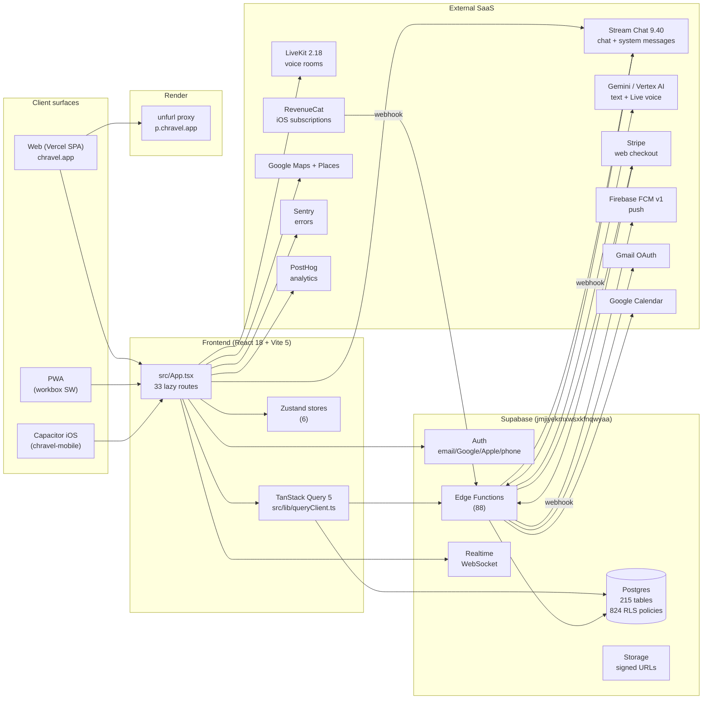

## Topology in plain English

- **Frontend** is a pure SPA. Vercel serves static bundles + injects build/SHA markers (`vite.config.ts:37-46`).
- **All app logic** lives in React; there is no traditional Node server.
- **Supabase** is the sole owned backend. Postgres + Auth + Edge Functions (Deno) + Storage + Realtime.
- **Edge functions** carry server-side logic the client cannot do safely: AI calls, payment webhooks, OAuth flows, push fanout, embeddings, image proxying.
- **Stream Chat** is the chat transport for consumer trips and pro channels. Supabase Realtime is used for non-chat updates (presence, notifications, polls, calendar events).
- **LiveKit** powers voice concierge rooms; an external voice agent (`deploy-agent.yml`) lives outside this repo.
- **Gemini / Vertex** handles concierge text + voice. Two paths: direct via `GEMINI_API_KEY` or fallback through Lovable gateway (`.env.example` AI provider routing).
- **Stripe** (web checkout) and **RevenueCat** (iOS) are billing peers; entitlements are reconciled into `src/store/entitlementsStore.ts`.
- **Render** hosts a 156-line unfurl proxy used by branded OG link previews (`p.chravel.app`); not on the critical path.

## The single Supabase client

There is exactly one frontend Supabase client init — `src/integrations/supabase/client.ts:35-52`. All hooks/services import `supabase` from this singleton. Any other `createClient(...)` call in `src/` is a finding (see `RISKS.md`).

Key options set there:
- `persistSession: true`, `autoRefreshToken: true` (`src/integrations/supabase/client.ts:41-42`)
- `storageKey: 'chravel-auth-session'` (`src/integrations/supabase/client.ts:43`)
- `detectSessionInUrl: true` — required for OAuth callback to hydrate session (`src/integrations/supabase/client.ts:44`)
- Realtime `eventsPerSecond: 40` (`src/integrations/supabase/client.ts:47-49`)
- Safe-storage fallback for sandboxed environments (`src/integrations/supabase/client.ts:8-26`)

## Edge function shared contract

Every edge function on the authenticated path follows the same shape:
1. Validate origin via `_shared/cors.ts:5-30` (no wildcards).
2. Validate Authorization via `_shared/requireAuth.ts:1-30`.
3. Validate required secrets via `_shared/validateSecrets.ts` (called at function startup per `CLAUDE.md` rule #11).
4. Do work. Return JSON with the same CORS headers.

Public functions (`verify_jwt = false` in `supabase/config.toml`): `demo-concierge`, `stripe-webhook`, `revenuecat-webhook` (via Stream-related and webhook paths), `gemini-voice-session`, `livekit-token`, `image-proxy`, `concierge-tts`, `generate-trip-preview`, `generate-invite-preview`, `get-invite-preview`, `get-trip-preview`, `event-reminders`, `dispatch-notification-deliveries`, `gemini-voice-proxy`, `batch-generate-embeddings`, `regenerate-all-embeddings`, `stream-webhook`.

## Performance bedrock

- 33 routes are all `lazy()` with `retryImport` (`src/App.tsx:39-99`) — chunk-load failures auto-recover (`src/App.tsx:243-298`).
- Manual chunks reduce vendor reloads (`vite.config.ts:52-67`).
- TanStack Query 5 caches all server reads with per-domain stale/gc times (`src/lib/queryKeys.ts:71-158`).
- IndexedDB-backed offline queue exists at `src/offline/` and `src/services/offlineSyncService.ts`.
- Service worker built post-build via `scripts/build-sw.cjs` (`package.json:11`).

## Mobile / PWA / Capacitor considerations

- The web build is the iOS/Android build (Capacitor wraps the same SPA in `chravel-mobile`).
- OAuth in installed shells (`isInstalledApp()`) opens the system browser via `@capacitor/browser` rather than the WebView; Google rejects embedded WebView OAuth (`useAuth.tsx:899-941`).
- Service worker updates check on visibility change (`src/App.tsx:226-240`).
- Storage shim falls back to no-op when `localStorage` is unavailable (`src/integrations/supabase/client.ts:8-26`) — relevant in sandboxed previews.

## Known risks

- **Concierge tool sync** — 5-file fan-out per tool (memory #26). See `subsystems/ai-concierge.md` and `RISKS.md`.
- **Stream message custom-field forwarding** — adapter-layer specific (memory #28). See `subsystems/chat-broadcasts.md`.
- **Stale demo data on real sign-in** — guarded in `useAuth.tsx:712-718` and `:645-651`. Any new demo-mode entry point must replicate this.
- **Voice room prereqs** — LiveKit agent + room metadata (memory #14). See `integrations/gemini-lovable-api.md`.

## Source Refs

- `src/App.tsx:300-615` — composition root
- `src/integrations/supabase/client.ts:1-61`
- `vite.config.ts:1-102`
- `supabase/config.toml:1-147`
- `supabase/functions/_shared/requireAuth.ts:1-30`
- `supabase/functions/_shared/cors.ts:1-30`
- `src/lib/queryKeys.ts:1-173`
- Diagram source: [`../diagrams/system-architecture.mmd`](../diagrams/system-architecture.mmd)

<!-- END: architecture/01-system-architecture.md -->


<!-- BEGIN: architecture/02-routing.md -->

# Routing

Single router in `src/App.tsx:322-608`. `BrowserRouter` (`src/App.tsx:111`). Every route is wrapped in `<LazyRoute>` (`src/components/LazyRoute.tsx`) and lazy-imported via `retryImport` (`src/lib/retryImport.ts`).

## Route table

| Path | Component | Page file | Guard | Public/auth | Line |
|---|---|---|---|---|---|
| `/` | `Index` | `src/pages/Index.tsx` | - | Public | `src/App.tsx:328-335` |
| `/api/gmail/oauth/callback` | `GmailCallbackPage` | `src/pages/GmailCallbackPage.tsx` | - | Public (callback) | `src/App.tsx:336-343` |
| `/trip/:tripId` | `TripDetail` | `src/pages/TripDetail.tsx` | in-component | Public route, auth-gated data | `src/App.tsx:344-351` |
| `/trip/:tripId/preview` | `TripPreview` | `src/pages/TripPreview.tsx` | - | Public | `src/App.tsx:352-359` |
| `/t/:tripId` | `TripPreview` | `src/pages/TripPreview.tsx` | - | Public | `src/App.tsx:360-367` |
| `/demo/trip/:demoTripId` | `DemoTripGate` | `src/pages/DemoTripGate.tsx` | - | Demo | `src/App.tsx:368-375` |
| `/demo` | `DemoEntry` | `src/pages/DemoEntry.tsx` | - | Demo | `src/App.tsx:376-383` |
| `/auth` | `AuthPage` | `src/pages/AuthPage.tsx` | - | Public | `src/App.tsx:384-391` |
| `/auth-callback` | `AuthPage` | `src/pages/AuthPage.tsx` | - | Public (callback) | `src/App.tsx:392-399` |
| `/reset-password` | `ResetPasswordPage` | `src/pages/ResetPasswordPage.tsx` | - | Public | `src/App.tsx:400-407` |
| `/join/:token` | `JoinTrip` | `src/pages/JoinTrip.tsx` | - | Public (token-gated) | `src/App.tsx:408-415` |
| `/j/:token` | `InviteSlugRedirect` | `src/pages/InviteSlugRedirect.tsx` | - | Public (redirect) | `src/App.tsx:416-423` |
| `/tour/pro/:proTripId` | `ProTripDetail` | `src/pages/ProTripDetail.tsx` | in-component | Auth-gated data | `src/App.tsx:424-431` |
| `/tour/pro-:proTripId` | `LegacyProTripRedirect` | inline component | - | Redirect | `src/App.tsx:432-439` |
| `/event/:eventId` | `EventDetail` | `src/pages/EventDetail.tsx` | - | Public (event surface) | `src/App.tsx:440-447` |
| `/teams` | `ForTeams` | `src/pages/ForTeams.tsx` | - | Marketing | `src/App.tsx:448-455` |
| `/recs` | `ChravelRecsPage` | `src/pages/ChravelRecsPage.tsx` | - | Marketing | `src/App.tsx:456-463` |
| `/advertiser` | `AdvertiserDashboard` | `src/pages/AdvertiserDashboard.tsx` | - | Advertiser-tier | `src/App.tsx:464-471` |
| `/healthz` | `Healthz` | `src/pages/Healthz.tsx` | - | Public (probe) | `src/App.tsx:472-479` |
| `/privacy` | `PrivacyPolicy` | `src/pages/PrivacyPolicy.tsx` | - | Public | `src/App.tsx:480-487` |
| `/support` | `SupportPage` | `src/pages/SupportPage.tsx` | - | Public | `src/App.tsx:488-495` |
| `/terms` | `TermsOfService` | `src/pages/TermsOfService.tsx` | - | Public | `src/App.tsx:496-503` |
| `/sms-terms` | `SmsTerms` | `src/pages/SmsTerms.tsx` | - | Public | `src/App.tsx:504-511` |
| `/delete-account` | `DeleteAccountPage` | `src/pages/DeleteAccountPage.tsx` | - | Public | `src/App.tsx:512-519` |
| `/profile` | `ProfilePage` | `src/pages/ProfilePage.tsx` | `<ProtectedRoute>` | Auth | `src/App.tsx:520-529` |
| `/settings` | `SettingsPage` | `src/pages/SettingsPage.tsx` | `<ProtectedRoute>` | Auth | `src/App.tsx:530-539` |
| `/archive` | `ArchivePage` | `src/pages/ArchivePage.tsx` | `<ProtectedRoute>` | Auth | `src/App.tsx:540-549` |
| `/admin/scheduled-messages` | `AdminDashboard` | `src/pages/AdminDashboard.tsx` | `<InternalAdminRoute>` | Admin | `src/App.tsx:550-559` |
| `/organizations` | `OrganizationsHub` | `src/pages/OrganizationsHub.tsx` | `<ProtectedRoute>` | Auth | `src/App.tsx:560-569` |
| `/organization/:orgId` | `OrganizationDashboard` | `src/pages/OrganizationDashboard.tsx` | `<ProtectedRoute>` | Auth | `src/App.tsx:570-579` |
| `/accept-invite/:token` | `AcceptOrganizationInvite` | `src/pages/AcceptOrganizationInvite.tsx` | - | Public (token-gated) | `src/App.tsx:580-587` |
| `/dev/device-matrix` | `DeviceTestMatrix` | `src/pages/DeviceTestMatrix.tsx` | `import.meta.env.DEV` | Dev only | `src/App.tsx:588-597` |
| `*` | `NotFound` | `src/pages/NotFound.tsx` | - | Catch-all | `src/App.tsx:598-605` |

Total: **33 routes + 1 catch-all + 1 dev-only**.

## Route guards

| Guard | File | What it does |
|---|---|---|
| `<ProtectedRoute>` | `src/components/ProtectedRoute.tsx` | Requires `useAuth().user`; redirects to `/auth?returnTo=...` otherwise |
| `<InternalAdminRoute>` | `src/components/InternalAdminRoute.tsx` | Email allow-list against `VITE_SUPER_ADMIN_EMAILS` / `SUPER_ADMIN_EMAILS` constant |
| `<LazyRoute>` | `src/components/LazyRoute.tsx` | Suspense boundary + error handling for lazy chunks |

## Public route surface (OfflineIndicator skip-list)

`OfflineIndicatorGate` in `src/App.tsx:140-164` enumerates public-route prefixes that should NOT show the offline indicator (they don't require auth):

```
/, /auth, /reset-password, /join, /j/, /accept-invite,
/teams, /recs, /advertiser, /privacy, /support, /terms,
/sms-terms, /delete-account, /demo, /healthz
```

This list is the de-facto "public surface" inventory.

## Mobile route variants

Pages with explicit mobile variants:
- `MobileTripDetail.tsx` vs `TripDetail.tsx` (`src/pages/`)
- `MobileProTripDetail.tsx` vs `ProTripDetail.tsx`
- `MobileEventDetail.tsx` vs `EventDetail.tsx`
- `TripDetailDesktop.tsx`, `ProTripDetailDesktop.tsx` (desktop refinements)

Switching between mobile and desktop is component-internal, not route-based; the `MobileAppLayout` wrapper (`src/App.tsx:326`) gates layout.

## Page-view telemetry

Every route change fires `pageView(pathname)` via `src/telemetry/events.ts`. The tracker lives in `PageViewTracker` (`src/App.tsx:120-138`) and runs both on initial mount and on every `pathname` change.

## Demo entry points

Two surfaces:
- `/demo` (`DemoEntry`) - landing
- `/demo/trip/:demoTripId` (`DemoTripGate`) - preconfigured demo trip

Demo mode state lives in `useDemoModeStore`. The `ExitDemoButtonWithNav` floating control is rendered globally (`src/App.tsx:114-117, 324`).

## Mobile / PWA / Capacitor considerations

- All routes are accessible in the PWA shell - no route is web-only.
- Auth callbacks in installed shells return to `chravel.app/auth-callback` (a Universal Link) rather than the localhost dev origin (`useAuth.tsx:907-908`).
- `/auth-callback` deliberately mounts the same `AuthPage` component so the OAuth `detectSessionInUrl` exchange completes inside the SPA.

## Known risks

- Trip detail routes are publicly routable but auth-gate inside the component. This is intentional (allows preview surfaces) but is the recurring regression vector tracked in `agent_memory.jsonl` entry #3 and `DEBUG_PATTERNS.md`.
- `<ProtectedRoute>` evaluates `useAuth().user`; if auth is still hydrating, a brief redirect flash can occur. Apply the pattern from memory entry #5 - gate data fetches on `!isLoading && user`.

## Source Refs

- `src/App.tsx:39-99` - lazy imports
- `src/App.tsx:104-108` - legacy redirect inline component
- `src/App.tsx:140-164` - public route prefix list
- `src/App.tsx:322-608` - full Routes block
- `src/components/ProtectedRoute.tsx`, `src/components/InternalAdminRoute.tsx`, `src/components/LazyRoute.tsx`
- `src/lib/retryImport.ts`

<!-- END: architecture/02-routing.md -->


<!-- BEGIN: architecture/03-state-management.md -->

# State Management

Three layers:

1. **Server state** — TanStack Query 5 (`@tanstack/react-query` 5.56.2). Single `QueryClient` in `src/lib/queryClient.ts`. Query keys enumerated in `src/lib/queryKeys.ts`.
2. **Cross-cutting client state** — Zustand 5.0.6, 6 stores total. Lives in `src/store/` and `src/stores/`.
3. **Local component state** — `useState`/`useReducer`. Not enumerated here.

## TanStack Query

### Provider

`<QueryClientProvider>` wraps the entire app: `src/App.tsx:313`. The client comes from `src/lib/queryClient.ts`.

### Query key factory

`src/lib/queryKeys.ts:12-63` exports the `tripKeys` factory. **Every read should derive keys from this factory** — inline keys are a P2 finding.

| Key | Builder | Notes |
|---|---|---|
| `['trips']` | `tripKeys.all` | Base |
| `['trips', 'list']` | `tripKeys.lists()` | Dashboard |
| `['trip', tripId]` | `tripKeys.detail(tripId)` | Trip detail |
| `['trip-members', tripId]` | `tripKeys.members(tripId)` | Roster |
| `['tripChat', tripId]` | `tripKeys.chat(tripId)` | Chat aux data |
| `['tripChatMessages', tripId, limit?]` | `tripKeys.chatMessages(...)` | Chat messages |
| `['calendarEvents', tripId]` | `tripKeys.calendar(tripId)` | Calendar |
| `['tripTasks', tripId, isDemoMode?]` | `tripKeys.tasks(...)` | Tasks (demo-aware) |
| `['tripPolls', tripId, isDemoMode?]` | `tripKeys.polls(...)` | Polls (demo-aware) |
| `['tripMedia', tripId, isDemoMode?]` | `tripKeys.media(...)` | Media (demo-aware) |
| `['tripPlaces', tripId, isDemoMode?]` | `tripKeys.places(...)` | Places (demo-aware) |
| `['tripLinks', tripId, isDemoMode?]` | `tripKeys.tripLinks(...)` | Links (demo-aware) |
| `['tripPayments', tripId]` | `tripKeys.payments(tripId)` | Payments |
| `['tripPaymentBalances', tripId, userId]` | `tripKeys.paymentBalances(...)` | Balance summary |
| `['tripBroadcasts', tripId]` | `tripKeys.broadcasts(tripId)` | Broadcasts |
| `['tripRoster', tripId]` | `tripKeys.roster(tripId)` | Pro roster |
| `['tripChannels', tripId]` | `tripKeys.channels(tripId)` | Pro channels |
| `['tripAdmins', tripId]` | `tripKeys.tripAdmins(tripId)` | Trip admins |
| `['tripRoles', tripId]` | `tripKeys.tripRoles(tripId)` | Trip roles |
| `['eventAgenda', tripId]` | `tripKeys.agenda(tripId)` | Event agenda |
| `['eventLineup', tripId]` | `tripKeys.lineup(tripId)` | Event lineup |
| `['eventRsvps', tripId]` | `tripKeys.rsvps(tripId)` | Event RSVPs |

### Cache config (`QUERY_CACHE_CONFIG`)

`src/lib/queryKeys.ts:71-158`. Per-domain stale/gc/refetch policy:

| Domain | `staleTime` | `gcTime` | `refetchOnWindowFocus` |
|---|---|---|---|
| `trip` | 60s | 5m | true |
| `members` | 30s | 5m | false |
| `chat` | 10s | 3m | false (realtime owns it) |
| `calendar` | 60s | 10m | true |
| `tasks` | 30s | 5m | true |
| `polls` | 60s | 5m | true |
| `media` | 120s | 10m | false |
| `payments` | 30s | 5m | true |
| `paymentBalances` | 30s | 5m | true |
| `places` | 120s | 10m | false |
| `channels` | 30s | 5m | false |
| `tripAdmins` | 60s | 5m | false |
| `tripRoles` | 60s | 5m | false |

### Prefetch priorities

`src/lib/queryKeys.ts:164-173`:
```
members(1) > chat(2) > calendar(3) > tasks(4) > polls(5) > media(6) > payments(7) > places(8)
```
Lower number = higher priority. Used by trip-detail prefetch logic.

### Useful patterns in this codebase

- `queryClient.clear()` is called on sign-out (`useAuth.tsx:1111, 785`) to prevent cross-user contamination.
- `queryClient.prefetchQuery(...)` warms the user-trip cache during auth (`useAuth.tsx:452-461`).
- Cache invalidation on mutations: see hook files in `src/hooks/` (e.g. `useDeleteTrip.ts`).

## Zustand stores (6)

All stores live in `src/store/` or `src/stores/`. They are persisted to `localStorage` when state survives reloads (demo, onboarding, notifications); session-only otherwise (concierge, demo members).

| Store | File | Hook | Persisted? | Purpose |
|---|---|---|---|---|
| Demo mode | `src/store/demoModeStore.ts` | `useDemoModeStore` | Yes (`TRIPS_DEMO_VIEW`) | `demoView: 'off' \| 'marketing' \| 'app-preview'`. Computed: `isDemoMode = demoView === 'app-preview'`. |
| Demo trip members | `src/stores/demoTripMembersStore.ts` | `useDemoTripMembersStore` | Session | Per-trip mock members added during preview. |
| Onboarding | `src/stores/onboardingStore.ts` | `useOnboardingStore` | Yes (`chravel_onboarding_completed`) | First-run screens, pending destination capture. |
| Notifications realtime | `src/store/notificationRealtimeStore.ts` | `useNotificationRealtimeStore` | Yes (resets on sign-out) | In-app notification list + unread count. |
| Entitlements | `src/store/entitlementsStore.ts` | `useEntitlementsStore` | Session | Single source of subscription truth (RC + Stripe + demo + super-admin). |
| Concierge session | `src/store/conciergeSessionStore.ts` | `useConciergeSessionStore` | Session | AI concierge messages, voice state, error/success markers, per-trip session map. |

### Single-writer discipline (`CLAUDE.md`)

Each store should have exactly one canonical writer surface. Cross-checks that flagged risks:
- `useAuth.tsx` writes to `useDemoModeStore.setDemoView('off')` on sign-in (`useAuth.tsx:649-651, 714-717, 1102-1104`) and on sign-out (`signOut`). Acceptable because it's a derived "clear-on-auth-event" — but any other writer outside `DemoEntry.tsx`/`AuthPage.tsx`/`DemoTripGate.tsx` is suspect.
- `useNotificationRealtimeStore.clearAll()` runs on every sign-out (`useAuth.tsx:788, 1120, 1135-1137`).

See `RISKS.md` for any detected >1-writer violations.

### Demo state of truth

`useDemoModeStore` is **the** source of demo state. Any local boolean `isDemo` derived elsewhere is a code-smell candidate.

The store recognizes a legacy `TRIPS_DEMO_MODE` localStorage key for backwards compat (see `src/store/demoModeStore.ts`). Reading raw `localStorage.getItem('TRIPS_DEMO_VIEW')` is not the pattern — go through the store.

## Contexts (non-Zustand)

| Context | File | Purpose |
|---|---|---|
| `AuthContext` | `src/hooks/useAuth.tsx:134, 1376-1382` | Auth user + session + auth methods |
| `ConsumerSubscriptionProvider` | `src/hooks/useConsumerSubscription.tsx` | Wraps subscription state for consumer trips |
| `TooltipProvider` | `@radix-ui/react-tooltip` via `src/components/ui/tooltip.tsx` | Radix tooltip context |

Provider order in `App.tsx:313-617`: `QueryClientProvider` → `AuthProvider` → `ConsumerSubscriptionProvider` → `AppInitializer` → `TooltipProvider` → toasters + `Router`.

## Local persistence (beyond Zustand)

- `localStorage` direct reads/writes — auth breaking-version flag (`src/App.tsx:198-223`), onboarding cache, Supabase session key (`chravel-auth-session`).
- `idb` (`package.json:113`) backs the offline message queue (`src/offline/`, `src/services/offlineMessageQueue.ts`).
- `fake-indexeddb` for tests (`package.json:107`).

## Mobile / PWA / Capacitor considerations

- All stores persist via `localStorage` — Capacitor's `Preferences` is **not** used in this repo; the native shell relies on web `localStorage`.
- IndexedDB-backed offline queue is functional in PWA + Capacitor shells.
- On visibility-change, auth refreshes session (`useAuth.tsx:808-845`); stores do not need to react to visibility separately.

## Known risks

- **Inline query keys.** Hooks that build `['trip-foo', tripId]` inline rather than through `tripKeys` are P2 drift candidates. Sweep planned in `RISKS.md`.
- **Per-domain `isDemoMode` parameter.** Several keys accept `isDemoMode?` (tasks/polls/media/places/tripLinks). When the boolean is omitted, the key is missing the demo-distinguishing segment — a subtle cache-collision risk between demo and real data. Verify every caller passes it.
- **`queryClient.clear()` on sign-out.** Catches anything not keyed under user — but trip data is keyed by `tripId` not `userId`. If two users share a device, the sign-out clear is what prevents leakage. Removing it would be a P0 regression.

## Source Refs

- `src/lib/queryKeys.ts:1-173`
- `src/lib/queryClient.ts`
- `src/App.tsx:313, 322` (provider order, Router placement)
- `src/store/demoModeStore.ts`
- `src/store/entitlementsStore.ts`
- `src/store/notificationRealtimeStore.ts`
- `src/store/conciergeSessionStore.ts`
- `src/stores/onboardingStore.ts`
- `src/stores/demoTripMembersStore.ts`
- `src/hooks/useAuth.tsx:1111, 785, 788, 1120` (cross-store cleanup on auth events)

<!-- END: architecture/03-state-management.md -->


<!-- BEGIN: architecture/04-data-model-er.md -->

# Data Model / ER

**215 unique tables** across **358 migrations** (counted at SHA `1e833665`). **824 RLS policies** defined.

Because rendering 215 tables in one Mermaid diagram is unreadable, this section groups them into 8 domain clusters. Each cluster has its own ER fragment.

> **Authoritative source:** `supabase/migrations/*.sql` (append-only). For an ML-friendly schema dump, see `docs/ACTIVE/SCHEMA_AUDIT.md`. The TypeScript shape lives in `src/integrations/supabase/types.ts` (auto-generated via `mcp__supabase__generate_typescript_types` or `supabase gen types`).

## Cluster overview

| # | Cluster | Tables (count) | Anchor table |
|---|---|---|---|
| 1 | Trip core | ~22 | `trips` |
| 2 | Chat & broadcasts | ~18 | `trip_chat_messages`, `broadcasts` |
| 3 | Calendar & events | ~14 | `trip_events`, `synced_calendar_events` |
| 4 | Payments & billing | ~16 | `payment_requests`, `payment_splits` |
| 5 | Media & files | ~10 | `trip_photos`, `trip_files` |
| 6 | Notifications & comms | ~18 | `notification_deliveries`, `push_notifications` |
| 7 | AI / concierge / search | ~12 | `ai_queries`, `kb_documents`, `kb_chunks`, `trip_embeddings` |
| 8 | Orgs, roles, identity | ~24 | `organizations`, `user_roles`, `profiles` |

Remaining tables (~81): event-specific extensions (lineup, schedule, RSVPs, QA), recommendations, integrations (gmail, calendar connections, smart imports), admin/audit, rate limits, secure storage, demo / mock tables. See `RISKS.md` for mock-table-in-prod-schema findings.

## Cluster 1 — Trip core

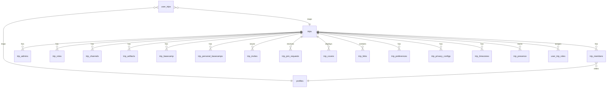

Notable specialty tables: `trip_member_preferences` (per-member trip settings), `pro_trip_organizations` (links pro trips to orgs), `trip_link_index`, `trip_media_index` (search indices).

## Cluster 2 — Chat & broadcasts

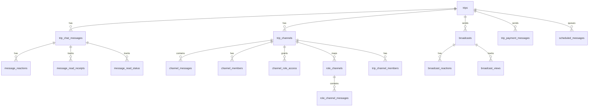

Sister tables in demo: `mock_messages`, `mock_broadcasts`. See `agent_memory.jsonl` #27 — mock-ID tier gate caution.

## Cluster 3 — Calendar & events

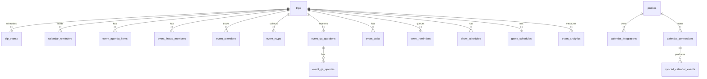

`synced_calendar_events` dedupes by external event ID (memory #15).

## Cluster 4 — Payments & billing

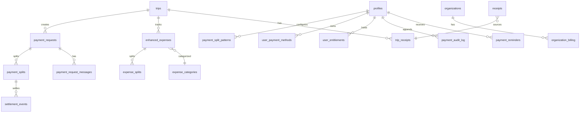

`payment_splits` is the state machine (memory #16). Stripe + RevenueCat reconcile into `user_entitlements`.

## Cluster 5 — Media & files

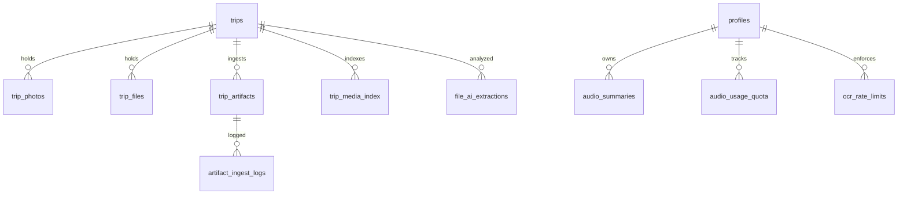

Media flows: see `subsystems/media.md`. AI tagging populates `trip_media_index`.

## Cluster 6 — Notifications & comms

```mermaid
erDiagram
    profiles ||--o{ notification_deliveries : receives
    profiles ||--o{ notification_history : owns
    profiles ||--o{ notification_preferences : configures
    profiles ||--o{ notification_logs : appends
    profiles ||--o{ notification_badges : has
    profiles ||--o{ notification_queue : queues
    profiles ||--o{ push_device_tokens : owns
    profiles ||--o{ push_tokens : owns
    profiles ||--o{ push_notifications : receives
    profiles ||--o{ web_push_subscriptions : holds
    profiles ||--o{ email_bounces : tracks
    profiles ||--o{ sms_opt_in : opts
    trips ||--o{ message_scheduler_logs : appends
    trips ||--o{ daily_digests : produces
    profiles ||--o{ system_notifications : reads
    profiles ||--o{ message_templates : owns
```

Dual-path dedup pattern (memory #10) prevents duplicate delivery across email + push.

## Cluster 7 — AI / concierge / search

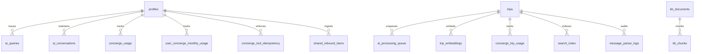

`concierge_tool_idempotency` prevents duplicate writes (memory #25). `trip_embeddings` is RAG corpus.

## Cluster 8 — Orgs, roles, identity

```mermaid
erDiagram
    organizations ||--o{ organization_members : has
    organizations ||--o{ organization_invites : sends
    organizations ||--o{ organization_billing : has
    organizations ||--o{ pro_trip_organizations : owns
    profiles }|--|| private_profiles : extends
    profiles ||--o{ user_roles : has
    profiles ||--o{ user_preferences : owns
    profiles ||--o{ user_trip_roles : holds
    profiles ||--o{ user_pro_trip_quota : tracks
    profiles ||--o{ user_blocks : maintains
    profiles ||--o{ user_loyalty_programs : enrolls
    profiles ||--o{ user_schedules : owns
    profiles ||--o{ user_accommodations : owns
    profiles ||--o{ user_entitlements : holds
    role_templates ||--o{ trip_roles : seeds
    trips ||--o{ trip_admins : has
    trips ||--o{ trip_roles : has
```

`user_roles` table holds app-wide roles (`pro`, `enterprise_admin`). Trip-scoped roles in `user_trip_roles` and `trip_roles`. Super-admins are email-list-gated in `src/constants/admins.ts` and edge-side in `_shared/superAdmins.ts`.

## Drift watchlist (top-10 entities)

The recurring P0 bug class is column ↔ TS-interface name drift. Top-10 entities tracked in `RISKS.md` field-drift sweep:

1. `trips` ↔ `Trip` interface
2. `trip_members` ↔ `TripMember` interface
3. `trip_chat_messages` ↔ `Message` interface
4. `broadcasts` ↔ `Broadcast` interface
5. `trip_events` / `synced_calendar_events` ↔ `CalendarEvent` interface
6. `payment_requests` / `payment_splits` ↔ payment types
7. `receipts` / `trip_receipts` ↔ `Receipt` interface
8. `profiles` / `private_profiles` ↔ `Profile` / `User` interface
9. `trip_tasks` ↔ `Task` interface
10. (poll table) ↔ `Poll` interface

See `RISKS.md` for findings.

## Migration conventions (from `CLAUDE.md`)

- Files timestamped `YYYYMMDDHHMMSS_description.sql`.
- All `CREATE TABLE` uses `IF NOT EXISTS`.
- All functions use `CREATE OR REPLACE`.
- All `DROP` uses `IF EXISTS`.
- Destructive changes require two-phase migration with forward-fix documented.
- Validated via `npx tsx scripts/lint-migrations.ts` (per `CLAUDE.md` Supabase rule #6).

## Mobile / PWA / Capacitor considerations

The DB is the same across surfaces. RLS is the only enforcement layer; client-side filters are conveniences. Realtime subscriptions on iOS/PWA are subject to the same `eventsPerSecond: 40` cap (`src/integrations/supabase/client.ts:48`).

## Known risks

- Mock tables (`mock_broadcasts`, `mock_messages`) live in the production schema. Demo paths read them; production writes must never target them. Sweep in `RISKS.md`.
- Tables without explicit RLS enablement — best-effort grep is in inventory; manual audit pending. Top suspects: `app_settings`, `feature_flags` (admin-only by design).
- `trip_payment_messages` is a chat-payments bridge — double-check that messages here are still RLS-gated by trip membership, not just by sender.

## Source Refs

- `supabase/migrations/` — 358 .sql files at SHA `1e833665`
- `supabase/migrations/*_concierge_tool_idempotency_store.sql` — idempotency table
- `src/integrations/supabase/types.ts` — auto-generated TS types
- `docs/ACTIVE/SCHEMA_AUDIT.md` — long-form schema audit
- Diagram source: [`../diagrams/er-diagram.mmd`](../diagrams/er-diagram.mmd)

<!-- END: architecture/04-data-model-er.md -->


<!-- BEGIN: architecture/05-auth-and-rls.md -->

# Auth and RLS

> Cross-link: `docs/ACTIVE/AUTHENTICATION_SETUP.md`, `docs/ACTIVE/AUTHORIZATION_AUDIT.md`.

## Auth provider stack

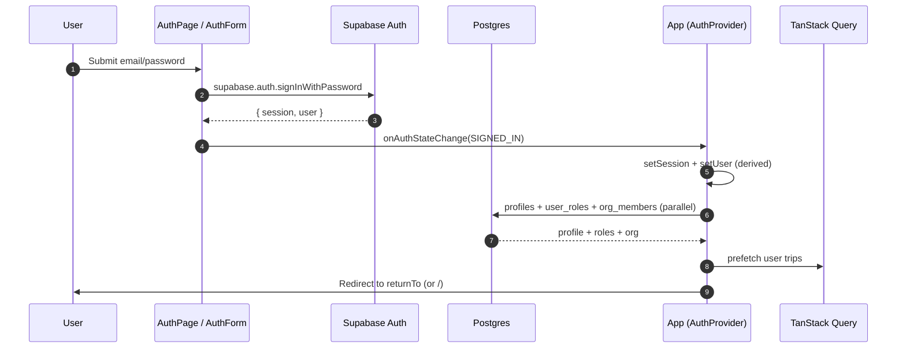

Diagram source: [`../diagrams/auth-sequence.mmd`](../diagrams/auth-sequence.mmd).

## Sign-in surfaces

| Method | Function | File |
|---|---|---|
| Email + password | `signIn(email, password)` | `src/hooks/useAuth.tsx:853-897` |
| Google OAuth | `signInWithGoogle(returnTo?)` | `src/hooks/useAuth.tsx:899-950` |
| Apple OAuth | `signInWithApple(returnTo?)` | `src/hooks/useAuth.tsx:952-990` |
| Phone OTP | `signInWithPhone(phone)` | `src/hooks/useAuth.tsx:992-1030` |
| Email signup | `signUp(email, password, first, last)` | `src/hooks/useAuth.tsx:1032-1098` |
| Password reset | `resetPassword(email)` | `src/hooks/useAuth.tsx:1150-1171` |
| Sign out | `signOut()` | `src/hooks/useAuth.tsx:1100-1148` |

## Session lifecycle

`src/hooks/useAuth.tsx:506-805`. Key invariants:

- **10s safety timeout.** Loading is forcibly cleared after 10 seconds (`:508-512`) to prevent infinite hydration spinners.
- **Two-stage user.** Immediately set `buildSessionDerivedUser(session.user)` (`:561, 571, 601, 626, 665, 755, 778`) for synchronous render, then async `transformUser` enriches with profile/roles/org/notification-prefs (`:759-779`).
- **Token validity check.** `isSessionTokenValid(access_token)` runs on init (`:556, 592`); invalid tokens trigger `forceRefreshSession()` (`:467-503`).
- **Near-expiry proactive refresh.** If `expires_at < now + 5min`, refresh up front (`:615-635`).
- **Visibility-change refresh.** Returning to tab refreshes near-expiry sessions (`:808-845`).
- **Deferred async work.** Async work inside `onAuthStateChange` is deferred via `setTimeout(0)` (`:754-780`) to avoid Supabase auth deadlock.

## Demo-vs-authenticated handling in auth

- Demo `user` is a stable per-session UUID with read-only permissions (`src/hooks/useAuth.tsx:151-183`).
- On `SIGNED_IN`: demo mode is forcibly cleared (`:712-718`).
- On `signOut`: demo mode is forcibly cleared (`:1102-1104`).
- On init with no session: demo user is provided if `shouldUseDemoUserRef.current` (`:680, 608, 790, 850`).

This is the canonical defense for memory #27 (demo data contamination).

## Cross-store cleanup on sign-out (`useAuth.tsx:1100-1148`)

In order:
1. Demo mode cleared (`:1102-1104`)
2. Onboarding localStorage cleared (`:1107-1108`)
3. `queryClient.clear()` (`:1111`)
4. `supabase.removeAllChannels()` (`:1114`)
5. `conciergeCacheService.clearAllCaches()` (`:1117`)
6. `useNotificationRealtimeStore.clearAll()` (`:1120`)
7. `useOnboardingStore.resetOnboarding()` (`:1123-1125`)
8. `supabase.auth.signOut()` (`:1142`)
9. `window.location.href = '/'` (`:1147`)

This is the bulwark against cross-user data contamination on a shared device.

## Role propagation

Per `CLAUDE.md` rule + memory #19: **DB -> RLS -> hook -> UI**, never trust client claims.

| Surface | Source of truth | File |
|---|---|---|
| App-wide roles | `user_roles` table | `src/hooks/useAuth.tsx:300-308` |
| Trip-scoped roles | `user_trip_roles`, `trip_roles` | `src/hooks/useTripRoles.ts` |
| Pro role enum | `User.proRole` derived from org membership + email | `src/hooks/useAuth.tsx:402-410` |
| Super admin | Email allow-list (`SUPER_ADMIN_EMAILS`) | `src/constants/admins.ts`, `supabase/functions/_shared/superAdmins.ts` |
| Org membership | `organization_members` (active only) | `src/hooks/useAuth.tsx:311-323` |

The `switchRole()` method is **dev-only** (`useAuth.tsx:1323-1351`). In production it warns and no-ops - explicitly hardened against client-side privilege escalation.

## RLS posture

**824 policies** across 358 migrations. Top concentrations (by anchor table):

| Cluster | Anchor | Why high |
|---|---|---|
| Trips | `trips`, `trip_members`, `user_trips` | Multi-tier access (consumer/pro/event/org) |
| Chat | `trip_chat_messages`, `channel_messages` | Per-member + per-channel-role gating |
| Payments | `payment_requests`, `payment_splits` | Sensitive: only request creator + included splitters |
| Notifications | `notification_deliveries`, `push_*` | Per-user only |
| Profiles | `profiles`, `private_profiles` | Public-display vs private fields split |

`docs/ACTIVE/AUTHORIZATION_AUDIT.md` is the deeper inventory.

## Edge function auth contract

`supabase/functions/_shared/requireAuth.ts:1-30`:
1. Read `Authorization` header.
2. If absent: return 401 with CORS headers.
3. Use `SUPABASE_SERVICE_ROLE_KEY` (server-side) to validate the user JWT via `getUser`.
4. Return `{ user, error: null, response: null }` on success or `{ user: null, error, response }` on failure.

`supabase/config.toml:1-147` lists every function with `verify_jwt = true/false`. Public functions (webhook + preview + voice + image proxy) skip JWT - they enforce auth differently (signature, capability token, or unauthenticated by design).

## Known security hotspots (cross-link `DEBUG_PATTERNS.md`)

1. Capability token default secret fallback (`DEBUG_PATTERNS.md` #1) - any edge function that signs capability tokens MUST require a non-default `CAPABILITY_TOKEN_SECRET`.
2. CORS wildcard subdomain matching (`DEBUG_PATTERNS.md` #2) - `_shared/cors.ts` uses exact-origin matching only.
3. Client-side super admin bypass (`DEBUG_PATTERNS.md` #3) - `switchRole` is dev-only.
4. CronGuard fail-open (`DEBUG_PATTERNS.md` #4) - cron-only functions MUST require `CRON_SECRET` and fail closed.

## Mobile / PWA / Capacitor considerations

- Installed shells (Capacitor / PWA) open OAuth in the system browser via `@capacitor/browser`, not the WebView (`useAuth.tsx:899-941`). Google rejects embedded WebView OAuth.
- Universal Link return URL: `https://chravel.app/auth-callback` (`useAuth.tsx:907-908, 957-958`).
- Session is persisted in `localStorage` under `chravel-auth-session` (`src/integrations/supabase/client.ts:43`).

## Known risks

- `signInWithOAuth({ provider: 'google', queryParams: { prompt: 'select_account' } })` forces the account picker. Removing this would re-introduce silent dup-account creation (memory: useAuth.tsx:720-750 toast).
- Profile self-heal in `ensureProfileExists` (`useAuth.tsx:201-223`) is best-effort and silently swallows errors. If profile creation persistently fails, downstream code paths may receive `null` profile and degrade gracefully - but track in telemetry.
- The 10s loading timeout is a safety net. If the underlying network is slow, the user lands with `user: null` but `isLoading: false`. UI should not crash in that state.

## Source Refs

- `src/hooks/useAuth.tsx:1-1383`
- `src/integrations/supabase/client.ts:1-61`
- `src/constants/admins.ts`
- `supabase/functions/_shared/requireAuth.ts:1-30`
- `supabase/functions/_shared/cors.ts:1-60`
- `supabase/functions/_shared/superAdmins.ts`
- `supabase/config.toml:1-147`
- `docs/ACTIVE/AUTHENTICATION_SETUP.md`, `docs/ACTIVE/AUTHORIZATION_AUDIT.md`, `docs/ACTIVE/SECURITY_FINDINGS.md`
- Diagram source: [`../diagrams/auth-sequence.mmd`](../diagrams/auth-sequence.mmd)

<!-- END: architecture/05-auth-and-rls.md -->


<!-- BEGIN: architecture/06-edge-functions.md -->

# Edge Functions

**88 edge functions** under `supabase/functions/` at SHA `1e833665`. All Deno-runtime, deployed via the `deploy-functions.yml` GitHub Action when changes land on `main`.

## Shared utilities (`supabase/functions/_shared/`)

| File | Purpose |
|---|---|
| `requireAuth.ts` | JWT validation middleware (used on every authed function) |
| `cors.ts` | CORS origin allow-list (exact match, no wildcards) |
| `validateSecrets.ts` | `requireSecrets()` startup check (per `CLAUDE.md` rule #11) |
| `featureFlags.ts` | Runtime kill switches via `feature_flags` table |
| `cronGuard.ts` | Cron secret validation (fail-closed) |
| `gemini.ts` | Gemini API client (streaming + non-streaming) |
| `vertexAuth.ts` | Vertex AI auth via service account |
| `contextBuilder.ts` | Rich AI context assembly (30 KB) |
| `functionExecutor.ts` | **Concierge tool dispatcher** (143 KB — main brain) |
| `voiceToolDeclarations.ts` | Voice concierge tool specs |
| `multimodalEmbeddings.ts` | Embedding generation |
| `notificationContentBuilder.ts` | Message templating |
| `notificationUtils.ts` | Notification delivery helpers |
| `fcmV1.ts` | Firebase Cloud Messaging v1 wrapper |
| `webPushUtils.ts` | Web push notification helpers |
| `smsTemplates.ts` | SMS templates |
| `circuitBreaker.ts` | Failure recovery |
| `rateLimitGuard.ts` | Rate-limit enforcement |
| `errorHandling.ts` | Unified error responses |
| `securityHeaders.ts` | Response header hardening |
| `security.ts` + `security/` | RLS/token/permission helpers |
| `tokenCrypto.ts`, `gmailTokenCrypto.ts` | Token encrypt/decrypt |
| `tripEntitlementPolicy.ts` | Trip access control logic |
| `conciergeUsage.ts`, `smartImportUsage.ts` | Quota tracking |
| `entitlementSelection.ts`, `entitlementUpsert.ts` | Entitlement updates |
| `superAdmins.ts` | Super-admin allow-list (server-side) |
| `ogUtils.ts`, `urlScraper.ts` | OG metadata helpers |
| `telemetry.ts` | Event tracking |
| `validation.ts` | Schema validation |
| `promptBuilder.ts`, `promptTypes.ts` | Prompt assembly |
| `aiUtils.ts`, `aiQualityTests.ts` | AI model helpers + asserts |
| `authHeaders.ts` | Bearer-token extraction |

## Function inventory (88)

Grouped by domain. Every function's directory exists under `supabase/functions/<name>/`. Lines below identify each function's `verify_jwt` setting per `supabase/config.toml`.

### Auth & identity (5)

| Name | `verify_jwt` | Purpose |
|---|---|---|
| `join-trip` | true | Accept an invite token, create membership |
| `approve-join-request` | true | Trip admin approves pending member |
| `accept-organization-invite` | true | Accept org invite token |
| `invite-organization-member` | true | Send org invite |
| `log-auth-event` | (default) | Auth telemetry sink |

### Trips & members (7)

`create-trip`, `get-trip-detail`, `get-trip-preview` (false), `generate-trip-preview` (false), `restore-trip`, `export-trip`, `link-trip-to-organization`.

### Chat / broadcasts / Stream (11)

| Name | `verify_jwt` | Purpose |
|---|---|---|
| `broadcasts-create` | (default) | Create broadcast row + fan-out |
| `broadcasts-fetch` | (default) | Pull broadcasts for trip |
| `broadcasts-react` | (default) | Reaction toggle |
| `stream-token` | true | Mint Stream Chat user token |
| `stream-webhook` | false | Stream-side events |
| `stream-setup-permissions` | true | Initial Stream role setup |
| `stream-canary-guard` | (default) | Parity / canary checks |
| `stream-ensure-membership` | (default) | Sync Stream channel membership |
| `stream-join-channel` | (default) | Add user to Stream channel |
| `stream-moderation-action` | (default) | Stream moderation API |
| `stream-reconcile-membership` | (default) | Periodic membership sync |
| `create-default-channels` | true | Seed trip channels |

### Calendar & events (5)

`calendar-sync`, `event-reminders` (false; cron), `message-scheduler`, `scrape-schedule`, `scrape-agenda`, `scrape-lineup`.

### AI concierge (10)

| Name | `verify_jwt` | Purpose |
|---|---|---|
| `lovable-concierge` | true | Main concierge text + tool-call dispatcher |
| `demo-concierge` | false | Public demo concierge (separate rate-limited endpoint) |
| `execute-concierge-tool` | (default) | Post-confirmation tool execution |
| `concierge-tts` | false | TTS for concierge readbacks |
| `gemini-tts` | (default) | General Gemini TTS |
| `google-tts` | (default) | Google Cloud TTS fallback |
| `gemini-voice-session` | false | Vertex AI Live session bootstrap |
| `gemini-voice-proxy` | false | Voice proxy bridge |
| `livekit-token` | false | Mint LiveKit room token |
| `place-grounding` | (default) | Ground AI responses with place data |

### AI infra / search / RAG (8)

`ai-answer`, `ai-features`, `ai-ingest`, `ai-search`, `artifact-ingest`, `artifact-search`, `generate-embeddings`, `batch-generate-embeddings` (false), `regenerate-all-embeddings` (false), `populate-search-index`.

### Smart import / parsing (6)

`gmail-auth`, `gmail-import-worker`, `document-processor`, `enhanced-ai-parser`, `file-ai-parser` _(via shared)_, `message-parser`, `process-receipt-ocr`, `receipt-parser`, `confirm-reservation-draft`.

### Media / uploads (3)

`file-upload`, `image-upload`, `image-proxy` (false), `upload-campaign-image`.

### Payments / billing (6)

| Name | `verify_jwt` | Purpose |
|---|---|---|
| `create-checkout` | true | Stripe checkout init |
| `customer-portal` | true | Stripe customer portal link |
| `fetch-invoices` | true | Stripe invoice list |
| `check-subscription` | true | Resolve current entitlement |
| `stripe-webhook` | false | Stripe webhook receiver |
| `revenuecat-webhook` | (default; signature-gated) | RC webhook receiver |
| `sync-revenuecat-entitlement` | true | Push RC state to DB |
| `payment-reminders` | (default; cron) | Schedule reminders |

### Notifications & push (9)

`create-notification`, `dispatch-notification-deliveries` (false; cron), `push-notifications`, `send-push`, `web-push-send`, `send-email-with-retry`, `daily-digest`, `event-reminders` (false), `share-preview`.

### Orgs / admin / ops (8)

`process-account-deletions`, `export-user-data`, `cleanup-staging-tables`, `verify-identity`, `delete-stale-locations`, `health`, `seed-demo-data`, `seed-carlton-social`, `seed-carlton-universe`, `seed-mock-messages`.

### Misc / integrations (5)

`google-maps-proxy`, `fetch-og-metadata`, `update-location`, `venue-enricher`.

## High-leverage deep-dives

### `lovable-concierge`

- **Size:** 2,155 lines (per `CLAUDE.md` tech-debt note).
- **Inputs:** Authenticated user, optional `tripId`, conversation history, user message.
- **Pipeline:** auth → rate-limit → query classification (18 classes) → selective tool loading (38 tools from `_shared/concierge/toolRegistry.ts`) → context build → prompt assembly → Gemini call with function calling → tool execution via capability tokens + `functionExecutor.ts` → usage tracking → response.
- **Tool single-source-of-truth:** `_shared/concierge/toolRegistry.ts` (memory #23).
- **Idempotency:** `concierge_tool_idempotency` table (memory #25).
- **5-file sync warning** (memory #26): registry + executor + confirm-handler + UI renderer + telemetry must all stay aligned. See `subsystems/ai-concierge.md`.

### `stripe-webhook`

- **`verify_jwt = false`** — webhook validation is signature-based (`STRIPE_WEBHOOK_SECRET`).
- Writes to `user_entitlements`, may touch `payment_audit_log`.
- Idempotency via `webhook_events` table (best practice).

### `gemini-voice-session` + `livekit-token`

- Both public (`verify_jwt = false`). Auth is via short-lived capability tokens minted server-side.
- Prereq: LiveKit voice agent deployed (`.github/workflows/deploy-agent.yml`) and room metadata seeded (memory #14).

### `gmail-import-worker`

- Long-running. Imports gmail threads → parses → produces `trip_artifacts` / `smart_import_candidates`.
- Memory #22: must persist partial state — never silently drop parsed items on retry.

## CI deploy contract

`.github/workflows/deploy-functions.yml`:
- Triggers on push to `main` with changes under `supabase/functions/**`.
- Uses Supabase CLI to push each function.
- Secrets validated against `_shared/validateSecrets.ts` at function startup.

## Mobile / PWA / Capacitor considerations

Edge functions are server-side; mobile shells call them the same way as web. The CORS allow-list (`_shared/cors.ts`) includes `http://localhost` and Lovable preview origins — see file for the full list. Native Capacitor builds run via custom scheme — those origins must be added if a function-direct call is needed (most go through `supabase-js`, which doesn't need CORS).

## Known risks

- **`functionExecutor.ts` is 143 KB.** Modifications without careful test coverage are high-risk. Cross-link `RISKS.md`.
- **`lovable-concierge` is 2,155 lines** (`CLAUDE.md` tech-debt). Tool additions silently break if any of the 5 sync points are missed.
- **Cron functions** (`event-reminders`, `dispatch-notification-deliveries`, `payment-reminders`, etc.) — must use `cronGuard.ts` to validate `CRON_SECRET`. Any function with no cron guard is a P0 (memory: DEBUG_PATTERNS #4).

## Source Refs

- `supabase/functions/` — 88 directories
- `supabase/functions/_shared/` — 40 shared utilities
- `supabase/config.toml:1-147` — `verify_jwt` per-function map
- `.github/workflows/deploy-functions.yml` — deploy pipeline
- `CLAUDE.md` — Supabase rule #11 (validateSecrets)
- `agent_memory.jsonl` #22, #23, #25, #26 — concierge tool sync rules

<!-- END: architecture/06-edge-functions.md -->


<!-- BEGIN: architecture/07-realtime-channels.md -->

# Realtime Channels

Two realtime transports coexist:
1. **Supabase Realtime** (Postgres logical replication via WebSocket) — for presence, notifications, polls, calendar, payments, system messages.
2. **Stream Chat** (Stream Chat 9.40, `package.json:134`) — for trip chat, pro channels, broadcasts.

Both are subject to memory #20: **filter by `trip_id`** (or equivalent scope) to prevent receiving ALL global events.

## Subscription inventory (41 files)

Found via `rg "\.channel\(|\.on\('postgres_changes" src -l`:

### Supabase Realtime (`postgres_changes`)

| File | Domain |
|---|---|
| `src/hooks/useUserTripsRealtime.ts` | Dashboard user-trip list |
| `src/hooks/useNotificationRealtime.ts` | In-app notifications |
| `src/hooks/useDashboardJoinRequests.ts` | Pending join requests |
| `src/hooks/useTripTasks.ts` | Tasks |
| `src/hooks/useTripPolls.ts` | Polls |
| `src/hooks/useTripMembersQuery.ts` | Members |
| `src/hooks/useTripAdmins.ts` | Trip admins |
| `src/hooks/useTripRoles.ts` | Trip roles |
| `src/hooks/useEventAgenda.ts` | Event agenda |
| `src/hooks/useEventLineup.ts` | Event lineup |
| `src/hooks/useEventTabSettings.ts` | Event tab settings |
| `src/hooks/useRoleAssignments.ts` | Role assignments |
| `src/hooks/useTripBasecamp.ts` | Basecamp |
| `src/hooks/useJoinRequests.ts` | Join requests (admin) |
| `src/hooks/useBalanceSummary.ts` | Payment balances |
| `src/hooks/usePayments.ts` | Payments |
| `src/hooks/useMediaManagement.ts` | Media |
| `src/features/calendar/hooks/useCalendarRealtime.ts` | Calendar |
| `src/components/mobile/MobileTripPayments.tsx` | Payments mobile UI |
| `src/components/PlacesSection.tsx` | Places |
| `src/components/UnifiedMediaHub.tsx` | Unified media |
| `src/components/media/MediaUrlsPanel.tsx` | Media URLs |
| `src/components/trip/EventLogDrawer.tsx` | Event log |

### Stream Chat (`.channel(...)`)

| File | Domain |
|---|---|
| `src/services/stream/streamMembershipSync.ts` | Membership sync |
| `src/services/stream/streamMessageSearch.ts` | Message search |
| `src/services/stream/streamChannelFactory.ts` | Channel factory |
| `src/hooks/stream/useStreamBroadcasts.ts` | Broadcasts |
| `src/hooks/stream/useStreamProChannel.ts` | Pro channels |
| `src/hooks/stream/useStreamTripChat.ts` | Trip chat |
| `src/services/systemMessageService.ts` | System messages (silent + skip_push) |
| `src/services/chatService.ts` | Chat service |
| `src/services/chatSearchService.ts` | Chat search |
| `src/services/channelService.ts` | Channel service |
| `src/services/roleChannelService.ts` | Role channels |
| `src/services/broadcastService.ts` | Broadcasts (DB write path) |
| `src/services/chatBroadcastService.ts` | Chat broadcast bridge |
| `src/services/readReceiptService.ts` | Read receipts |
| `src/services/typingIndicatorService.ts` | Typing indicators |
| `src/features/chat/components/ThreadView.tsx` | Threaded replies |

## Cleanup discipline

Per `CLAUDE.md` Supabase rule #5: every realtime channel must be cleaned up in a `useEffect` return.

`supabase.removeAllChannels()` is called on sign-out (`useAuth.tsx:786, 1114`) as the last-resort sweep. **Hooks must not rely on it** — they must cleanup individually.

## Realtime fan-out diagram

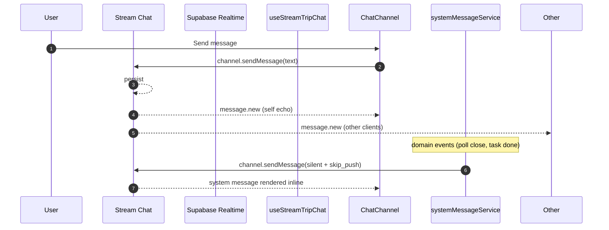

Diagram source: [`../diagrams/chat-realtime-sequence.mmd`](../diagrams/chat-realtime-sequence.mmd).

## Stream system messages (memory #29)

System messages route through `Stream channel.sendMessage` with `silent: true` and `skip_push: true`. This is how domain actions (poll close, task complete) emit inline activity updates without producing duplicate push notifications.

Custom fields on Stream messages must be forwarded through BOTH adapter paths (memory #28) — Stream native and Chravel-adapter. See `subsystems/chat-broadcasts.md`.

## Backfill on reconnect (memory #13)

Per memory #13 (RECOVERY): chat WebSocket disconnects (e.g., backgrounding mobile) drop messages. On reconnect, the chat hook must run a backfill query against the DB or the Stream channel state to catch up. This is implemented in `useStreamTripChat` and the offline message queue in `src/offline/`.

## Configuration

- Supabase Realtime: `eventsPerSecond: 40` per client (`src/integrations/supabase/client.ts:48`).
- Stream Chat config parity check: `npm run ops:check-stream-parity` (`scripts/check-stream-config-parity.cjs`).
- Stream API key: `VITE_STREAM_API_KEY`.
- Stream token minted server-side via `supabase/functions/stream-token/`.

## Mobile / PWA / Capacitor considerations

- Background/foreground transitions on iOS suspend the WebSocket. The visibility-change listener in `App.tsx:226-240` refreshes the SW; chat hooks must backfill on reconnect (memory #13).
- Stream Chat handles its own reconnect; consumers should expose a loading state during the gap.

## Known risks

- **Unfiltered subscriptions are P1.** Any `.on('postgres_changes', { event: '*' }, ...)` without a `filter: 'trip_id=eq.<id>'` receives every row change globally. Sweep planned in `RISKS.md`.
- **Read-receipt write amplification** (`DEBUG_PATTERNS.md`): N×M upserts per visible message. Throttle/debounce in `readReceiptService.ts`.
- **Reaction refetch storm** (`DEBUG_PATTERNS.md`): every new message previously triggered a full reactions refetch — addressed but watch on regressions.

## Source Refs

- 41 files enumerated via `rg "\\.channel\\(|\\.on\\('postgres_changes" src -l`
- `src/integrations/supabase/client.ts:46-50` — realtime rate cap
- `src/hooks/useAuth.tsx:786, 1114` — sign-out sweep
- `agent_memory.jsonl` #13, #20, #28, #29 — relevant memory
- Diagram source: [`../diagrams/chat-realtime-sequence.mmd`](../diagrams/chat-realtime-sequence.mmd)

<!-- END: architecture/07-realtime-channels.md -->


<!-- BEGIN: architecture/08-deployment-topology.md -->

# Deployment Topology

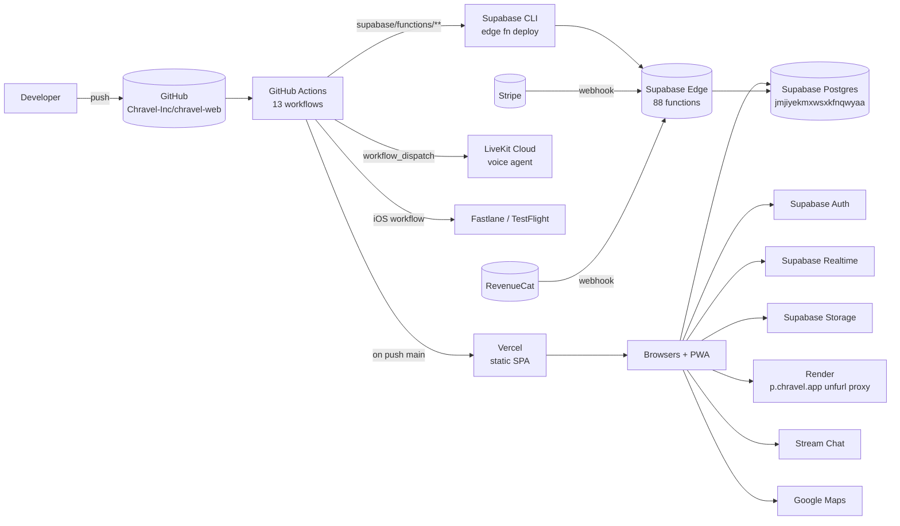

Diagram source: [`../diagrams/deployment-topology.mmd`](../diagrams/deployment-topology.mmd).

## Hosting

| Surface | Host | Config |
|---|---|---|
| Frontend SPA | **Vercel** | `vercel.json` |
| Edge functions | **Supabase Edge** (Deno) | `supabase/config.toml` |
| Postgres + Auth + Realtime + Storage | **Supabase** project `jmjiyekmxwsxkfnqwyaa` | — |
| OG unfurl proxy | **Render** | `render.yaml` |
| iOS native shell | TestFlight → App Store | (sister repo `chravel-mobile`) |
| Voice agent | **LiveKit Cloud** | `.github/workflows/deploy-agent.yml` |
| Vercel edge functions for OG | **Vercel Edge** | `api/` directory |

## Vercel config (`vercel.json`)

- `buildCommand: "vite build"`
- `installCommand: "npm ci"`
- `framework: "vite"`
- `outputDirectory: "dist"`
- Cache-Control headers force `no-store, no-cache, must-revalidate` on `/`, `/index.html`, `/sw.js` to prevent stale SPA loads.

## CI workflows (13 in `.github/workflows/`)

| Workflow | Trigger | Purpose |
|---|---|---|
| `ci.yml` | push to main/develop, PRs | Full validation: lint, typecheck, tests, build, migration lint, env coverage |
| `auto-format.yml` | PR open/sync/reopen | Prettier auto-format |
| `codeql.yml` | scheduled + PR | Static security analysis |
| `deploy-functions.yml` | push to main with `supabase/functions/**` diff | Deploy edge functions via Supabase CLI |
| `deploy-agent.yml` | workflow_dispatch + push | Deploy LiveKit voice agent |
| `deploy-notify.yml` | post-deploy | Deployment notifications |
| `deploy-safety.yml` | PR to main | Impact analysis comment |
| `ios-release.yml` | manual | Fastlane → TestFlight / App Store |
| `jules-review.yml` | PR events | Automated review |
| `merge-conflict-check.yml` | PR sync | Detect merge conflicts |
| `no-doc-spam.yml` | PR | Block documentation noise |
| `scheduled-e2e-staging.yml` | cron | Nightly E2E against staging |
| `secret-scan.yml` | push/PR | Gitleaks secret scan |

## Deploy markers / observability

Every build embeds:
- `VITE_BUILD_ID` — buildVersion timestamp (`vite.config.ts:38-40`)
- `VITE_DEPLOY_SHA` — `VERCEL_GIT_COMMIT_SHA` or `RENDER_GIT_COMMIT` or `'local'` (`vite.config.ts:42-44`)
- `VITE_DEPLOY_TIMESTAMP` — ISO timestamp (`vite.config.ts:45`)

These are sent to Sentry + PostHog for incident correlation.

## Environment variables

**~94 unique env vars** across:
- 23 client-side `VITE_*` (Supabase URL/key, Maps key, Stripe pubkey, etc.)
- ~70 server-side (Gemini, Vertex, Stripe secret, APNS, Twilio, Resend, AWS, OAuth secrets, cron secrets)

CI validates coverage via `scripts/check-env-coverage.ts`. Validate locally with `npm run validate-env`.

Cross-link: `docs/ACTIVE/ENVIRONMENT_SETUP_GUIDE.md`.

## Cache busting strategy

- Chunk filenames include build version: `assets/js/[name]-[hash]-${buildVersion}.js` (`vite.config.ts:69-70`).
- HTML cache headers force fresh on every request.
- SW (`/sw.js`) is uncached.
- App also checks for SW updates on visibility change (`src/App.tsx:226-240`) and auto-recovers from chunk-load failures (`src/App.tsx:243-298`).

## Migration deployment

**Manual.** `supabase db push` or Supabase Dashboard. Migrations are NOT auto-applied by CI per current setup. Pre-push lint via `npx tsx scripts/lint-migrations.ts`.

## Capacitor / iOS deploy

Native shell lives in `chravel-mobile`. The iOS workflow in this repo (`ios-release.yml`) handles release scaffolding (app store metadata under `appstore/`, `playstore/`). Actual app build is in `chravel-mobile`.

## Render unfurl proxy

Hosts a 156-line Node.js proxy under `unfurl/` for branded OG link previews. Domain: `p.chravel.app`. Not on the critical path — link previews degrade gracefully if down.

## Vercel Edge functions

`api/*` directory (4 functions) — small edge handlers for OG previews. Distinct from Supabase Edge Functions.

## Mobile / PWA / Capacitor considerations

- The PWA is the same Vercel build with `workbox-build` (`package.json:141`) producing the SW post-build (`scripts/build-sw.cjs`, `package.json:11`).
- iOS releases are independent — the Capacitor shell pulls the latest web build at app launch but native binary updates require a TestFlight/App Store release.
- Universal Links land on `chravel.app/auth-callback` which the iOS shell intercepts.

## Known risks

- **Migrations are manual.** A schema change without a corresponding manual `supabase db push` will fail edge functions silently. Verify before declaring a release done.
- **CronGuard fail-open** (`DEBUG_PATTERNS.md` #4). Cron-only functions must require `CRON_SECRET`.
- **Capability token default secret fallback** (`DEBUG_PATTERNS.md` #1). Voice + image-proxy etc. must enforce non-default token secrets.
- Vercel `installCommand: npm ci` requires `package-lock.json` to match `package.json` precisely. Lockfile drift breaks deploys.

## Source Refs

- `vercel.json:1-50+`
- `render.yaml`
- `.github/workflows/` (13 files)
- `vite.config.ts:37-46` — deploy markers
- `vite.config.ts:69-82` — chunk filename strategy
- `scripts/build-sw.cjs`, `package.json:11`
- `scripts/check-env-coverage.ts`
- `supabase/config.toml`
- `docs/ACTIVE/DEPLOYMENT_GUIDE.md`, `docs/ACTIVE/ENVIRONMENT_SETUP_GUIDE.md`
- Diagram source: [`../diagrams/deployment-topology.mmd`](../diagrams/deployment-topology.mmd)

<!-- END: architecture/08-deployment-topology.md -->


<!-- BEGIN: subsystems/chat-broadcasts.md -->

# Chat & Broadcasts

## Purpose
Real-time group communication: trip chat, role-based pro channels, trip-wide broadcasts, threads, reactions, read receipts, typing indicators, system messages.

## Transport reality
Two transports operate side-by-side:
1. **Stream Chat (9.40)** owns the actual chat — trip channels, pro channels, broadcasts UI.
2. **Supabase Realtime** owns adjacent state — reactions, read receipts (in some surfaces), system message inserts.

This dual-path arrangement is the source of memory #28 (custom field forwarding) and memory #29 (system message routing via silent+skip_push).

## Entry Points
| Component / Hook | File | Purpose |
|---|---|---|
| `TripChat` | `src/features/chat/components/TripChat.tsx` | Main chat surface |
| `ChatMessages` | `src/features/chat/components/ChatMessages.tsx` | Message list renderer |
| `MessageBubble` | `src/features/chat/components/MessageBubble.tsx` | Single bubble |
| `ChatInput` | `src/features/chat/components/ChatInput.tsx` | Composer |
| `ThreadView` | `src/features/chat/components/ThreadView.tsx` | Threaded replies |
| `Broadcasts` | `src/features/broadcasts/components/Broadcasts.tsx` | Broadcast surface |
| `BroadcastComposer` | `src/features/broadcasts/components/BroadcastComposer.tsx` | Compose UI |
| `useStreamTripChat` | `src/hooks/stream/useStreamTripChat.ts` | Stream trip channel hook |
| `useStreamProChannel` | `src/hooks/stream/useStreamProChannel.ts` | Pro channel hook |
| `useStreamBroadcasts` | `src/hooks/stream/useStreamBroadcasts.ts` | Broadcasts hook |
| `useChatReactions` | `src/features/chat/hooks/useChatReactions.ts` | Reactions |

## Data Flow
1. User sends message in `ChatInput`.
2. `useChatComposer` -> `chatService.sendMessage()` -> Stream `channel.sendMessage()`.
3. Stream persists + echoes via Stream watcher.
4. `useStreamTripChat` listens to `message.new`, updates local state.
5. UI re-renders via `MessageBubble`.

For system messages (poll close, task done):
1. Domain action completes.
2. `systemMessageService.emit(...)` builds the message.
3. Stream `channel.sendMessage({ silent: true, skip_push: true, ...customFields })` (memory #29).
4. `SystemMessageBubble` renders inline.

For broadcasts:
1. Composer -> `broadcastService.createBroadcast` -> `supabase/functions/broadcasts-create` -> DB row in `broadcasts`.
2. Stream channel + push fan-out triggered server-side.
3. `useStreamBroadcasts` listens, renders.

## State Touched
- **TanStack Query keys:**
  - `tripKeys.chat(tripId)` (`['tripChat', tripId]`)
  - `tripKeys.chatMessages(tripId, limit?)` (`['tripChatMessages', tripId, limit?]`)
  - `tripKeys.broadcasts(tripId)` (`['tripBroadcasts', tripId]`)
  - `tripKeys.channels(tripId)` (`['tripChannels', tripId]`)
- **Zustand:** none directly; concierge UI in chat reads `useConciergeSessionStore`.
- **Local:** Stream channel state, typing indicators.

## Tables & RLS
| Table | Read policy | Write policy | Notes |
|---|---|---|---|
| `trip_chat_messages` | trip members only | sender + trip admins | DB mirror of Stream messages where used |
| `channel_messages` | channel members | channel members | Role-gated |
| `role_channel_messages` | role members | role members | Pro role-scoped |
| `trip_channels` | trip members | trip admins | |
| `channel_role_access` | trip admins | trip admins | Role -> channel mapping |
| `broadcasts` | trip members | trip admins | |
| `broadcast_reactions` | trip members | self | |
| `broadcast_views` | trip members | self | Tracks who saw |
| `message_reactions` | trip members | self | |
| `message_read_receipts` | trip members | self | Per-user-per-message |
| `message_read_status` | trip members | self | Aggregate |
| `scheduled_messages` | trip admins | trip admins | Scheduled outbound |
| `trip_payment_messages` | trip members | trip admins | Payments bridge |
| `mock_messages`, `mock_broadcasts` | demo only | never (in code) | Memory #27 |

824 RLS policies overall; chat tables carry the densest per-row gating.

## Edge Functions Used
- `broadcasts-create`, `broadcasts-fetch`, `broadcasts-react`
- `stream-token` (mint Stream JWT)
- `stream-setup-permissions`, `stream-ensure-membership`, `stream-join-channel`, `stream-moderation-action`
- `stream-reconcile-membership` (periodic sync)
- `stream-canary-guard` (parity check)
- `stream-webhook` (Stream -> us, for moderation events)
- `create-default-channels` (seed trip channels)
- `message-scheduler` (scheduled messages)
- `message-parser` (parsed mentions, links)

## Demo vs Authenticated
- Demo mode reads `mock_messages` / `mock_broadcasts` instead of real tables.
- Stream Chat is not active in demo (no Stream token minted) — `useStreamTripChat` short-circuits when `isDemoMode === true`.
- Mock data **must not be mutated**. Demo composer is no-op or local-only.
- See memory #27 — Mock-ID tier gate disables consumer-only chat features for real trips of other tiers.

## Mobile / PWA / Capacitor considerations
- Background -> foreground transition can drop Stream WS; backfill required (memory #13).
- Push notifications fan out via APNS (`send-push`, `push-notifications`, `web-push-send`).
- Read receipts must be throttled on mobile (write amplification regression in `DEBUG_PATTERNS.md`).
- Typing indicators must NOT fire push.

## Known Risks
- Custom Stream fields require **both adapter paths** to forward (memory #28). Any new metadata field added in one adapter without the other silently disappears in some surfaces.
- System messages route via `Stream channel.sendMessage` with `silent + skip_push` (memory #29). Skipping these flags produces duplicate push notifications.
- Read-receipt write amplification (`DEBUG_PATTERNS.md`): N×M upserts per visible message; throttle in `readReceiptService.ts`.
- Reaction refetch storm (`DEBUG_PATTERNS.md`): every new message previously refetched all reactions.
- Pin/unpin mutations should live in shared chat hooks, not UI surfaces (`LESSONS.md`).
- In transport-mixed surfaces, transport mode (Stream vs Supabase) must propagate to the mutation trigger component (`LESSONS.md`).

## Source Refs
- `src/features/chat/` — feature module
- `src/features/broadcasts/` — feature module
- `src/hooks/stream/useStreamTripChat.ts`, `useStreamProChannel.ts`, `useStreamBroadcasts.ts`
- `src/services/chatService.ts`, `chatBroadcastService.ts`, `systemMessageService.ts`, `broadcastService.ts`, `readReceiptService.ts`, `typingIndicatorService.ts`
- `src/services/stream/` — Stream helpers (channel factory, membership sync, message search)
- `supabase/functions/broadcasts-*`, `stream-*`, `create-default-channels`, `message-scheduler`, `message-parser`
- `src/lib/queryKeys.ts:22-26, 51, 55` — query keys
- `agent_memory.jsonl` #13, #28, #29
- Diagram: [`../diagrams/chat-realtime-sequence.mmd`](../diagrams/chat-realtime-sequence.mmd)

<!-- END: subsystems/chat-broadcasts.md -->


<!-- BEGIN: subsystems/calendar.md -->

# Calendar

## Purpose
Trip calendar events with reminders, agendas, and bi-directional Google Calendar sync. Idempotent dedupe by external event ID (memory #15).

## Entry Points
| Component / Hook | File | Purpose |
|---|---|---|
| Calendar feature module | `src/features/calendar/` | Components, hooks, utils |
| `useCalendarRealtime` | `src/features/calendar/hooks/useCalendarRealtime.ts` | Realtime updates |
| `calendarService` | `src/services/calendarService.ts` | CRUD |
| `calendarSync` | `src/services/calendarSync.ts` | External sync |
| `calendarStorageService` | `src/services/calendarStorageService.ts` | Offline cache |
| `calendarOfflineQueue` | `src/services/calendarOfflineQueue.ts` | Offline mutation queue |

## Data Flow
1. User adds event in trip calendar tab.
2. `calendarService.create()` writes to `trip_events` (or `synced_calendar_events` for connected calendars).
3. `useCalendarRealtime` picks up the change via Supabase Realtime, invalidates `tripKeys.calendar(tripId)`.
4. If user has a Google Calendar connection (`calendar_connections`), `calendar-sync` edge function pushes the event upstream.
5. Webhook from Google triggers `calendar-sync` again to reconcile — deduped by external ID + sync token (memory #15).

## State Touched
- **TanStack Query keys:** `tripKeys.calendar(tripId)` = `['calendarEvents', tripId]`
- **Cache config:** `staleTime: 60s, gcTime: 10m, refetchOnWindowFocus: true` (`src/lib/queryKeys.ts:94-98`)
- **Local:** offline mutation queue when offline

## Tables & RLS
| Table | Read | Write | Notes |
|---|---|---|---|
| `trip_events` | trip members | members + admins | |
| `synced_calendar_events` | trip members + owner | sync-service-role only | Deduped by external_event_id |
| `calendar_reminders` | trip members | self / admins | |
| `calendar_integrations` | self | self | OAuth refresh tokens stored encrypted |
| `calendar_connections` | self | self | Per-user provider link |
| `event_reminders` | trip members | admins | Cron-fired |

## Edge Functions Used
- `calendar-sync` — bi-directional sync with Google Calendar
- `event-reminders` — cron-fired reminder dispatch (`verify_jwt = false`, must use `cronGuard`)

## Demo vs Authenticated
- Demo calendar reads mocked events from `src/mockData/`.
- `useCalendarRealtime` short-circuits in demo (no Supabase subscription).
- External calendar sync disabled in demo.

## Mobile / PWA / Capacitor considerations
- Offline queue ensures mutations survive flaky connections.
- Reminder push notifications via `send-push` / `web-push-send`.
- Local timezone awareness: each trip has a `trip_timezones` entry.

## Known Risks
- **Idempotency required** (memory #9, #15). Any new external calendar provider integration must dedupe by external event ID, not insert order.
- **`event-reminders` is cron-fired and `verify_jwt = false`.** Must validate `CRON_SECRET` via `cronGuard.ts` (fail-closed). Memory: `DEBUG_PATTERNS.md` #4.
- Recurring event handling is delicate — moves an instance vs the series.
- Drift watchlist: `synced_calendar_events.external_event_id` vs TS interface field. Verify in `RISKS.md`.

## Source Refs
- `src/features/calendar/` — feature module
- `src/services/calendarService.ts`, `calendarSync.ts`, `calendarStorageService.ts`, `calendarOfflineQueue.ts`
- `supabase/functions/calendar-sync/`, `supabase/functions/event-reminders/`
- `src/lib/queryKeys.ts:27` — query key
- `agent_memory.jsonl` #9, #15
- `docs/ACTIVE/GOOGLE_MAPS_PLACES_INTEGRATION.md` (adjacent integration notes)

<!-- END: subsystems/calendar.md -->


<!-- BEGIN: subsystems/places-and-links.md -->

# Places & Links

## Purpose
Save places (POIs) from Google Maps to a trip, share links with rich OG previews, build itinerary anchors. Single map instance per page (memory #18).

## Entry Points
| Component / Hook | File | Purpose |
|---|---|---|
| `PlacesSection` | `src/components/PlacesSection.tsx` | Places tab |
| `usePlaceResolution` | `src/hooks/usePlaceResolution.ts` | Resolve place_id -> details |
| `usePlacesLinkSync` | `src/hooks/usePlacesLinkSync.ts` | Sync places ↔ links |
| `useSaveToTripPlaces` | `src/hooks/useSaveToTripPlaces.ts` | Save mutation |
| `googlePlacesNew` | `src/services/googlePlacesNew.ts` | New Places API client |
| `googlePlacesCache` | `src/services/googlePlacesCache.ts` | Place response cache |
| `tripPlacesService` | `src/services/tripPlacesService.ts` | Trip-scoped place mutations |
| `linkService` | `src/services/linkService.ts` | Trip links |
| `tripLinksService` | `src/services/tripLinksService.ts` | Trip-scoped link mutations |
| `ogMetadataService` | `src/services/ogMetadataService.ts` | OG fetch + cache |

## Data Flow

**Places:**
1. User searches in Places input → `googlePlacesNew` calls Google Places API.
2. Result clicked → `useSaveToTripPlaces` mutates `trip_links` (or trip-places equivalent) via `tripPlacesService`.
3. Realtime channel on `trip_links` updates the list.

**Links:**
1. User pastes URL in chat or Links tab.
2. `chatUrlExtractor` / `linkService` strips URL.
3. `fetch-og-metadata` edge function (or `unfurl/` Render proxy for branded hosts) fetches OG tags.
4. Result cached in `google_places_cache` or `trip_links` (per source).
5. `LinkPreviewCard` renders inline.

## State Touched
- **TanStack Query keys:** `tripKeys.places(tripId, isDemoMode?)` = `['tripPlaces', tripId, isDemoMode]`, `tripKeys.tripLinks(tripId, isDemoMode?)` = `['tripLinks', tripId, isDemoMode]`
- **Cache config:** Both `staleTime: 120s, gcTime: 10m, refetchOnWindowFocus: false` (`src/lib/queryKeys.ts:136-140`)
- Map instance state lives in `MapView` component; debounced events per memory #18.

## Tables & RLS
| Table | Read | Write | Notes |
|---|---|---|---|
| `trip_links` | trip members | members | |
| `trip_link_index` | trip members | service | Search index |
| `google_places_cache` | trip members | service | TTL-bounded |
| `loyalty_*` (airlines/hotels/rentals) | self | self | User loyalty programs (related links) |

## Edge Functions Used
- `google-maps-proxy` — server-side Maps calls for key protection
- `fetch-og-metadata` — OG fetch
- `place-grounding` — grounds AI concierge with place data
- `venue-enricher` — enriches a venue with extra metadata

## Demo vs Authenticated
- Demo places are mocked. Real Maps API calls are NOT made in demo.
- Demo links are mocked OG previews.

## Mobile / PWA / Capacitor considerations
- Memory #18: **single map instance per page**, debounce drag/zoom/`bounds_changed` (300ms), null-check `mapRef.current`, cleanup listeners.
- Map can be heavy on iOS — lazy-mount when tab is visible.

## Known Risks
- Memory #18: never duplicate `MapView`. Any UI showing two maps (e.g., overview + detail simultaneously) must use a single shared instance.
- OG fetcher must respect `LESSONS.md` warning: "branded OG hosts should never be used as app CTA destinations" — the unfurl proxy at `p.chravel.app` is for rendering, not navigation targets.
- `google_places_cache` row growth — periodic cleanup via `cleanup-staging-tables` or similar.
- `VITE_GOOGLE_MAPS_API_KEY` must be restricted to your domains in Google Cloud Console.

## Source Refs
- `src/components/PlacesSection.tsx`
- `src/hooks/usePlaceResolution.ts`, `usePlacesLinkSync.ts`, `useSaveToTripPlaces.ts`
- `src/services/googlePlacesNew.ts`, `googlePlacesCache.ts`, `tripPlacesService.ts`, `linkService.ts`, `tripLinksService.ts`, `ogMetadataService.ts`, `openStreetMapFallback.ts`
- `supabase/functions/google-maps-proxy/`, `fetch-og-metadata/`, `place-grounding/`, `venue-enricher/`
- `unfurl/` (Render-hosted proxy)
- `src/lib/queryKeys.ts:40-47`
- `agent_memory.jsonl` #18
- `docs/ACTIVE/GOOGLE_MAPS_PLACES_INTEGRATION.md`

<!-- END: subsystems/places-and-links.md -->


<!-- BEGIN: subsystems/ai-concierge.md -->

# AI Concierge

## Purpose
AI-powered trip assistant with text + voice. Plans, recommends, summarizes, and executes trip mutations through a typed tool registry. Text is Gemini direct (or via Lovable gateway); voice is Vertex AI Live or LiveKit-hosted.

## Entry Points
| Component / Hook | File | Purpose |
|---|---|---|
| `AiChatInput` | `src/features/chat/components/AiChatInput.tsx` | Concierge composer |
| `ConciergeActionCard(Group)` | `src/features/chat/components/ConciergeActionCard*.tsx` | Pending-action renderer |
| `PendingActionCard` | `src/features/chat/components/PendingActionCard.tsx` | Confirm card |
| `VoiceLiveInline`, `VoiceButton` | `src/features/chat/components/VoiceLive*.tsx`, `VoiceButton.tsx` | Voice surface |
| Concierge hooks | `src/features/concierge/hooks/` | Conversation + tool execution |
| `useConciergeUsage` | `src/hooks/useConciergeUsage.ts` | Quota |
| `useConciergeHistory` | `src/hooks/useConciergeHistory.ts` | Message history |
| `useAIConciergePreferences` | `src/hooks/useAIConciergePreferences.ts` | User prefs |
| `useConciergeReadAloud` | `src/hooks/useConciergeReadAloud.ts` | TTS |
| `conciergeGateway` | `src/services/conciergeGateway.ts` | Main client -> edge gateway |
| `conciergeCacheService` | `src/services/conciergeCacheService.ts` | Local response cache |

## Edge function
`supabase/functions/lovable-concierge/index.ts` — 2,155 lines per `CLAUDE.md` tech-debt note. Pipeline:

1. **Auth + rate limit** — `requireAuth.ts` + `rateLimitGuard.ts`
2. **Query classification** — 18 classes from `_shared/concierge/queryClassifier.ts` (memory #24)
3. **Selective tool loading** — 38 tools from `_shared/concierge/toolRegistry.ts` (memory #23)
4. **Context build** — `contextBuilder.ts` (30 KB) assembles trip-scoped context
5. **Prompt assembly** — `promptBuilder.ts` conditional layers
6. **Gemini call** — `gemini.ts`, function-calling enabled
7. **Tool execution** — capability tokens + `functionExecutor.ts` (143 KB)
8. **Usage tracking** — `conciergeUsage.ts` -> `concierge_usage`, `concierge_trip_usage`, `user_concierge_monthly_usage`
9. **Idempotency** — `concierge_tool_idempotency` (memory #25)
10. **Response** — streamed back to client

## Data Flow

**Text:**
1. User types in `AiChatInput`.
2. `conciergeGateway.send(...)` -> `lovable-concierge` edge function.
3. Edge runs the pipeline; pending writes go to `trip_pending_actions` (memory #7).
4. Client renders `PendingActionCard` for human-confirm flows.
5. On confirm: `execute-concierge-tool` edge function commits the pending action.

**Voice:**
1. User taps `VoiceButton`.
2. Client requests a voice session token via `gemini-voice-session` (or `livekit-token`).
3. Voice agent attaches to room (memory #14 — LiveKit agent must be deployed; room metadata must be seeded).
4. Audio streams duplex.
5. Tool calls trigger the same `functionExecutor` path.

## State Touched
- **Zustand:** `useConciergeSessionStore` (sessions, messages, voice state, last error/success, history loaded flag)
- **TanStack Query:** concierge usage queries; conversation history queries
- **Local:** `conciergeCacheService` localStorage cache (cleared on sign-out per `useAuth.tsx:1117`)

## Tables & RLS
| Table | Read | Write | Notes |
|---|---|---|---|
| `ai_queries` | self | service | Conversation log |
| `ai_conversations` | self | service | |
| `ai_processing_queue` | service | service | |
| `kb_documents` | service | service | KB source |
| `kb_chunks` | service | service | RAG chunks |
| `trip_embeddings` | trip members | service | Per-trip embedding |
| `concierge_usage`, `concierge_trip_usage`, `user_concierge_monthly_usage` | self | service | Quota |
| `concierge_tool_idempotency` | service | service | Memory #25 |
| `shared_inbound_items` | self | service | Shared content for ingest |
| `message_parser_logs` | service | service | Parse audit |

## Edge Functions Used
- `lovable-concierge` — main
- `demo-concierge` (public; separate rate limits)
- `execute-concierge-tool` — post-confirm tool execution
- `concierge-tts`, `gemini-tts`, `google-tts` — TTS
- `gemini-voice-session`, `gemini-voice-proxy`, `livekit-token` — voice
- `place-grounding` — ground responses with place data
- `ai-answer`, `ai-features`, `ai-ingest`, `ai-search`
- `generate-embeddings`, `batch-generate-embeddings`, `regenerate-all-embeddings`
- `artifact-ingest`, `artifact-search`
- `populate-search-index`

## Demo vs Authenticated
- Demo uses `demo-concierge` (public, rate-limited by `DEMO_CONCIERGE_RPM` / `DEMO_CONCIERGE_RPH` from `.env.example`).
- Demo concierge is **disabled by default** (`ENABLE_DEMO_CONCIERGE=false`).
- Voice not available in demo.

## Mobile / PWA / Capacitor considerations
- Voice requires microphone permission; gate behind explicit request.
- LiveKit WebRTC works in both web and Capacitor (with native WebView mic permission).
- Background memory pressure can kill WebRTC; restart on visibility regain.

## Known Risks (cross-link `RISKS.md`)

- **Memory #23, #26 — single source of truth + 5-file sync.** New tools must update: (1) `_shared/concierge/toolRegistry.ts`, (2) `_shared/functionExecutor.ts`, (3) confirm handler for any pending-buffer write tool (memory #25), (4) `_shared/voiceToolDeclarations.ts` if used in voice, (5) the UI renderer (e.g., `ConciergeActionCard`). Miss one → silent failure.
- **Memory #25 — pending action confirm handler** must have a case for every pending-buffer write tool.
- **Memory #7 — AI writes go through pending actions buffer.** New tools should never mutate shared trip data directly without a pending-action gate.
- **Memory #24 — tools conditionally loaded by query class.** Adding a tool without registering its query class means it never loads.
- **Memory #11 — Gemini Live voice sessions require explicit lifecycle cleanup.**
- **Memory #14 — voice prereqs:** LiveKit agent deployment + room metadata.
- **DEBUG_PATTERNS** — "Voice tool call fails silently due to unimplemented declaration", "Action Plan JSON mandate ignored by model", "Preference injection on irrelevant queries wastes tokens".

## Source Refs
- `supabase/functions/lovable-concierge/` — 2,155 line monolith
- `supabase/functions/_shared/concierge/toolRegistry.ts` — tool single source
- `supabase/functions/_shared/functionExecutor.ts` — 143 KB dispatcher
- `supabase/functions/_shared/voiceToolDeclarations.ts`
- `supabase/functions/_shared/contextBuilder.ts`, `promptBuilder.ts`, `gemini.ts`
- `supabase/functions/execute-concierge-tool/`
- `src/features/concierge/` — feature module
- `src/services/conciergeGateway.ts`, `conciergeCacheService.ts`, `chatAnalysisService.ts`
- `src/hooks/useConciergeUsage.ts`, `useConciergeHistory.ts`, `useAIConciergePreferences.ts`, `useConciergeReadAloud.ts`
- `src/store/conciergeSessionStore.ts`
- `agent_memory.jsonl` #7, #11, #14, #23, #24, #25, #26
- `DEBUG_PATTERNS.md` — voice tool, action plan, preference injection patterns
- `docs/AI_CONCIERGE_*.md`, `docs/GEMINI_LIVE_*.md`
- Diagram: [`../diagrams/ai-concierge-sequence.mmd`](../diagrams/ai-concierge-sequence.mmd)

<!-- END: subsystems/ai-concierge.md -->


<!-- BEGIN: subsystems/polls.md -->

# Polls

## Purpose
Trip-scoped voting: create → cast vote → live tally → close → system message in chat.

## Entry Points
| File | Purpose |
|---|---|
| `src/hooks/useTripPolls.ts` | Realtime poll list + mutations |
| `src/services/pollStorageService.ts` | Per-trip poll storage helpers |

## Data Flow
1. Admin creates poll (`useTripPolls.create`) → DB insert into poll table.
2. Members vote → upsert vote row.
3. `useTripPolls` subscribes via Supabase Realtime (`postgres_changes`) to refresh tally.
4. On close: `systemMessageService.emit({ type: 'poll_close', ... })` → Stream channel `sendMessage({ silent: true, skip_push: true })` (memory #29).
5. `SystemMessageBubble` renders the closure inline in chat.

## State Touched
- **TanStack Query keys:** `tripKeys.polls(tripId, isDemoMode?)` = `['tripPolls', tripId, isDemoMode]`
- **Cache config:** `staleTime: 60s, gcTime: 5m, refetchOnWindowFocus: true` (`src/lib/queryKeys.ts:107-112`)

## Tables & RLS
Poll-related tables (names from `architecture/04-data-model-er.md` Cluster 1/2): the `tripKeys.polls` query key is `'tripPolls'` — the underlying table follows the trip-scoped pattern (read: trip members, write: members for votes / admins for poll definition).

## Edge Functions Used
None directly; polls are pure CRUD on the DB. System message emission happens client-side via `systemMessageService.ts`.

## Demo vs Authenticated
- Demo polls are mocked; vote state is local-only.
- Poll close in demo does not emit a Stream system message.

## Mobile / PWA / Capacitor considerations
- Vote button is a touch target — ensure ≥ 44 px tap area.
- Realtime tally must batch (don't re-render on every vote — debounce 200ms).

## Known Risks
- Memory #29: poll close → Stream silent system message. Wiring a new poll-state transition (e.g., "poll archived") must follow the same pattern.
- Memory #20: poll realtime subscription must filter by `trip_id`. Unfiltered subscriptions receive ALL global events.
- Memory #27: in mock-ID trips, poll behavior may differ from consumer trips — verify tier gates.

## Source Refs
- `src/hooks/useTripPolls.ts`
- `src/services/pollStorageService.ts`
- `src/services/systemMessageService.ts`
- `src/lib/queryKeys.ts:32-35`
- `agent_memory.jsonl` #20, #27, #29

<!-- END: subsystems/polls.md -->


<!-- BEGIN: subsystems/tasks.md -->

# Tasks

## Purpose
Assignable trip tasks with status, due dates, and per-event variants. Consumer trips, pro trips, and events all surface tasks under different permission models (memory #8).

## Entry Points
| File | Purpose |
|---|---|
| `src/hooks/useTripTasks.ts` | Trip tasks with realtime |
| `src/hooks/useEventTasks.ts` | Event-specific tasks |
| `src/services/taskStorageService.ts` | Storage helpers |
| Trip tasks tab UI under `src/components/trip/` | Renderer |

## Data Flow
1. User creates task in trip → `useTripTasks.create` → DB insert into `trip_tasks`.
2. Assignment: `task_assignments` row links user → task.
3. Status updates write to `task_status` / `trip_task_status`.
4. `useTripTasks` subscribes via Supabase Realtime.
5. Task complete → `systemMessageService.emit({ type: 'task_complete' })` → silent Stream message.

## State Touched
- **TanStack Query keys:** `tripKeys.tasks(tripId, isDemoMode?)` = `['tripTasks', tripId, isDemoMode]`
- **Cache config:** `staleTime: 30s, gcTime: 5m, refetchOnWindowFocus: true` (`src/lib/queryKeys.ts:101-105`)

## Tables & RLS
| Table | Read | Write | Notes |
|---|---|---|---|
| `trip_tasks` | trip members | members (consumer), role-gated (pro), organizer-only (event) | Memory #8 |
| `task_assignments` | trip members | task creator + assignee | |
| `task_status` / `trip_task_status` | trip members | assignee + admins | |
| `event_tasks` | event members | organizer | |

## Edge Functions Used
None directly. Task mutations are client → Supabase.

## Demo vs Authenticated
- Demo tasks are mocked.
- Task complete in demo does not emit Stream system message.

## Mobile / PWA / Capacitor considerations
- Task list virtualization (`@tanstack/react-virtual`) for large trips.
- Swipe gestures for complete/snooze.
- Task assignment must propagate to push notification (`notificationContentBuilder.ts`) for assignee.

## Known Risks
- Memory #8: **permission model varies by trip type.** A shared `useTripTasks` mutation hook serving multiple trip types must consult the trip-type-aware permission guard.
- Memory #20: realtime must filter by `trip_id`.
- Lineup "replace import" can hard-delete data on transient insert failures (`DEBUG_PATTERNS.md`) — relevant when bulk-importing tasks.

## Source Refs
- `src/hooks/useTripTasks.ts`, `useEventTasks.ts`
- `src/services/taskStorageService.ts`
- `src/services/systemMessageService.ts`
- `src/lib/queryKeys.ts:28-31`
- `agent_memory.jsonl` #8, #20, #29
- `DEBUG_PATTERNS.md` — Lineup "replace import" hard-delete

<!-- END: subsystems/tasks.md -->


<!-- BEGIN: subsystems/payments.md -->

# Payments

## Purpose
Three intertwined concerns:
1. **Subscriptions** — Pro/Explorer/Frequent Chraveler tiers via Stripe (web) or RevenueCat (iOS).
2. **Trip payment requests** — "you owe me $40 for dinner" workflow.
3. **Expense splitting** — multi-method settlements with optimistic locking (memory #16).

Strict SDK boundary (memory #6): **RevenueCat for iOS, Stripe for web.** Never mix.

## Entry Points
| File | Purpose |
|---|---|
| `src/billing/config.ts` | `TIER_ENTITLEMENTS` map |
| `src/billing/types.ts` | `SubscriptionTier`, `EntitlementId`, `PurchaseType` |
| `src/store/entitlementsStore.ts` | Single source of subscription truth |
| `src/services/entitlementService.ts` | Sync entitlements |
| `src/integrations/revenuecat/revenuecatClient.ts` | RC client |
| `src/integrations/revenuecat/types.ts` | RC types |
| `src/services/paymentProcessors/stripeProcessor.ts` | Stripe processor |
| `src/services/paymentService.ts` | Payment requests |
| `src/services/paymentBalanceService.ts` | Balance calc |
| `src/services/paymentErrors.ts` | Error taxonomy |
| `src/hooks/useRevenueCatSubscription.ts` | RC hook |
| `src/hooks/useConsumerSubscription.tsx` | Subscription context |
| `src/hooks/usePayments.ts` | Trip payments |
| `src/hooks/usePaymentSplits.ts` | Splits |
| `src/hooks/useBalanceSummary.ts` | Balances |

## Data Flow

**Subscription (web checkout):**
1. User taps Upgrade → `usePaywall` → `create-checkout` edge function.
2. User completes Stripe checkout → `stripe-webhook` (verify_jwt = false; signature-gated).
3. Webhook writes `user_entitlements`.
4. `check-subscription` reconciles into `entitlementsStore` on next refresh.

**Subscription (iOS):**
1. User taps Upgrade → RevenueCat SDK purchase.
2. RC posts to `revenuecat-webhook` (signature-gated).
3. Webhook calls `sync-revenuecat-entitlement` → writes `user_entitlements`.
4. `useRevenueCatSubscription` updates client-side state.

**Trip payment request:**
1. Creator opens payment composer → `usePayments.createRequest` → DB insert `payment_requests`.
2. Splits computed via `payment_split_patterns` or manual → `payment_splits` rows per participant.
3. `useBalanceSummary` recomputes balances.
4. Participants pay → `settlement_events` row + state transitions on `payment_splits` (pending → confirmed → settled).
5. Optimistic locking on `payment_splits.version` (memory #16).

## State Touched
- **Zustand:** `useEntitlementsStore` (plan, status, source, entitlements, computed booleans)
- **TanStack Query keys:**
  - `tripKeys.payments(tripId)` = `['tripPayments', tripId]`
  - `tripKeys.paymentBalances(tripId, userId)` = `['tripPaymentBalances', tripId, userId]`
- **Cache config:** payments `staleTime: 30s, gcTime: 5m, refetchOnWindowFocus: true` (`src/lib/queryKeys.ts:122-133`)

## Tables & RLS
| Table | Read | Write | Notes |
|---|---|---|---|
| `payment_requests` | trip members | creator + admins | |
| `payment_splits` | trip members | split participants (own) | Optimistic lock |
| `payment_request_messages` | trip members | members | Chat bridge |
| `payment_split_patterns` | self | self | User patterns |
| `settlement_events` | trip members | service | Audit |
| `enhanced_expenses` | trip members | creator + admins | |
| `expense_splits` | trip members | split participants | |
| `expense_categories` | trip members | service | Seeded |
| `receipts` / `trip_receipts` | trip members | uploader + admins | OCR'd receipts |
| `user_payment_methods` | self | self | Per-user cards |
| `user_entitlements` | self | service (webhooks) | Single source |
| `organization_billing` | org admins | service | B2B seats |
| `payment_audit_log` | service | service | Audit trail |
| `payment_reminders` | self | service | Cron-fired |

## Edge Functions Used
- `create-checkout` (Stripe checkout init)
- `customer-portal` (Stripe portal link)
- `fetch-invoices`
- `check-subscription`
- `stripe-webhook` (verify_jwt = false)
- `revenuecat-webhook` (signature-gated)
- `sync-revenuecat-entitlement`
- `payment-reminders` (cron)

## Demo vs Authenticated
- Demo `entitlementsStore.setDemoMode(true)` provides a fake "Pro" tier for preview.
- Demo paywall does NOT call Stripe/RC; tap upgrade in demo opens an exit-demo modal.
- Memory #27: mock trips bypass entitlement gates entirely.

## Mobile / PWA / Capacitor considerations
- **Strict boundary** (memory #6): iOS shell uses RevenueCat exclusively. Web/PWA uses Stripe. Never mix.
- Detected via `isInstalledApp()` (`src/utils/platformDetection.ts`).
- Apple In-App Purchase rules require RC for any subscription on iOS.

## Known Risks
- Memory #6: payment SDK boundary. Any subscription check in `usePaywall` etc. must dispatch to the correct processor.
- Memory #16: split state machine. New settlement states must update `payment_splits.version` and produce a `settlement_events` audit row.
- `stripe-webhook` and `revenuecat-webhook` are `verify_jwt = false` — signature validation is the only auth layer. Loss of signature secret is catastrophic.
- `payment-reminders` is cron; must use `cronGuard.ts`.
- Drift watchlist: `payment_splits.status` enum vs TS type union; `enhanced_expenses` column drift vs `Expense` interface.

## Source Refs
- `src/billing/` — config, types, providers (with `__tests__/`)
- `src/integrations/revenuecat/`
- `src/services/paymentProcessors/stripeProcessor.ts`
- `src/services/paymentService.ts`, `paymentBalanceService.ts`, `paymentErrors.ts`
- `src/hooks/useRevenueCatSubscription.ts`, `useConsumerSubscription.tsx`, `usePayments.ts`, `usePaymentSplits.ts`, `useBalanceSummary.ts`
- `src/store/entitlementsStore.ts`
- `supabase/functions/{create-checkout,customer-portal,check-subscription,fetch-invoices,stripe-webhook,revenuecat-webhook,sync-revenuecat-entitlement,payment-reminders}/`
- `src/lib/queryKeys.ts:48-50`
- `agent_memory.jsonl` #6, #16
- `docs/ACTIVE/SECURITY_FINDINGS.md` (payment-related)
- Diagram: [`../diagrams/payments-stripe-sequence.mmd`](../diagrams/payments-stripe-sequence.mmd)

<!-- END: subsystems/payments.md -->


<!-- BEGIN: subsystems/media.md -->

# Media

## Purpose
Per-trip photo/video/file gallery with compression, server-side validation, AI tagging, and search.

## Entry Points
| File | Purpose |
|---|---|
| `src/components/UnifiedMediaHub.tsx` | Unified gallery |
| `src/components/media/MediaUrlsPanel.tsx` | URL panel |
| `src/hooks/useMediaManagement.ts` | Upload + delete |
| `src/hooks/useMediaLimits.ts` | Quota check |
| `src/hooks/useResolvedTripMediaUrl.ts` | Resolve signed URLs |
| `src/services/mediaService.ts` | CRUD |
| `src/services/tripMediaService.ts` | Trip-scoped |
| `src/services/tripMediaUrlResolver.ts` | URL resolution |
| `src/services/mediaSearchService.ts` | Search |
| `src/services/mediaAITagging.ts` | AI tagging |

## Data Flow
1. User picks file → `browser-image-compression` (`package.json:96`) compresses (memory #12).
2. Upload via `mediaService` → `file-upload` or `image-upload` edge function.
3. Edge function validates (size, MIME, virus-ish heuristics) → uploads to Supabase Storage → returns signed URL.
4. DB row in `trip_photos` / `trip_files`.
5. `mediaAITagging` enqueues to `ai_processing_queue` → `file-ai-parser` extracts tags / OCR → updates `file_ai_extractions`.
6. Search index `trip_media_index` populated for the gallery search bar.

## State Touched
- **TanStack Query keys:** `tripKeys.media(tripId, isDemoMode?)` = `['tripMedia', tripId, isDemoMode]`
- **Cache config:** `staleTime: 120s, gcTime: 10m, refetchOnWindowFocus: false` (`src/lib/queryKeys.ts:114-119`)

## Tables & RLS
| Table | Read | Write | Notes |
|---|---|---|---|
| `trip_photos` | trip members | uploader + admins | |
| `trip_files` | trip members | uploader + admins | |
| `trip_media_index` | trip members | service | Search |
| `file_ai_extractions` | trip members | service | OCR / tags |
| `audio_summaries` | self | service | |
| `audio_usage_quota` | self | service | |
| `ocr_rate_limits` | service | service | |

## Edge Functions Used
- `file-upload` — validation + signed URL issuance
- `image-upload` — image-specific path
- `image-proxy` (verify_jwt = false) — transforms / serves images
- `file-ai-parser` — OCR + AI parsing
- `process-receipt-ocr` (overlap with payments)

## Demo vs Authenticated
- Demo media reads from `src/mockData/` and `src/assets/`.
- Demo upload is no-op or local-only.

## Mobile / PWA / Capacitor considerations
- Compression happens client-side via `browser-image-compression` to reduce upload bandwidth (memory #12).
- iOS native camera capture goes through Capacitor (in `chravel-mobile`), not here.
- Large gallery virtualization for memory pressure on iOS.

## Known Risks
- Memory #12: compression before storage is required; uncompressed uploads can blow storage quotas.
- Memory #17: server-side validation + signed URLs + cleanup triggers all required.
- `image-proxy` is `verify_jwt = false`. Must enforce capability tokens (DEBUG_PATTERNS #1).
- `trip_photos` and `trip_files` storage paths must be RLS-gated; a leaked signed URL is a P0.

## Source Refs
- `src/components/UnifiedMediaHub.tsx`, `src/components/media/MediaUrlsPanel.tsx`
- `src/hooks/useMediaManagement.ts`, `useMediaLimits.ts`, `useResolvedTripMediaUrl.ts`
- `src/services/mediaService.ts`, `tripMediaService.ts`, `tripMediaUrlResolver.ts`, `mediaSearchService.ts`, `mediaAITagging.ts`
- `supabase/functions/{file-upload,image-upload,image-proxy,file-ai-parser,process-receipt-ocr}/`
- `src/lib/queryKeys.ts:36-39`
- `agent_memory.jsonl` #12, #17
- `DEBUG_PATTERNS.md` — capability token default secret fallback

<!-- END: subsystems/media.md -->


<!-- BEGIN: subsystems/events-and-viral-loop.md -->

# Events & Viral Loop

## Purpose
Public-facing event surface that converts guests into authenticated users. Event organizers run agenda + lineup + RSVPs + Q&A; attendees can RSVP, ask, and convert to full trip members.

## Entry Points
| File | Purpose |
|---|---|
| `src/pages/EventDetail.tsx` | Desktop event page |
| `src/pages/MobileEventDetail.tsx` | Mobile event page |
| `src/hooks/useEventAdmin.ts` | Organizer checks |
| `src/hooks/useEventPermissions.ts` | Permission gates |
| `src/hooks/useEventAgenda.ts`, `useEventAgendaFiles.ts` | Agenda |
| `src/hooks/useEventLineup.ts`, `useEventLineupFiles.ts` | Lineup |
| `src/hooks/useEventTasks.ts` | Tasks |
| `src/hooks/useEventTabSettings.ts` | Per-event tab visibility |
| `src/pages/TripPreview.tsx`, `JoinTrip.tsx`, `InviteSlugRedirect.tsx` | Viral path |

## Routes (from `architecture/02-routing.md`)
- `/event/:eventId` — public event page (guests can render w/o auth)
- `/t/:tripId` and `/trip/:tripId/preview` — preview surface for any trip
- `/join/:token` — invite token landing
- `/j/:token` — short-link redirect to `/join/:token`
- `/accept-invite/:token` — org invite

## Viral loop

```
Share link (organizer)
  ↓
/event/:eventId  (guest renders, no auth required)
  ↓
RSVP / "Join chat" CTA
  ↓
/auth?returnTo=/event/:eventId  (or /join/:token)
  ↓
Sign-up → onAuthStateChange → returnTo target → join trip
```

## Tables & RLS
| Table | Read | Write | Notes |
|---|---|---|---|
| `event_agenda_items` | event members | organizer | |
| `event_lineup_members` | event members | organizer | |
| `event_attendees` | event members | organizer | |
| `event_rsvps` | event members | self | |
| `event_qa_questions` | event members | members | |
| `event_qa_upvotes` | event members | members | |
| `event_tasks` | event members | organizer | |
| `event_reminders` | event members | service | Cron-fired |
| `event_analytics` | event members | service | Aggregate |
| `attendee_connections` | event members | self | Networking surface |
| `show_schedules`, `game_schedules` | event members | organizer | |
| `trip_invites` | issued+target | service | |
| `invite_links` | trip admins | trip admins | |
| `invite_rate_limits` | service | service | Anti-abuse |
| `trip_join_requests` | requester + admins | requester | |

## Edge Functions Used
- `generate-trip-preview` (verify_jwt = false) — render-safe trip preview HTML
- `get-trip-preview` (verify_jwt = false) — fetch preview JSON
- `generate-invite-preview` / `get-invite-preview` (both verify_jwt = false)
- `join-trip` — accept invite + create membership
- `approve-join-request` — admin approves pending member
- `event-reminders` (verify_jwt = false; cron) — push reminders
- `share-preview` — generate share-able preview

## Demo vs Authenticated
- Demo event uses mocked agenda/lineup.
- Guest view of an event is essentially "demo of one event" — RSVP CTAs still route to auth.

## Mobile / PWA / Capacitor considerations
- `MobileEventDetail.tsx` is the mobile variant.
- Event Q&A must be touch-friendly (large tap targets).
- Push notification dispatch for reminders works in PWA + Capacitor.

## Known Risks
- Memory #21: trip access requires existence check AND RLS-gated membership. Public event surfaces must respect this — never leak member-only data on the guest path.
- "Trip preview CTA should resolve membership and join-request status together" (`LESSONS.md`).
- "Branded OG hosts should never be used as app CTA destinations" (`LESSONS.md`) — the `p.chravel.app` unfurl host is for rendering, not navigation.
- "Dashboard request cards and request counters must share the same outbound source-of-truth" (`LESSONS.md`).
- `event-reminders` is cron; must use `cronGuard`.
- `invite_rate_limits` must be honored — otherwise brute-force invite-token enumeration is possible.

## Source Refs
- `src/pages/EventDetail.tsx`, `MobileEventDetail.tsx`, `TripPreview.tsx`, `JoinTrip.tsx`, `InviteSlugRedirect.tsx`, `AcceptOrganizationInvite.tsx`
- `src/hooks/useEventAdmin.ts`, `useEventPermissions.ts`, `useEventAgenda.ts`, `useEventLineup.ts`, `useEventTasks.ts`, `useEventTabSettings.ts`, `useInviteLink.ts`, `useDashboardJoinRequests.ts`
- `supabase/functions/{generate-trip-preview,get-trip-preview,generate-invite-preview,get-invite-preview,join-trip,approve-join-request,event-reminders,share-preview}/`
- `agent_memory.jsonl` #21
- `LESSONS.md` — preview CTA, dashboard requests, branded OG hosts

<!-- END: subsystems/events-and-viral-loop.md -->


<!-- BEGIN: subsystems/pro-enterprise-tiers.md -->

# Pro / Enterprise Tiers

## Purpose
B2B surface for tour managers, event coordinators, and sports teams. Per-organization seats, role-based channels, custom roles, billing aggregated at the org level.

## Entry Points
| File | Purpose |
|---|---|
| `src/pages/OrganizationsHub.tsx` | List user's orgs |
| `src/pages/OrganizationDashboard.tsx` | Single-org dashboard |
| `src/pages/AcceptOrganizationInvite.tsx` | Accept org invite |
| `src/pages/ProTripDetail.tsx`, `ProTripDetailDesktop.tsx`, `MobileProTripDetail.tsx` | Pro trip surface |
| `src/hooks/useTripRoles.ts` | Role assignment |
| `src/hooks/useTripAdmins.ts` | Admin list |
| `src/hooks/useRoleAssignments.ts` | Bulk role assign |
| `src/hooks/useBulkRoleAssignment.ts` | Bulk operations |
| `src/services/roleChannelService.ts` | Role channel CRUD |
| `src/services/mockRolesService.ts` | Mock roles (demo) |

## Pro role enum (from `useAuth.tsx:74-87`)
`admin | staff | talent | player | crew | security | medical | producer | speakers | guests | coordinators | logistics | press`

## Permission model (memory #8)
- **Consumer trips** — open by default (any member can mutate most resources).
- **Pro trips** — role-based (`user_trip_roles` + `trip_roles` + `role_channel_access`).
- **Event trips** — organizer-only mutations.

A unified permission guard hook (`LESSONS.md`) is the right pattern for any shared mutation hook serving multiple trip types.

## Data Flow
**Invite a teammate:**
1. Admin in `OrganizationDashboard` → `invite-organization-member` edge function.
2. Edge sends email + writes `organization_invites`.
3. Recipient lands on `/accept-invite/:token` → `accept-organization-invite` edge function.
4. Membership row in `organization_members` (status='active').
5. `useAuth.tsx:311-323` reads it on next session refresh; `User.organizationId` populated.

**Set roles on a trip:**
1. Admin in pro trip → role picker → `useRoleAssignments.assign` or `useBulkRoleAssignment.assignMany`.
2. Writes to `user_trip_roles` and/or `trip_roles`.
3. Role-gated channels (`role_channels` + `channel_role_access`) gain new visibility.
4. Stream channel membership reconciled by `stream-reconcile-membership`.

## State Touched
- **Zustand:** `useEntitlementsStore` — `isOrgPro` boolean
- **TanStack Query:** `tripKeys.roster(tripId)`, `tripKeys.tripAdmins(tripId)`, `tripKeys.tripRoles(tripId)`, `tripKeys.channels(tripId)`

## Tables & RLS
| Table | Read | Write | Notes |
|---|---|---|---|
| `organizations` | org members | org admins | |
| `organization_members` | org members | org admins | |
| `organization_invites` | issuer + target | issuer | |
| `organization_billing` | org admins | service (Stripe) | |
| `pro_trip_organizations` | org members + trip members | service | Links pro trips to orgs |
| `user_trip_roles` | trip members | trip admins | |
| `trip_roles` | trip members | trip admins | |
| `trip_admins` | trip members | trip admins (bootstrap = creator) | |
| `role_templates` | service | service | Seeded |
| `role_channels` + `channel_role_access` + `role_channel_messages` | role members | role members + admins | |

## Edge Functions Used
- `invite-organization-member`
- `accept-organization-invite`
- `link-trip-to-organization`
- `stream-reconcile-membership` (sync Stream when roles change)
- `stream-setup-permissions` (initial setup)

## Demo vs Authenticated
- Demo pro role data uses `mockRolesService.ts`.
- Memory #27: mock-ID trip path disables consumer features that pro trips shouldn't see.

## Mobile / PWA / Capacitor considerations
- `MobileProTripDetail.tsx` provides a mobile-optimized layout.
- Role pickers must be touch-friendly.

## Known Risks
- Memory #19: **DB → RLS → hook → UI.** Never trust client-side role claims. The `useAuth.transformUser` enriches `proRole` from server data; client surfaces must consume that, not local overrides.
- Memory #8: cross-trip-type mutations need a unified permission guard.
- The `switchRole` dev-only escape hatch (`useAuth.tsx:1323-1351`) must remain dev-gated.
- Org billing is at the org level; do not mix with individual subscription tier.

## Source Refs
- `src/pages/OrganizationsHub.tsx`, `OrganizationDashboard.tsx`, `AcceptOrganizationInvite.tsx`
- `src/pages/ProTripDetail.tsx`, `ProTripDetailDesktop.tsx`, `MobileProTripDetail.tsx`
- `src/hooks/useTripRoles.ts`, `useTripAdmins.ts`, `useRoleAssignments.ts`, `useBulkRoleAssignment.ts`
- `src/services/roleChannelService.ts`, `mockRolesService.ts`
- `supabase/functions/{invite-organization-member,accept-organization-invite,link-trip-to-organization,stream-reconcile-membership,stream-setup-permissions}/`
- `src/hooks/useAuth.tsx:300-323, 386-410, 1323-1351`
- `agent_memory.jsonl` #8, #19, #27
- `LESSONS.md` — unified permission guard hook

<!-- END: subsystems/pro-enterprise-tiers.md -->


<!-- BEGIN: integrations/stripe.md -->

# Stripe

## Why we use it
Web checkout for consumer subscription tiers (Explorer, Frequent Chraveler). Customer portal for self-service. Stripe is the **web side** of the payment SDK boundary (memory #6); iOS uses RevenueCat instead.

## Where it's initialized
- Client publishable key: `VITE_STRIPE_PUBLISHABLE_KEY` (`.env.example`).
- Server-side secret: `STRIPE_SECRET_KEY` (edge function secret; not exposed to client).
- Webhook secret: `STRIPE_WEBHOOK_SECRET` (validates incoming events).

Client wrapper: `src/services/paymentProcessors/stripeProcessor.ts`.

## API surface used
- `create-checkout` edge function — `stripe.checkout.sessions.create({...})`
- `customer-portal` edge function — `stripe.billingPortal.sessions.create({...})`
- `fetch-invoices` edge function — `stripe.invoices.list({...})`
- `stripe-webhook` (verify_jwt = false) — receives `checkout.session.completed`, `customer.subscription.updated`, `customer.subscription.deleted`, `invoice.payment_succeeded`, etc.

## Env vars
| Var | Side | Purpose |
|---|---|---|
| `VITE_STRIPE_PUBLISHABLE_KEY` | client | Publishable key |
| `STRIPE_SECRET_KEY` | edge | Server API |
| `STRIPE_WEBHOOK_SECRET` | edge | Signature validation |

## Failure modes & retry behavior
- Webhook signature mismatch -> 400, request not processed (correct: Stripe will retry).
- Idempotency via `webhook_events` table — re-deliveries become no-ops.
- Client-side checkout init failure -> error toast + telemetry (PostHog event); no retry (user re-tries manually).
- Customer portal session expiry handled by Stripe redirect.

## Cost / quota notes
- Per-charge fee + per-active-subscription. Stripe usage stays in line with active-subscriber count.
- No batch limits hit at current scale; `fetch-invoices` paginates if needed.

## Source Refs
- `src/services/paymentProcessors/stripeProcessor.ts`
- `supabase/functions/{create-checkout,customer-portal,fetch-invoices,stripe-webhook}/`
- `src/store/entitlementsStore.ts` — single source of truth post-webhook
- `supabase/config.toml:33-38, 70-71, 73-74` — `verify_jwt` settings
- `agent_memory.jsonl` #6 — payment SDK boundary
- Diagram: [`../diagrams/payments-stripe-sequence.mmd`](../diagrams/payments-stripe-sequence.mmd)

<!-- END: integrations/stripe.md -->


<!-- BEGIN: integrations/revenuecat.md -->

# RevenueCat

## Why we use it
iOS subscription management. Apple App Store rules require IAP for any consumable/subscription on iOS — RevenueCat wraps that. The **iOS side** of the payment SDK boundary (memory #6); web uses Stripe.

## Where it's initialized
- Client wrapper: `src/integrations/revenuecat/revenuecatClient.ts`
- Types: `src/integrations/revenuecat/types.ts`
- Entitlement constants: `src/constants/revenuecat.ts`
- Hook: `src/hooks/useRevenueCatSubscription.ts`
- Web SDK: `@revenuecat/purchases-js` 1.23.0 (`package.json:79`) — chunked separately (`vite.config.ts:66`, 808 KB, only loaded at paywall)

## API surface used
- Configure SDK on app boot for iOS / Android shells.
- `purchases.getCustomerInfo()` — current entitlements.
- `purchases.purchasePackage(...)` — buy a package.
- Webhooks → `revenuecat-webhook` (signature-gated) → `sync-revenuecat-entitlement` → DB `user_entitlements`.

## Env vars
| Var | Side | Purpose |
|---|---|---|
| `VITE_REVENUECAT_API_KEY` | client | Generic key |
| `VITE_REVENUECAT_IOS_API_KEY` | client | iOS-specific key |
| `VITE_REVENUECAT_ANDROID_API_KEY` | client | Android-specific key |
| `VITE_REVENUECAT_EXPLORER_ENTITLEMENT_ID` | client | Explorer tier ID |
| `VITE_REVENUECAT_FREQUENT_CHRAVELER_ENTITLEMENT_ID` | client | Frequent Chraveler tier ID |
| `VITE_REVENUECAT_ENABLED` | client | Feature flag (off in dev) |
| `REVENUECAT_WEBHOOK_AUTH` | edge | Webhook signature secret |

## Failure modes & retry behavior
- Webhook signature mismatch -> reject; RC retries with backoff.
- iOS purchase failures surface a user-facing error; client retries on user action.
- Entitlement reconciliation runs on every app boot via `check-subscription` to catch any missed webhook.

## Cost / quota notes
- RC tiers itself by tracked-trackable revenue (TTR). Stays within free tier at low scale.

## Source Refs
- `src/integrations/revenuecat/revenuecatClient.ts`, `types.ts`
- `src/constants/revenuecat.ts`
- `src/hooks/useRevenueCatSubscription.ts`
- `supabase/functions/{revenuecat-webhook,sync-revenuecat-entitlement,check-subscription}/`
- `src/store/entitlementsStore.ts` — sink
- `vite.config.ts:66` — chunk separation
- `agent_memory.jsonl` #6

<!-- END: integrations/revenuecat.md -->


<!-- BEGIN: integrations/google-maps.md -->

# Google Maps

## Why we use it
Places search, place details, geocoding, autocomplete, map render for places + location sharing. ADR-003 (`docs/ADRs/003-google-maps-over-mapbox.md`) documents the choice.

## Where it's initialized
- Loader: `@googlemaps/js-api-loader` 1.16.10 (`package.json:55`)
- Client services: `src/services/googlePlacesNew.ts` (new Places API), `googlePlacesCache.ts` (cache), `googleMapsService.ts`
- Components: `src/features/chat/components/GoogleMapsWidget.tsx`; the shared `MapView` (one instance per page, memory #18)
- Fallback: `src/services/openStreetMapFallback.ts` (if Maps fails)

## API surface used
- Places API (new) — `searchText`, `searchNearby`, `getPlace`, autocomplete
- Maps JavaScript API — `Map`, `Marker`, `InfoWindow`, drag/zoom events (debounced 300ms per `CLAUDE.md` Maps rule #3)
- Geocoding API — server-side via `google-maps-proxy`

## Env vars
| Var | Side | Purpose |
|---|---|---|
| `VITE_GOOGLE_MAPS_API_KEY` | client | Maps JS key (restrict to chravel.app + localhost in GCP Console) |
| `GOOGLE_MAPS_API_KEY` | edge | Server-side calls (`google-maps-proxy`) |

## Failure modes & retry behavior
- Quota exceeded -> `openStreetMapFallback.ts` provides a degraded mode for basic location display.
- Place autocomplete debounced 300ms to limit billable calls.
- `googlePlacesCache.ts` caches by `place_id` (and stores in `google_places_cache` table) to avoid duplicate billed lookups.

## Cost / quota notes
- Maps + Places billed per request. The proxy + cache combo is critical for cost containment.
- Restricting the client key to specific HTTP referrers is mandatory.

## Mobile / PWA / Capacitor considerations
- Memory #18: **one map instance per page**. Never render two `MapView`s simultaneously.
- Debounce drag/zoom/`bounds_changed` to 300ms (`CLAUDE.md` Maps rule #3).
- Always null-check `mapRef.current`.
- Cleanup listeners in `useEffect` return.
- iOS performance — lazy-mount map when its tab is active.

## Source Refs
- `src/services/googlePlacesNew.ts`, `googlePlacesCache.ts`, `googleMapsService.ts`, `openStreetMapFallback.ts`
- `src/features/chat/components/GoogleMapsWidget.tsx`
- `supabase/functions/google-maps-proxy/`
- `docs/ADRs/003-google-maps-over-mapbox.md`
- `docs/ACTIVE/GOOGLE_MAPS_PLACES_INTEGRATION.md`
- `agent_memory.jsonl` #18
- `CLAUDE.md` — Google Maps rules section

<!-- END: integrations/google-maps.md -->


<!-- BEGIN: integrations/firebase.md -->

# Firebase (FCM)

## Why we use it
**Push notifications only** via Firebase Cloud Messaging v1. Not used for auth, DB, hosting, or storage — Supabase covers those.

## Where it's initialized
- Server-side wrapper: `supabase/functions/_shared/fcmV1.ts` (4.6 KB)
- Web push paired with native push: `supabase/functions/_shared/webPushUtils.ts`
- Token storage: `push_device_tokens`, `push_tokens` tables

## API surface used
- `POST` to `https://fcm.googleapis.com/v1/projects/{project_id}/messages:send` with service-account-derived bearer token.
- Token registration: client posts FCM token from native shell -> stored against user.

## Env vars
| Var | Side | Purpose |
|---|---|---|
| `FCM_SERVICE_ACCOUNT_JSON` | edge | Service account credentials (JSON-encoded) |
| `FCM_PROJECT_ID` | edge | GCP project ID |
| `VITE_VAPID_PUBLIC_KEY` | client | Web push VAPID public key |
| `VAPID_PRIVATE_KEY` | edge | Web push VAPID private key |

## Failure modes & retry behavior
- Token unregistered -> mark `push_device_tokens.is_active = false`.
- Quota / rate limit -> log + back off.
- Dual-path dedup (memory #10): same user can have multiple registered tokens (iOS + web); fan-out logic in `notificationUtils.ts` must dedupe to one delivery per user per logical notification.

## Cost / quota notes
- FCM is free at standard volumes. Watch token churn.

## Source Refs
- `supabase/functions/_shared/fcmV1.ts`
- `supabase/functions/_shared/webPushUtils.ts`
- `supabase/functions/_shared/notificationUtils.ts`
- `supabase/functions/{send-push,push-notifications,web-push-send}/`
- DB tables: `push_device_tokens`, `push_tokens`, `web_push_subscriptions`
- `agent_memory.jsonl` #10 — dual-path dedup

<!-- END: integrations/firebase.md -->


<!-- BEGIN: integrations/sentry.md -->

# Sentry

## Why we use it
Frontend error tracking + performance monitoring + release health correlation. Edge functions log to their own observability via Supabase logs.

## Where it's initialized
- Package: `@sentry/react` 10.43.0 (`package.json:80`)
- Excluded from Vite optimizeDeps (`vite.config.ts:100`) so it's bundled normally.
- Init point: `src/services/errorTracking.ts` (called from `src/App.tsx:180-188`)

## API surface used
- `errorTracking.init({ environment })` on app boot.
- `errorTracking.setUser(userId)` once auth resolves.
- Auto error capture; manual breadcrumbs from key events.
- Release / deploy-SHA correlation via `VITE_DEPLOY_SHA`.

## Env vars
| Var | Side | Purpose |
|---|---|---|
| `VITE_SENTRY_DSN` | client | DSN |
| `VITE_SENTRY_FORCE_ENABLE` | client | Force-enable in non-prod for debugging |
| `VITE_DEPLOY_SHA` | client | Release marker (auto-injected by Vite) |

## Failure modes & retry behavior
- Errors deduped by Sentry server-side (stack-trace hash).
- DSN missing -> Sentry silently no-ops; production should always have DSN set.
- Sample rate configured in `errorTracking.ts`.

## Cost / quota notes
- Sentry billed by event volume. Set sample rate appropriately.

## Source Refs
- `src/services/errorTracking.ts`
- `src/App.tsx:180-188`
- `vite.config.ts:100`

<!-- END: integrations/sentry.md -->


<!-- BEGIN: integrations/posthog.md -->

# PostHog

## Why we use it
Product analytics. Page views, conversion funnels, feature flags (we use Supabase `feature_flags` table separately), session replays optional.

## Where it's initialized
- Package: `posthog-js` 1.360.2 (`package.json:122`)
- Excluded from Vite optimizeDeps (`vite.config.ts:100`)
- Service: `src/telemetry/service.ts`
- Events helper: `src/telemetry/events.ts` (exports `pageView`, etc.)
- Init: app boot

## API surface used
- `telemetry.identify({ id, display_name, is_pro, organization_id })` post-auth (`useAuth.tsx:765-770`).
- `telemetry.reset()` on `SIGNED_OUT` (`useAuth.tsx:794-796`).
- `pageView(pathname)` on every route change (`src/App.tsx:120-138`).
- Custom event emission via `telemetry.capture(...)`.

## Env vars
| Var | Side | Purpose |
|---|---|---|
| `VITE_POSTHOG_API_KEY` | client | Project API key |
| `VITE_POSTHOG_HOST` | client | Host (defaults to US cloud) |

## Failure modes & retry behavior
- PostHog batches and retries internally.
- Network failures are silent — analytics must never block UX.

## Cost / quota notes
- Billed by tracked events. Identify-on-sign-in plus per-page-view is the baseline.

## Source Refs
- `src/telemetry/service.ts`, `events.ts`
- `src/App.tsx:120-138` (pageView wiring)
- `src/hooks/useAuth.tsx:765-770, 794-796` (identify/reset)
- `vite.config.ts:100`

<!-- END: integrations/posthog.md -->


<!-- BEGIN: integrations/gemini-lovable-api.md -->

# Gemini / Vertex / Lovable API

## Why we use it
All AI workloads — concierge text, function-calling, embeddings, TTS, voice. Gemini direct via `GEMINI_API_KEY` is the default; `LOVABLE_API_KEY` (Lovable gateway) is the rollback path.

## Models in use (from `.env.example`)
| Model | Purpose | Var |
|---|---|---|
| `gemini-3.1-flash` | Text/chat (non-realtime) | `GEMINI_FLASH_MODEL` |
| `gemini-3.1-flash-tts-preview` | TTS | `GEMINI_TTS_MODEL` |
| `gemini-live-2.5-flash-native-audio` | Realtime voice (Vertex AI Live) | `GEMINI_LIVE_MODEL` |

## Where it's initialized
- Edge wrapper: `supabase/functions/_shared/gemini.ts` (17 KB)
- Vertex auth: `supabase/functions/_shared/vertexAuth.ts` (service-account-derived bearer)
- Concierge dispatcher: `supabase/functions/lovable-concierge/index.ts` (text), ``gemini-voice-session` (config-declared; no impl on disk — see RISKS R-013)` (voice)

## API surface used
- Gemini text — non-streaming and streaming generate-content with function-calling
- Vertex AI Live — duplex audio websocket, function-calling, voice presets (default `Charon`, configurable via `VITE_GEMINI_VOICE_NAME`)
- TTS via `concierge-tts` / `gemini-tts` / `google-tts` (fallback)
- Embeddings via `generate-embeddings` / `batch-generate-embeddings`

## Env vars
| Var | Side | Purpose |
|---|---|---|
| `GEMINI_API_KEY` | edge | Direct Gemini API key |
| `LOVABLE_API_KEY` | edge | Lovable gateway fallback |
| `AI_PROVIDER` | edge | `gemini` (default) or `lovable` (rollback) |
| `GEMINI_ENABLE_LOVABLE_FALLBACK` | edge | Auto-fallback on Gemini failure |
| `GEMINI_FLASH_MODEL`, `GEMINI_TTS_MODEL`, `GEMINI_LIVE_MODEL` | edge | Model selection |
| `GEMINI_TTS_API_KEY` | edge | Optional dedicated TTS key |
| `VITE_VOICE_LIVE_ENABLED` | client | Voice feature flag |
| `VITE_LIVEKIT_WS_URL` | client | LiveKit WSS |
| `VITE_GEMINI_VOICE_NAME` | client | Voice preset |
| `VITE_CONCIERGE_TTS_ENABLED` | client | TTS feature flag |
| `ENABLE_DEMO_CONCIERGE`, `DEMO_CONCIERGE_RPM`, `DEMO_CONCIERGE_RPH` | edge | Demo concierge |
| `VERTEX_*` | edge | Vertex service account |

## Failure modes & retry behavior
- Circuit breaker (`_shared/circuitBreaker.ts`) wraps Gemini calls.
- Lovable fallback automatically engages on Gemini failure if `GEMINI_ENABLE_LOVABLE_FALLBACK=true`.
- Voice prereqs (memory #14): LiveKit agent must be deployed and room metadata seeded. Without these, voice silently fails.
- Voice lifecycle (memory #11): explicit cleanup required to prevent leaked sessions.
- Tool calls missing declarations fail silently (`DEBUG_PATTERNS.md`); the tool registry must be the single source of truth (memory #23).

## Cost / quota notes
- Per-request billing. Conditional tool loading by query class (memory #24) reduces token cost.
- Embedding generation is bulk-priced; batch via `batch-generate-embeddings`.
- Voice is the most expensive surface.

## Source Refs
- `supabase/functions/_shared/gemini.ts`, `vertexAuth.ts`, `circuitBreaker.ts`
- `supabase/functions/_shared/concierge/toolRegistry.ts` — single tool source
- `supabase/functions/lovable-concierge/`, `gemini-voice-session/`, `gemini-voice-proxy/`, `concierge-tts/`, `gemini-tts/`, `google-tts/`, `livekit-token/`
- `agent_memory.jsonl` #11, #14, #23, #24, #25, #26
- `DEBUG_PATTERNS.md` — voice tool, action plan, preference injection
- `docs/GEMINI_LIVE_*.md`

<!-- END: integrations/gemini-lovable-api.md -->


<!-- BEGIN: integrations/capacitor-mobile-bridge.md -->

# Capacitor Mobile Bridge

## Status: stub

**The Capacitor native shell does NOT live in this repo.** It lives in the `chravel-mobile` sister repo. This repository is the web/PWA shell — the same React build that the Capacitor wrapper consumes.

## Capacitor surface visible from THIS repo

Some Capacitor-shell awareness bleeds into the web code:

| Concern | File | What it does |
|---|---|---|
| Installed-app detection | `src/utils/platformDetection.ts` (`isInstalledApp()`) | Detects Capacitor / PWA shell vs plain browser |
| OAuth in installed shells | `src/hooks/useAuth.tsx:899-941, 952-990` | Opens system browser via `@capacitor/browser` (when registered) instead of in-WebView (Google rejects embedded WebView OAuth) |
| OAuth return URL | `src/hooks/useAuth.tsx:907-908, 957-958` | Universal Link `https://chravel.app/auth-callback` for the iOS shell to intercept |
| Installed-auth browser opener | `src/utils/installedAuthBrowser.ts` | Wraps `@capacitor/browser` open |
| Localstorage safety | `src/integrations/supabase/client.ts:8-26` | Safe-storage shim when `localStorage` is unavailable in sandboxed previews |
| Service worker visibility refresh | `src/App.tsx:226-240` | Silent SW update check on visibility change (native-app-style) |
| Chunk-load auto-recovery | `src/App.tsx:243-298` | Clears caches + reloads on dynamic-import failure |

## What does NOT live here
- No `capacitor.config.ts` (not in this repo).
- No `ios/` Xcode project.
- No `android/` Android project.
- No native plugins (camera, push, geolocation native bridge, etc.).
- No Fastlane / TestFlight scripts beyond `.github/workflows/ios-release.yml` orchestration.

All of those live in `chravel-mobile`.

## Cross-link
- This repo's `docs/ios/` directory documents iOS features (companion documentation; the actual native code is in `chravel-mobile`).
- `docs/mobile/` has additional mobile/PWA notes.
- The `appstore/` and `playstore/` directories here hold store metadata + screenshot scripts (`npm run screenshots:appstore`).

## Source Refs
- `src/utils/platformDetection.ts`
- `src/utils/installedAuthBrowser.ts`
- `src/hooks/useAuth.tsx:899-990`
- `src/integrations/supabase/client.ts:8-26`
- `src/App.tsx:226-298`
- `docs/ios/`, `docs/mobile/`
- `chravel-mobile` sister repo (external)

<!-- END: integrations/capacitor-mobile-bridge.md -->


<!-- BEGIN: platform/pwa.md -->

# PWA

## Status: shipping
The web build is installable as a PWA. Same single-page React app served from Vercel; service worker built post-build by `scripts/build-sw.cjs` via `workbox-build` 7.4 (`package.json:141, 11`).

## Manifest
- File: `public/manifest.json` (served as-is by Vercel).
- Includes app name, theme colors, icons, install prompts.

## Service worker
- Source-of-truth: `public/sw.js` (post-build artifact) — generated by `scripts/build-sw.cjs`.
- Strategy: Workbox-flavored caching with cache-bust on every build via `VITE_BUILD_ID`.
- Hosted with `Cache-Control: no-store, no-cache, must-revalidate` so the SW itself is never stale (`vercel.json` headers).

## Install path
- iOS Safari: "Add to Home Screen" via share sheet.
- Android Chrome: install banner shown automatically when criteria met (manifest valid, SW active).
- Desktop Chrome/Edge: install button in address bar.
- After install, `isInstalledApp()` returns `true` (`src/utils/platformDetection.ts`) and OAuth follows the Universal Link path (see `integrations/capacitor-mobile-bridge.md`).

## App lifecycle (PWA-flavored)
| Event | Hook |
|---|---|
| App boot | `src/main.tsx` → `<App />` |
| First render | Demo mode init (`src/App.tsx:169-171`); error tracking init (`:180-188`) |
| SW update available | `useSwUpdate()` shows a toast (`src/App.tsx:191`, `src/hooks/useSwUpdate.ts`) |
| Visibility change | Silent SW update check (`src/App.tsx:226-240`) |
| Chunk load failure | Auto-clear caches + reload (`src/App.tsx:243-298`) |
| Breaking version mismatch | Hard reload (`src/App.tsx:198-223`) |

## Offline behavior
- `idb` 8.0.3 (`package.json:113`) backs offline message + calendar queues.
- `src/offline/` directory holds the prefetch + queue machinery.
- `src/services/offlineMessageQueue.ts`, `globalSyncProcessor.ts`, `offlineSyncService.ts`, `calendarOfflineQueue.ts` form the queue layer.
- `<OfflineIndicator />` rendered conditionally on private routes via `OfflineIndicatorGate` (`src/App.tsx:140-164`).
- DB tables: `offline_prefetch_metadata` records what's been pre-cached.

## Push notifications (web push)
- VAPID-signed messages via `supabase/functions/web-push-send/` + `_shared/webPushUtils.ts`.
- Tokens in `web_push_subscriptions` table.
- Public key: `VITE_VAPID_PUBLIC_KEY` (client); private key in edge secrets.

## Known issues / risks
- `public/sw.js` is generated; manual edits will be overwritten on next build.
- Vite `base: '/'` was changed from `'./'` because relative base broke `/join/:token` deep links (`vite.config.ts:21-23`).
- SW cache invalidation depends on `VITE_BUILD_ID`. CI must inject a fresh value per deploy.

## Source Refs
- `public/manifest.json`, `public/sw.js`
- `scripts/build-sw.cjs`
- `package.json:11, 141` — build pipeline + workbox-build
- `vite.config.ts:21-23, 37-46, 69-82`
- `src/App.tsx:140-164, 191-298` — PWA-related app shell logic
- `src/hooks/useSwUpdate.ts`
- `src/offline/`, `src/services/offlineMessageQueue.ts`, `globalSyncProcessor.ts`, `offlineSyncService.ts`, `calendarOfflineQueue.ts`
- `supabase/functions/web-push-send/`, `_shared/webPushUtils.ts`

<!-- END: platform/pwa.md -->


<!-- BEGIN: platform/capacitor-ios.md -->

# Capacitor / iOS

## Status: STUB — native shell lives in `chravel-mobile` sister repo

This repository (`chravel-web`) is the **web / PWA shell**. The Capacitor v8 wrapper, the iOS Xcode project, the Android Gradle project, and all native plugins live in the **`chravel-mobile`** sister repo. See [`integrations/capacitor-mobile-bridge.md`](../integrations/capacitor-mobile-bridge.md) for the surface of this repo that bleeds into native concerns.

## What lives in THIS repo

- The actual React/Vite app that the Capacitor wrapper loads.
- The PWA service worker (`public/sw.js`) that runs in the web shell.
- iOS-aware control flow in client code:
  - `isInstalledApp()` detection (`src/utils/platformDetection.ts`).
  - System-browser OAuth open path (`src/utils/installedAuthBrowser.ts`, `src/hooks/useAuth.tsx:899-941`).
  - Universal Link return URLs.
  - Safe-storage fallback for sandboxed environments.
- App-Store-adjacent assets:
  - `appstore/` — App Store metadata, screenshots, marketing.
  - `playstore/` — Play Store metadata.
  - `ios-release/` — release scaffolding.
  - `macos/` — adjacent macOS assets.
- `.github/workflows/ios-release.yml` orchestrates the native release (delegates the build to `chravel-mobile`).
- Documentation under `docs/ios/` describing iOS feature behavior (companion to native code in `chravel-mobile`).

## What does NOT live in THIS repo

- `capacitor.config.ts` — not present (verified via `ls`).
- `ios/` directory — not present.
- `android/` directory — not present.
- Native plugins (camera, push, geolocation, etc.) — in `chravel-mobile`.
- Fastlane configuration — in `chravel-mobile`.

## Where to read next

- [`platform/pwa.md`](./pwa.md) — full PWA documentation.
- [`integrations/capacitor-mobile-bridge.md`](../integrations/capacitor-mobile-bridge.md) — Capacitor-aware code that lives here.
- [`docs/ios/`](../../ios/) — iOS feature guides.
- `chravel-mobile` repo — source of truth for the native shell.

## Source Refs

- `ls /home/user/chravel-web` — no `capacitor.config.ts`, `ios/`, or `android/` at SHA `1e833665`
- `src/utils/platformDetection.ts`, `src/utils/installedAuthBrowser.ts`
- `src/hooks/useAuth.tsx:899-941, 952-990`
- `.github/workflows/ios-release.yml`
- `appstore/`, `playstore/`, `ios-release/`, `macos/`, `docs/ios/`

<!-- END: platform/capacitor-ios.md -->


<!-- BEGIN: platform/performance.md -->

# Performance

## Headline numbers (verified at SHA `1e833665`)

| Metric | Value | Source |
|---|---|---|
| Total `.ts/.tsx` files in `src` | 1,105 | `find` count |
| Custom hooks | 107 | `ls src/hooks` |
| Services | 80 | `ls src/services` |
| Components | ~365 | `ls src/components` |
| Lazy routes | 33 | `src/App.tsx:39-99` |
| Test files | 217 (`*.test.*` / `*.spec.*` under `src`) | `find` count |
| ESLint warning baseline | 1,293 | `CLAUDE.md` (budget-tracked) |

## Bundle strategy

Vite manual chunks (`vite.config.ts:52-67`):

| Chunk | Contents | Notes |
|---|---|---|
| `react-vendor` | react, react-dom, react-router-dom | Stable; rarely re-fetched |
| `ui-vendor` | Radix dialog/dropdown/select/tabs | Core UI primitives |
| `supabase` | `@supabase/supabase-js` | Single Supabase client |
| `utils` | date-fns, clsx, tailwind-merge | Shared utilities |
| `charts` | recharts | Heavier; loaded when charts render |
| `pdf` | jspdf, jspdf-autotable, html2canvas | Export-path-only |
| `revenuecat-web` | `@revenuecat/purchases-js` | 808 KB — only loaded at paywall |

Build minifier: `esbuild`. CSS minify: enabled. Asset inline limit: 4096 B. Source maps off in production builds.

## Code splitting

Every route in `src/App.tsx:39-99` is lazy-loaded via `retryImport` (`src/lib/retryImport.ts`). `<LazyRoute>` provides Suspense boundary + error fallback. Chunk-load failures auto-recover via `src/App.tsx:243-298`.

## Cache buster

Chunk filenames include build version: `assets/js/[name]-[hash]-${buildVersion}.js` (`vite.config.ts:69-70`). `index.html` is uncached so stale clients always get a fresh manifest.

## Re-render hotspots (audit targets)

| Component | Why | Mitigation |
|---|---|---|
| `TripDetail` (and `TripDetailDesktop`/`MobileTripDetail`) | Many tabs, heavy data fan-in | Tab data isolated; per-tab query keys |
| `ChatMessages` / `TripChat` | Realtime + virtualization | `@tanstack/react-virtual` 3.13.18 (`package.json:84`); `VirtualizedMessageContainer` |
| `MapView` / `PlacesSection` | Map re-renders are expensive | Memory #18: one instance, debounced events |
| `UnifiedMediaHub` | Large list | Virtualization |
| `AIConciergeChat` (orchestrator) | Extracted to `src/features/concierge/hooks/` to reduce monolith |

## Realtime cap

Supabase Realtime client config: `eventsPerSecond: 40` (`src/integrations/supabase/client.ts:48`). Per-channel filters by `trip_id` are required (memory #20) — unfiltered subscriptions are an N×M cost.

## Query cache (TanStack 5)

Per-domain stale/gc tuning at `src/lib/queryKeys.ts:71-158`. Heavy domains (media, places, channels) have longer stale times and `refetchOnWindowFocus: false`. Sensitive domains (payments) refetch on focus. See `architecture/03-state-management.md`.

## Image pipeline

- Client-side compression via `browser-image-compression` 2.0.2 (`package.json:96`) before upload (memory #12).
- Server-side validation + signed URL via `file-upload` / `image-upload` edge functions (memory #17).
- `image-proxy` (`verify_jwt = false`) serves transformed images via capability tokens.

## Offline / IndexedDB

- `idb` 8.0.3 (`package.json:113`) for IndexedDB wrapping.
- Offline message queue: `src/services/offlineMessageQueue.ts`.
- Global sync processor: `src/services/globalSyncProcessor.ts`.
- Prefetch metadata: `offline_prefetch_metadata` table.

## Known performance regressions / risks

- **Read-receipt write amplification** (`DEBUG_PATTERNS.md`): N×M upserts per visible message. Throttle/debounce in `readReceiptService.ts`.
- **Reaction refetch storm** (`DEBUG_PATTERNS.md`): full reactions refetch on every new message — guard against regression.
- **Preference injection on irrelevant queries** (`DEBUG_PATTERNS.md`): wasted concierge tokens. Memory #24 — conditional tool loading via query class.
- **Chunk size warn limit set at 1000 KB** (`vite.config.ts:90`). Some vendor chunks (rcat-web, pdf) push this.
- **Concierge monoliths**: `lovable-concierge` (2,155 lines), `functionExecutor.ts` (143 KB), `contextBuilder.ts` (30 KB). High refactor cost.
- **Flat directories**: `src/hooks/` (107 files), `src/services/` (80 files) — slow IDE navigation; needs modularization per feature.

## Tooling

| Tool | Purpose | Script |
|---|---|---|
| `knip` 6.3.0 | Dead exports | `package.json:150` |
| `ts-prune` 0.10.3 | Unused exports | `package.json:151` |
| `eslint-warning-budget.cjs` | Track lint debt | `npm run lint:budget` |
| Lighthouse / Web Vitals | Manual perf checks | not wired in CI |

## Source Refs

- `vite.config.ts:1-102` — full Vite config
- `src/lib/queryKeys.ts:71-158` — cache config
- `src/integrations/supabase/client.ts:46-50` — realtime cap
- `src/App.tsx:39-99, 243-298` — lazy loading + chunk-load recovery
- `package.json:96, 113, 84, 150, 151` — perf-relevant deps
- `CLAUDE.md` — ESLint warning baseline + tech-debt notes
- `DEBUG_PATTERNS.md` — performance regression patterns
- `agent_memory.jsonl` #12, #17, #18, #20, #24

<!-- END: platform/performance.md -->


<!-- BEGIN: testing/vitest-setup.md -->

# Vitest Setup

## Versions
| Package | Version | Source |
|---|---|---|
| `vitest` | 4.0.18 | `package.json:154` |
| `@vitest/coverage-v8` | 4.0.18 | `package.json:147` |
| `@vitest/ui` | 4.0.18 | `package.json:148` |
| `@testing-library/react` | 14.3.1 | `package.json:146` |
| `@testing-library/dom` | 10.4.1 | `package.json:145` |
| `@testing-library/jest-dom` | 6.6.3 | `package.json:85` |
| `@testing-library/user-event` | 14.6.1 | `package.json:86` |
| `happy-dom` | 20.0.11 | `package.json:110` |
| `jsdom` | 27.4.0 | `package.json:149` |
| `fake-indexeddb` | 6.2.5 | `package.json:107` |

## Config
- `vitest.config.ts` at repo root.
- Uses Vite plugin pipeline directly (`@vitejs/plugin-react-swc`).
- Mix of `happy-dom` and `jsdom` environments (per-test override where needed).
- `fake-indexeddb` registers globally for IndexedDB-using tests (offline queue, idb consumers).

## Running tests

| Script | Behavior |
|---|---|
| `npm run test` | Watch mode |
| `npm run test:run` | Single run |
| `npm run test:run:ci` | CI: reporter=dot, coverage enabled |
| `npm run test:coverage` | Local coverage |
| `npm run test:ui` | Vitest UI |

## Where tests live

- `src/__tests__/` — root-level integration tests (security audits, etc.)
- `src/<feature>/**/__tests__/` — co-located with the module
- 217 `*.test.*` / `*.spec.*` files under `src` at SHA `1e833665`

Known co-located test directories:
- `src/billing/providers/__tests__/`
- `src/features/broadcasts/components/__tests__/`
- `src/features/calendar/utils/__tests__/`
- `src/features/chat/adapters/__tests__/`
- `src/features/chat/components/__tests__/`
- `src/features/chat/hooks/__tests__/`
- `src/features/chat/utils/__tests__/`
- `src/features/concierge/hooks/__tests__/`
- `src/features/smart-import/api/__tests__/`

## Test conventions (from `CLAUDE.md` / `LESSONS.md`)

- When a hook gains an auth dependency, **add explicit `useAuth` mocks immediately** to its tests (`LESSONS.md`).
- Tests should fail for the real reason before the fix is implemented (`CLAUDE.md` bug-fix protocol).
- Critical paths must have test coverage; gaps tracked in `TEST_GAPS.md`.

## Coverage

- Reporter: V8 via `@vitest/coverage-v8`.
- File coverage estimated ~12% at SHA `1e833665` (217 tests vs 1,105 source files).
- Coverage map at [`coverage-map.md`](./coverage-map.md).

## Source Refs

- `vitest.config.ts`
- `package.json:21-25, 107, 110, 145-149, 154`
- 217 files matching `*.test.*` / `*.spec.*` under `src`
- `CLAUDE.md` — bug-fix protocol
- `LESSONS.md` — explicit useAuth mocks; test gap tracking
- `TEST_GAPS.md` — 17 tracked test gaps

<!-- END: testing/vitest-setup.md -->


<!-- BEGIN: testing/coverage-map.md -->

# Coverage Map

> **Authoritative gap list:** [`TEST_GAPS.md`](../../../TEST_GAPS.md) at repo root tracks 17 specific gap areas.

## Headline

- **Test files:** 217 under `src/` (count via `find src -name "*.test.*" -o -name "*.spec.*"`)
- **Source files:** 1,105 `.ts/.tsx` under `src/`
- **Approximate file-level coverage:** ~12%

## Per-subsystem coverage (qualitative)

| Subsystem | Test presence | Notes |
|---|---|---|
| Chat | High (multiple `__tests__/` dirs in `src/features/chat/`) | Adapters, components, hooks, utils all have tests |
| Broadcasts | Some (`src/features/broadcasts/components/__tests__/`) | Mid coverage |
| Calendar | Some (`src/features/calendar/utils/__tests__/`) | Utils only — hooks gap |
| Concierge | Some (`src/features/concierge/hooks/__tests__/`) | Hooks covered; tool execution under-tested |
| Smart Import | Some (`src/features/smart-import/api/__tests__/`) | API surface tested |
| Billing / payments | Some (`src/billing/providers/__tests__/`) | Provider tests; mutation paths under-tested |
| Trips core | Low | Hook tests scattered in `src/hooks/__tests__/` (if present) |
| Auth | Medium | Critical path; specific `useAuth` mock guidance in `LESSONS.md` |
| Realtime | Low | 41 subscription files; few targeted tests |
| Edge functions | Variable | Some have inline tests in their dirs; coverage uneven |
| RLS / DB | Limited | Schema audit at `docs/ACTIVE/SCHEMA_AUDIT.md`; runtime policy tests not enumerated |

## Top documented gaps (from `TEST_GAPS.md`)

`TEST_GAPS.md` tracks 17 areas. Highlights known via `CLAUDE.md` "Test coverage ~12% file coverage" note:

- Trip preview CTA membership-and-join-request resolution
- Dashboard request cards vs request counters source-of-truth
- Pin/unpin chat mutations
- Transport-mode propagation in chat surfaces (Stream vs Supabase)
- Hook auth-dependency mocking (catch-as-you-add)
- AI renderer paths behind endpoint-level feature flags
- Lineup "replace import" hard-delete on transient insert failures (`DEBUG_PATTERNS.md`)

## How to add coverage

1. Read the relevant subsystem doc and pick a missing flow.
2. Write a failing test in the closest existing `__tests__/` directory.
3. Run `npm run test:run` to confirm it fails for the right reason.
4. (Optional) Run `npm run test:ui` for the interactive view.
5. Commit alongside any logic that closes the gap.
6. Update `TEST_GAPS.md` to remove the closed item.

## E2E

Playwright lives in `e2e/` — see [`e2e-strategy.md`](./e2e-strategy.md).

## Source Refs

- `TEST_GAPS.md` (repo root) — 17 tracked gaps
- 217 test files under `src/` (find at SHA `1e833665`)
- `CLAUDE.md` — coverage baseline note
- `LESSONS.md` — explicit useAuth mocks, etc.
- `DEBUG_PATTERNS.md` — patterns that should have regression tests

<!-- END: testing/coverage-map.md -->


<!-- BEGIN: testing/e2e-strategy.md -->

# E2E Strategy

## Stack
- **Playwright** 1.58.2 (`package.json:56`)
- Config: `playwright.config.ts`
- Test dir: `e2e/`
- Fixtures: `e2e/fixtures/`
- Spec subdirs: `e2e/specs/`, `e2e/tests/`

## Test files (top-level specs at SHA `1e833665`)

| File | Coverage area |
|---|---|
| `auth.spec.ts` | Auth flows |
| `chat.spec.ts` | Chat / messaging |
| `invite-links.spec.ts` | Invite token + viral loop |
| `offline-resilience.spec.ts` | Offline / PWA resilience |
| `settings.spec.ts` | Settings + preferences |
| `trip-creation.spec.ts` | Create trip happy path |
| `trip-flow.spec.ts` | Trip lifecycle end-to-end |

(Additional specs under `e2e/specs/` and `e2e/tests/`.)

## Running

| Script | Behavior |
|---|---|
| `npm run test:e2e` | All Playwright tests |
| `npm run test:e2e:smoke` | `pwa-smoke.spec.ts` only, chromium project |
| `npm run test:e2e:ui` | Playwright UI mode |
| `npm run test:e2e:debug` | Step-debug |

## CI integration

- **`scheduled-e2e-staging.yml`** — nightly run against staging environment.
- Failures alert via `deploy-notify.yml` (and Sentry/PostHog correlation).
- Not blocking on PRs by default; can be enabled per critical-path change.

## Critical-path coverage (canonical)

From `CLAUDE.md`:
1. Auth
2. Trips
3. Chat
4. Payments
5. AI Concierge
6. Calendar
7. Permissions
8. Notifications

E2E specs above cover #1, #2, #3, viral loop. **Gaps:** payments E2E, AI concierge E2E, calendar bi-sync E2E, role-propagation E2E.

## Conventions

- Tests must be idempotent — clean up created trips / users on teardown.
- Use Supabase service role only via dedicated test fixtures (`e2e/fixtures/`), never in spec files directly.
- Avoid hard-coded sleeps — use `page.waitForResponse` or `page.waitForSelector`.
- Mark known-flake tests via Playwright tag, never `.skip` them silently (`qa:skip-policy` enforces this — `package.json:41`).

## Doc drift check

`npm run qa:e2e-docs` (`scripts/qa/check-e2e-doc-drift.cjs`) verifies that E2E docs match the actual spec inventory.

## Source Refs

- `playwright.config.ts`
- `e2e/` — full test tree
- `.github/workflows/scheduled-e2e-staging.yml`
- `scripts/qa/check-skipped-tests.cjs`, `scripts/qa/check-e2e-doc-drift.cjs`
- `package.json:26-29, 41, 42` — E2E scripts

<!-- END: testing/e2e-strategy.md -->

