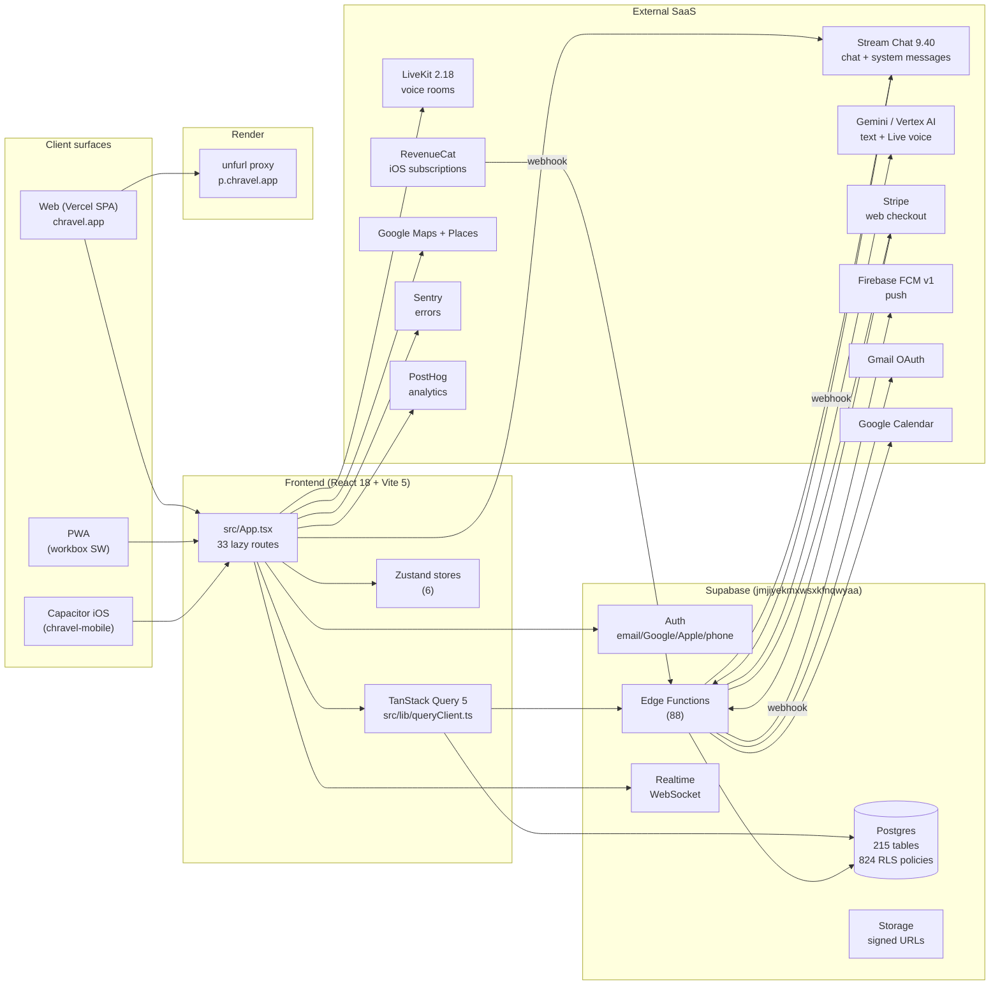

# System Architecture

## Topology in plain English

- **Frontend** is a pure SPA. Vercel serves static bundles + injects build/SHA markers (`vite.config.ts:37-46`).
- **All app logic** lives in React; there is no traditional Node server.
- **Supabase** is the sole owned backend. Postgres + Auth + Edge Functions (Deno) + Storage + Realtime.
- **Edge functions** carry server-side logic the client cannot do safely: AI calls, payment webhooks, OAuth flows, push fanout, embeddings, image proxying.
- **Stream Chat** is the chat transport for consumer trips and pro channels. Supabase Realtime is used for non-chat updates (presence, notifications, polls, calendar events).
- **LiveKit** powers voice concierge rooms; an external voice agent (`deploy-agent.yml`) lives outside this repo.
- **Gemini / Vertex** handles concierge text + voice. Two paths: direct via `GEMINI_API_KEY` or fallback through Lovable gateway (`.env.example` AI provider routing).
- **Stripe** (web checkout) and **RevenueCat** (iOS) are billing peers; entitlements are reconciled into `src/store/entitlementsStore.ts`.
- **Render** hosts a 156-line unfurl proxy used by branded OG link previews (`p.chravel.app`); not on the critical path.

## The single Supabase client

There is exactly one frontend Supabase client init — `src/integrations/supabase/client.ts:35-52`. All hooks/services import `supabase` from this singleton. Any other `createClient(...)` call in `src/` is a finding (see `RISKS.md`).

Key options set there:
- `persistSession: true`, `autoRefreshToken: true` (`src/integrations/supabase/client.ts:41-42`)
- `storageKey: 'chravel-auth-session'` (`src/integrations/supabase/client.ts:43`)
- `detectSessionInUrl: true` — required for OAuth callback to hydrate session (`src/integrations/supabase/client.ts:44`)
- Realtime `eventsPerSecond: 40` (`src/integrations/supabase/client.ts:47-49`)
- Safe-storage fallback for sandboxed environments (`src/integrations/supabase/client.ts:8-26`)

## Edge function shared contract

Every edge function on the authenticated path follows the same shape:
1. Validate origin via `_shared/cors.ts:5-30` (no wildcards).
2. Validate Authorization via `_shared/requireAuth.ts:1-30`.
3. Validate required secrets via `_shared/validateSecrets.ts` (called at function startup per `CLAUDE.md` rule #11).
4. Do work. Return JSON with the same CORS headers.

Public functions (`verify_jwt = false` in `supabase/config.toml`): `demo-concierge`, `stripe-webhook`, `revenuecat-webhook` (via Stream-related and webhook paths), `gemini-voice-session`, `livekit-token`, `image-proxy`, `concierge-tts`, `generate-trip-preview`, `generate-invite-preview`, `get-invite-preview`, `get-trip-preview`, `event-reminders`, `dispatch-notification-deliveries`, `gemini-voice-proxy`, `batch-generate-embeddings`, `regenerate-all-embeddings`, `stream-webhook`.

## Performance bedrock

- 33 routes are all `lazy()` with `retryImport` (`src/App.tsx:39-99`) — chunk-load failures auto-recover (`src/App.tsx:243-298`).
- Manual chunks reduce vendor reloads (`vite.config.ts:52-67`).
- TanStack Query 5 caches all server reads with per-domain stale/gc times (`src/lib/queryKeys.ts:71-158`).
- IndexedDB-backed offline queue exists at `src/offline/` and `src/services/offlineSyncService.ts`.
- Service worker built post-build via `scripts/build-sw.cjs` (`package.json:11`).

## Mobile / PWA / Capacitor considerations

- The web build is the iOS/Android build (Capacitor wraps the same SPA in `chravel-mobile`).
- OAuth in installed shells (`isInstalledApp()`) opens the system browser via `@capacitor/browser` rather than the WebView; Google rejects embedded WebView OAuth (`useAuth.tsx:899-941`).
- Service worker updates check on visibility change (`src/App.tsx:226-240`).
- Storage shim falls back to no-op when `localStorage` is unavailable (`src/integrations/supabase/client.ts:8-26`) — relevant in sandboxed previews.

## Known risks

- **Concierge tool sync** — 5-file fan-out per tool (memory #26). See `subsystems/ai-concierge.md` and `RISKS.md`.
- **Stream message custom-field forwarding** — adapter-layer specific (memory #28). See `subsystems/chat-broadcasts.md`.
- **Stale demo data on real sign-in** — guarded in `useAuth.tsx:712-718` and `:645-651`. Any new demo-mode entry point must replicate this.
- **Voice room prereqs** — LiveKit agent + room metadata (memory #14). See `integrations/gemini-lovable-api.md`.

## Source Refs

- `src/App.tsx:300-615` — composition root
- `src/integrations/supabase/client.ts:1-61`
- `vite.config.ts:1-102`
- `supabase/config.toml:1-147`
- `supabase/functions/_shared/requireAuth.ts:1-30`
- `supabase/functions/_shared/cors.ts:1-30`
- `src/lib/queryKeys.ts:1-173`
- Diagram source: [`../diagrams/system-architecture.mmd`](../diagrams/system-architecture.mmd)
