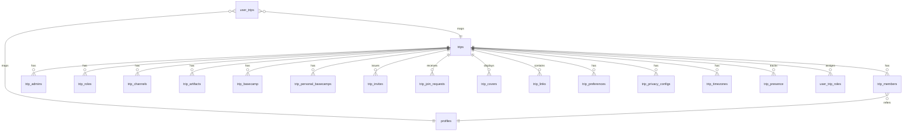
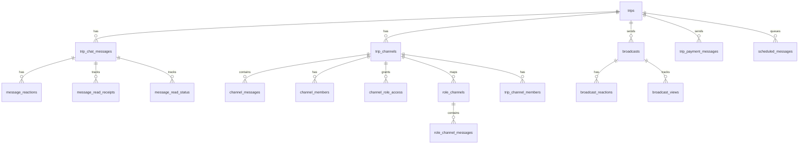
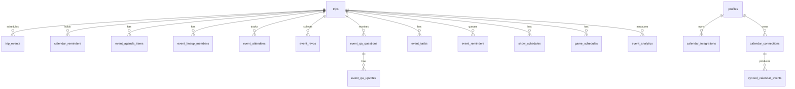
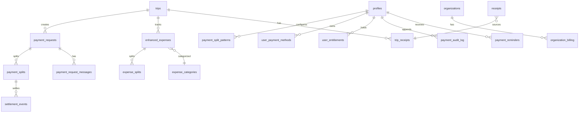
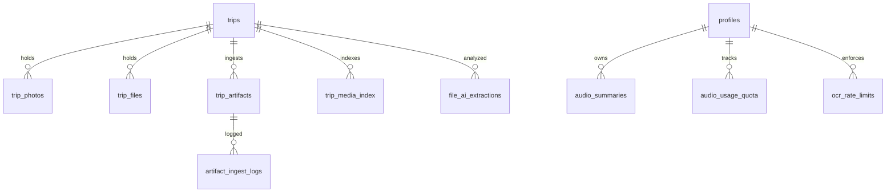
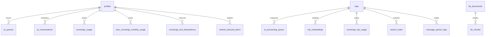

# Data Model / ER

**215 unique tables** across **358 migrations** (counted at SHA `1e833665`). **824 RLS policies** defined.

Because rendering 215 tables in one Mermaid diagram is unreadable, this section groups them into 8 domain clusters. Each cluster has its own ER fragment.

> **Authoritative source:** `supabase/migrations/*.sql` (append-only). For an ML-friendly schema dump, see `docs/ACTIVE/SCHEMA_AUDIT.md`. The TypeScript shape lives in `src/integrations/supabase/types.ts` (auto-generated via `mcp__supabase__generate_typescript_types` or `supabase gen types`).

## Cluster overview

| # | Cluster | Tables (count) | Anchor table |
|---|---|---|---|
| 1 | Trip core | ~22 | `trips` |
| 2 | Chat & broadcasts | ~18 | `trip_chat_messages`, `broadcasts` |
| 3 | Calendar & events | ~14 | `trip_events`, `synced_calendar_events` |
| 4 | Payments & billing | ~16 | `payment_requests`, `payment_splits` |
| 5 | Media & files | ~10 | `trip_photos`, `trip_files` |
| 6 | Notifications & comms | ~18 | `notification_deliveries`, `push_notifications` |
| 7 | AI / concierge / search | ~12 | `ai_queries`, `kb_documents`, `kb_chunks`, `trip_embeddings` |
| 8 | Orgs, roles, identity | ~24 | `organizations`, `user_roles`, `profiles` |

Remaining tables (~81): event-specific extensions (lineup, schedule, RSVPs, QA), recommendations, integrations (gmail, calendar connections, smart imports), admin/audit, rate limits, secure storage, demo / mock tables. See `RISKS.md` for mock-table-in-prod-schema findings.

## Cluster 1 — Trip core

Notable specialty tables: `trip_member_preferences` (per-member trip settings), `pro_trip_organizations` (links pro trips to orgs), `trip_link_index`, `trip_media_index` (search indices).

## Cluster 2 — Chat & broadcasts

Sister tables in demo: `mock_messages`, `mock_broadcasts`. See `agent_memory.jsonl` #27 — mock-ID tier gate caution.

## Cluster 3 — Calendar & events

`synced_calendar_events` dedupes by external event ID (memory #15).

## Cluster 4 — Payments & billing

`payment_splits` is the state machine (memory #16). Stripe + RevenueCat reconcile into `user_entitlements`.

## Cluster 5 — Media & files

Media flows: see `subsystems/media.md`. AI tagging populates `trip_media_index`.

## Cluster 6 — Notifications & comms

```mermaid
erDiagram
    profiles ||--o{ notification_deliveries : receives
    profiles ||--o{ notification_history : owns
    profiles ||--o{ notification_preferences : configures
    profiles ||--o{ notification_logs : appends
    profiles ||--o{ notification_badges : has
    profiles ||--o{ notification_queue : queues
    profiles ||--o{ push_device_tokens : owns
    profiles ||--o{ push_tokens : owns
    profiles ||--o{ push_notifications : receives
    profiles ||--o{ web_push_subscriptions : holds
    profiles ||--o{ email_bounces : tracks
    profiles ||--o{ sms_opt_in : opts
    trips ||--o{ message_scheduler_logs : appends
    trips ||--o{ daily_digests : produces
    profiles ||--o{ system_notifications : reads
    profiles ||--o{ message_templates : owns
```

Dual-path dedup pattern (memory #10) prevents duplicate delivery across email + push.

## Cluster 7 — AI / concierge / search

`concierge_tool_idempotency` prevents duplicate writes (memory #25). `trip_embeddings` is RAG corpus.

## Cluster 8 — Orgs, roles, identity

```mermaid
erDiagram
    organizations ||--o{ organization_members : has
    organizations ||--o{ organization_invites : sends
    organizations ||--o{ organization_billing : has
    organizations ||--o{ pro_trip_organizations : owns
    profiles }|--|| private_profiles : extends
    profiles ||--o{ user_roles : has
    profiles ||--o{ user_preferences : owns
    profiles ||--o{ user_trip_roles : holds
    profiles ||--o{ user_pro_trip_quota : tracks
    profiles ||--o{ user_blocks : maintains
    profiles ||--o{ user_loyalty_programs : enrolls
    profiles ||--o{ user_schedules : owns
    profiles ||--o{ user_accommodations : owns
    profiles ||--o{ user_entitlements : holds
    role_templates ||--o{ trip_roles : seeds
    trips ||--o{ trip_admins : has
    trips ||--o{ trip_roles : has
```

`user_roles` table holds app-wide roles (`pro`, `enterprise_admin`). Trip-scoped roles in `user_trip_roles` and `trip_roles`. Super-admins are email-list-gated in `src/constants/admins.ts` and edge-side in `_shared/superAdmins.ts`.

## Drift watchlist (top-10 entities)

The recurring P0 bug class is column ↔ TS-interface name drift. Top-10 entities tracked in `RISKS.md` field-drift sweep:

1. `trips` ↔ `Trip` interface
2. `trip_members` ↔ `TripMember` interface
3. `trip_chat_messages` ↔ `Message` interface
4. `broadcasts` ↔ `Broadcast` interface
5. `trip_events` / `synced_calendar_events` ↔ `CalendarEvent` interface
6. `payment_requests` / `payment_splits` ↔ payment types
7. `receipts` / `trip_receipts` ↔ `Receipt` interface
8. `profiles` / `private_profiles` ↔ `Profile` / `User` interface
9. `trip_tasks` ↔ `Task` interface
10. (poll table) ↔ `Poll` interface

See `RISKS.md` for findings.

## Migration conventions (from `CLAUDE.md`)

- Files timestamped `YYYYMMDDHHMMSS_description.sql`.
- All `CREATE TABLE` uses `IF NOT EXISTS`.
- All functions use `CREATE OR REPLACE`.
- All `DROP` uses `IF EXISTS`.
- Destructive changes require two-phase migration with forward-fix documented.
- Validated via `npx tsx scripts/lint-migrations.ts` (per `CLAUDE.md` Supabase rule #6).

## Mobile / PWA / Capacitor considerations

The DB is the same across surfaces. RLS is the only enforcement layer; client-side filters are conveniences. Realtime subscriptions on iOS/PWA are subject to the same `eventsPerSecond: 40` cap (`src/integrations/supabase/client.ts:48`).

## Known risks

- Mock tables (`mock_broadcasts`, `mock_messages`) live in the production schema. Demo paths read them; production writes must never target them. Sweep in `RISKS.md`.
- Tables without explicit RLS enablement — best-effort grep is in inventory; manual audit pending. Top suspects: `app_settings`, `feature_flags` (admin-only by design).
- `trip_payment_messages` is a chat-payments bridge — double-check that messages here are still RLS-gated by trip membership, not just by sender.

## Source Refs

- `supabase/migrations/` — 358 .sql files at SHA `1e833665`
- `supabase/migrations/*_concierge_tool_idempotency_store.sql` — idempotency table
- `src/integrations/supabase/types.ts` — auto-generated TS types
- `docs/ACTIVE/SCHEMA_AUDIT.md` — long-form schema audit
- Diagram source: [`../diagrams/er-diagram.mmd`](../diagrams/er-diagram.mmd)
