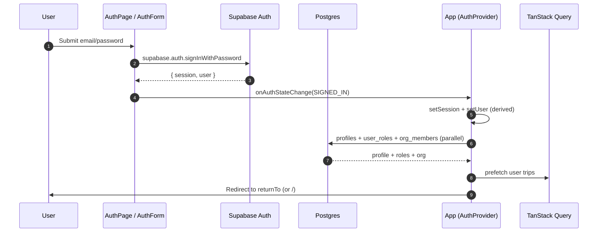

# Auth and RLS

> Cross-link: `docs/ACTIVE/AUTHENTICATION_SETUP.md`, `docs/ACTIVE/AUTHORIZATION_AUDIT.md`.

## Auth provider stack

Diagram source: [`../diagrams/auth-sequence.mmd`](../diagrams/auth-sequence.mmd).

## Sign-in surfaces

| Method | Function | File |
|---|---|---|
| Email + password | `signIn(email, password)` | `src/hooks/useAuth.tsx:853-897` |
| Google OAuth | `signInWithGoogle(returnTo?)` | `src/hooks/useAuth.tsx:899-950` |
| Apple OAuth | `signInWithApple(returnTo?)` | `src/hooks/useAuth.tsx:952-990` |
| Phone OTP | `signInWithPhone(phone)` | `src/hooks/useAuth.tsx:992-1030` |
| Email signup | `signUp(email, password, first, last)` | `src/hooks/useAuth.tsx:1032-1098` |
| Password reset | `resetPassword(email)` | `src/hooks/useAuth.tsx:1150-1171` |
| Sign out | `signOut()` | `src/hooks/useAuth.tsx:1100-1148` |

## Session lifecycle

`src/hooks/useAuth.tsx:506-805`. Key invariants:

- **10s safety timeout.** Loading is forcibly cleared after 10 seconds (`:508-512`) to prevent infinite hydration spinners.
- **Two-stage user.** Immediately set `buildSessionDerivedUser(session.user)` (`:561, 571, 601, 626, 665, 755, 778`) for synchronous render, then async `transformUser` enriches with profile/roles/org/notification-prefs (`:759-779`).
- **Token validity check.** `isSessionTokenValid(access_token)` runs on init (`:556, 592`); invalid tokens trigger `forceRefreshSession()` (`:467-503`).
- **Near-expiry proactive refresh.** If `expires_at < now + 5min`, refresh up front (`:615-635`).
- **Visibility-change refresh.** Returning to tab refreshes near-expiry sessions (`:808-845`).
- **Deferred async work.** Async work inside `onAuthStateChange` is deferred via `setTimeout(0)` (`:754-780`) to avoid Supabase auth deadlock.

## Demo-vs-authenticated handling in auth

- Demo `user` is a stable per-session UUID with read-only permissions (`src/hooks/useAuth.tsx:151-183`).
- On `SIGNED_IN`: demo mode is forcibly cleared (`:712-718`).
- On `signOut`: demo mode is forcibly cleared (`:1102-1104`).
- On init with no session: demo user is provided if `shouldUseDemoUserRef.current` (`:680, 608, 790, 850`).

This is the canonical defense for memory #27 (demo data contamination).

## Cross-store cleanup on sign-out (`useAuth.tsx:1100-1148`)

In order:
1. Demo mode cleared (`:1102-1104`)
2. Onboarding localStorage cleared (`:1107-1108`)
3. `queryClient.clear()` (`:1111`)
4. `supabase.removeAllChannels()` (`:1114`)
5. `conciergeCacheService.clearAllCaches()` (`:1117`)
6. `useNotificationRealtimeStore.clearAll()` (`:1120`)
7. `useOnboardingStore.resetOnboarding()` (`:1123-1125`)
8. `supabase.auth.signOut()` (`:1142`)
9. `window.location.href = '/'` (`:1147`)

This is the bulwark against cross-user data contamination on a shared device.

## Role propagation

Per `CLAUDE.md` rule + memory #19: **DB -> RLS -> hook -> UI**, never trust client claims.

| Surface | Source of truth | File |
|---|---|---|
| App-wide roles | `user_roles` table | `src/hooks/useAuth.tsx:300-308` |
| Trip-scoped roles | `user_trip_roles`, `trip_roles` | `src/hooks/useTripRoles.ts` |
| Pro role enum | `User.proRole` derived from org membership + email | `src/hooks/useAuth.tsx:402-410` |
| Super admin | Email allow-list (`SUPER_ADMIN_EMAILS`) | `src/constants/admins.ts`, `supabase/functions/_shared/superAdmins.ts` |
| Org membership | `organization_members` (active only) | `src/hooks/useAuth.tsx:311-323` |

The `switchRole()` method is **dev-only** (`useAuth.tsx:1323-1351`). In production it warns and no-ops - explicitly hardened against client-side privilege escalation.

## RLS posture

**824 policies** across 358 migrations. Top concentrations (by anchor table):

| Cluster | Anchor | Why high |
|---|---|---|
| Trips | `trips`, `trip_members`, `user_trips` | Multi-tier access (consumer/pro/event/org) |
| Chat | `trip_chat_messages`, `channel_messages` | Per-member + per-channel-role gating |
| Payments | `payment_requests`, `payment_splits` | Sensitive: only request creator + included splitters |
| Notifications | `notification_deliveries`, `push_*` | Per-user only |
| Profiles | `profiles`, `private_profiles` | Public-display vs private fields split |

`docs/ACTIVE/AUTHORIZATION_AUDIT.md` is the deeper inventory.

## Edge function auth contract

`supabase/functions/_shared/requireAuth.ts:1-30`:
1. Read `Authorization` header.
2. If absent: return 401 with CORS headers.
3. Use `SUPABASE_SERVICE_ROLE_KEY` (server-side) to validate the user JWT via `getUser`.
4. Return `{ user, error: null, response: null }` on success or `{ user: null, error, response }` on failure.

`supabase/config.toml:1-147` lists every function with `verify_jwt = true/false`. Public functions (webhook + preview + voice + image proxy) skip JWT - they enforce auth differently (signature, capability token, or unauthenticated by design).

## Known security hotspots (cross-link `DEBUG_PATTERNS.md`)

1. Capability token default secret fallback (`DEBUG_PATTERNS.md` #1) - any edge function that signs capability tokens MUST require a non-default `CAPABILITY_TOKEN_SECRET`.
2. CORS wildcard subdomain matching (`DEBUG_PATTERNS.md` #2) - `_shared/cors.ts` uses exact-origin matching only.
3. Client-side super admin bypass (`DEBUG_PATTERNS.md` #3) - `switchRole` is dev-only.
4. CronGuard fail-open (`DEBUG_PATTERNS.md` #4) - cron-only functions MUST require `CRON_SECRET` and fail closed.

## Mobile / PWA / Capacitor considerations

- Installed shells (Capacitor / PWA) open OAuth in the system browser via `@capacitor/browser`, not the WebView (`useAuth.tsx:899-941`). Google rejects embedded WebView OAuth.
- Universal Link return URL: `https://chravel.app/auth-callback` (`useAuth.tsx:907-908, 957-958`).
- Session is persisted in `localStorage` under `chravel-auth-session` (`src/integrations/supabase/client.ts:43`).

## Known risks

- `signInWithOAuth({ provider: 'google', queryParams: { prompt: 'select_account' } })` forces the account picker. Removing this would re-introduce silent dup-account creation (memory: useAuth.tsx:720-750 toast).
- Profile self-heal in `ensureProfileExists` (`useAuth.tsx:201-223`) is best-effort and silently swallows errors. If profile creation persistently fails, downstream code paths may receive `null` profile and degrade gracefully - but track in telemetry.
- The 10s loading timeout is a safety net. If the underlying network is slow, the user lands with `user: null` but `isLoading: false`. UI should not crash in that state.

## Source Refs

- `src/hooks/useAuth.tsx:1-1383`
- `src/integrations/supabase/client.ts:1-61`
- `src/constants/admins.ts`
- `supabase/functions/_shared/requireAuth.ts:1-30`
- `supabase/functions/_shared/cors.ts:1-60`
- `supabase/functions/_shared/superAdmins.ts`
- `supabase/config.toml:1-147`
- `docs/ACTIVE/AUTHENTICATION_SETUP.md`, `docs/ACTIVE/AUTHORIZATION_AUDIT.md`, `docs/ACTIVE/SECURITY_FINDINGS.md`
- Diagram source: [`../diagrams/auth-sequence.mmd`](../diagrams/auth-sequence.mmd)
