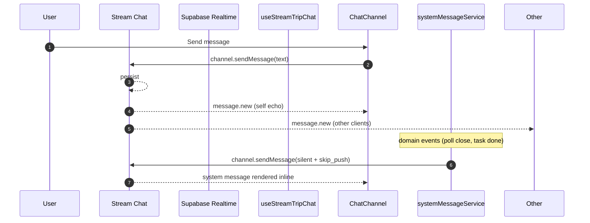

# Realtime Channels

Two realtime transports coexist:
1. **Supabase Realtime** (Postgres logical replication via WebSocket) — for presence, notifications, polls, calendar, payments, system messages.
2. **Stream Chat** (Stream Chat 9.40, `package.json:134`) — for trip chat, pro channels, broadcasts.

Both are subject to memory #20: **filter by `trip_id`** (or equivalent scope) to prevent receiving ALL global events.

## Subscription inventory (41 files)

Found via `rg "\.channel\(|\.on\('postgres_changes" src -l`:

### Supabase Realtime (`postgres_changes`)

| File | Domain |
|---|---|
| `src/hooks/useUserTripsRealtime.ts` | Dashboard user-trip list |
| `src/hooks/useNotificationRealtime.ts` | In-app notifications |
| `src/hooks/useDashboardJoinRequests.ts` | Pending join requests |
| `src/hooks/useTripTasks.ts` | Tasks |
| `src/hooks/useTripPolls.ts` | Polls |
| `src/hooks/useTripMembersQuery.ts` | Members |
| `src/hooks/useTripAdmins.ts` | Trip admins |
| `src/hooks/useTripRoles.ts` | Trip roles |
| `src/hooks/useEventAgenda.ts` | Event agenda |
| `src/hooks/useEventLineup.ts` | Event lineup |
| `src/hooks/useEventTabSettings.ts` | Event tab settings |
| `src/hooks/useRoleAssignments.ts` | Role assignments |
| `src/hooks/useTripBasecamp.ts` | Basecamp |
| `src/hooks/useJoinRequests.ts` | Join requests (admin) |
| `src/hooks/useBalanceSummary.ts` | Payment balances |
| `src/hooks/usePayments.ts` | Payments |
| `src/hooks/useMediaManagement.ts` | Media |
| `src/features/calendar/hooks/useCalendarRealtime.ts` | Calendar |
| `src/components/mobile/MobileTripPayments.tsx` | Payments mobile UI |
| `src/components/PlacesSection.tsx` | Places |
| `src/components/UnifiedMediaHub.tsx` | Unified media |
| `src/components/media/MediaUrlsPanel.tsx` | Media URLs |
| `src/components/trip/EventLogDrawer.tsx` | Event log |

### Stream Chat (`.channel(...)`)

| File | Domain |
|---|---|
| `src/services/stream/streamMembershipSync.ts` | Membership sync |
| `src/services/stream/streamMessageSearch.ts` | Message search |
| `src/services/stream/streamChannelFactory.ts` | Channel factory |
| `src/hooks/stream/useStreamBroadcasts.ts` | Broadcasts |
| `src/hooks/stream/useStreamProChannel.ts` | Pro channels |
| `src/hooks/stream/useStreamTripChat.ts` | Trip chat |
| `src/services/systemMessageService.ts` | System messages (silent + skip_push) |
| `src/services/chatService.ts` | Chat service |
| `src/services/chatSearchService.ts` | Chat search |
| `src/services/channelService.ts` | Channel service |
| `src/services/roleChannelService.ts` | Role channels |
| `src/services/broadcastService.ts` | Broadcasts (DB write path) |
| `src/services/chatBroadcastService.ts` | Chat broadcast bridge |
| `src/services/readReceiptService.ts` | Read receipts |
| `src/services/typingIndicatorService.ts` | Typing indicators |
| `src/features/chat/components/ThreadView.tsx` | Threaded replies |

## Cleanup discipline

Per `CLAUDE.md` Supabase rule #5: every realtime channel must be cleaned up in a `useEffect` return.

`supabase.removeAllChannels()` is called on sign-out (`useAuth.tsx:786, 1114`) as the last-resort sweep. **Hooks must not rely on it** — they must cleanup individually.

## Realtime fan-out diagram

Diagram source: [`../diagrams/chat-realtime-sequence.mmd`](../diagrams/chat-realtime-sequence.mmd).

## Stream system messages (memory #29)

System messages route through `Stream channel.sendMessage` with `silent: true` and `skip_push: true`. This is how domain actions (poll close, task complete) emit inline activity updates without producing duplicate push notifications.

Custom fields on Stream messages must be forwarded through BOTH adapter paths (memory #28) — Stream native and Chravel-adapter. See `subsystems/chat-broadcasts.md`.

## Backfill on reconnect (memory #13)

Per memory #13 (RECOVERY): chat WebSocket disconnects (e.g., backgrounding mobile) drop messages. On reconnect, the chat hook must run a backfill query against the DB or the Stream channel state to catch up. This is implemented in `useStreamTripChat` and the offline message queue in `src/offline/`.

## Configuration

- Supabase Realtime: `eventsPerSecond: 40` per client (`src/integrations/supabase/client.ts:48`).
- Stream Chat config parity check: `npm run ops:check-stream-parity` (`scripts/check-stream-config-parity.cjs`).
- Stream API key: `VITE_STREAM_API_KEY`.
- Stream token minted server-side via `supabase/functions/stream-token/`.

## Mobile / PWA / Capacitor considerations

- Background/foreground transitions on iOS suspend the WebSocket. The visibility-change listener in `App.tsx:226-240` refreshes the SW; chat hooks must backfill on reconnect (memory #13).
- Stream Chat handles its own reconnect; consumers should expose a loading state during the gap.

## Known risks

- **Unfiltered subscriptions are P1.** Any `.on('postgres_changes', { event: '*' }, ...)` without a `filter: 'trip_id=eq.<id>'` receives every row change globally. Sweep planned in `RISKS.md`.
- **Read-receipt write amplification** (`DEBUG_PATTERNS.md`): N×M upserts per visible message. Throttle/debounce in `readReceiptService.ts`.
- **Reaction refetch storm** (`DEBUG_PATTERNS.md`): every new message previously triggered a full reactions refetch — addressed but watch on regressions.

## Source Refs

- 41 files enumerated via `rg "\\.channel\\(|\\.on\\('postgres_changes" src -l`
- `src/integrations/supabase/client.ts:46-50` — realtime rate cap
- `src/hooks/useAuth.tsx:786, 1114` — sign-out sweep
- `agent_memory.jsonl` #13, #20, #28, #29 — relevant memory
- Diagram source: [`../diagrams/chat-realtime-sequence.mmd`](../diagrams/chat-realtime-sequence.mmd)
