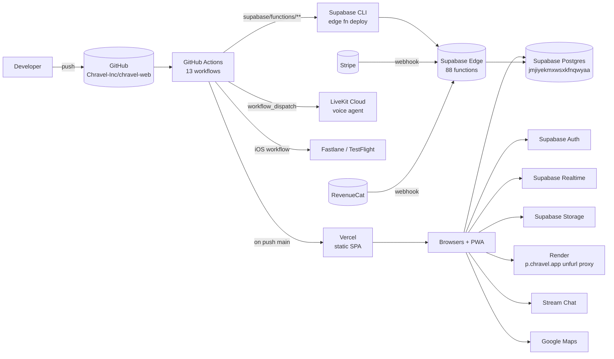

# Deployment Topology

Diagram source: [`../diagrams/deployment-topology.mmd`](../diagrams/deployment-topology.mmd).

## Hosting

| Surface | Host | Config |
|---|---|---|
| Frontend SPA | **Vercel** | `vercel.json` |
| Edge functions | **Supabase Edge** (Deno) | `supabase/config.toml` |
| Postgres + Auth + Realtime + Storage | **Supabase** project `jmjiyekmxwsxkfnqwyaa` | — |
| OG unfurl proxy | **Render** | `render.yaml` |
| iOS native shell | TestFlight → App Store | (sister repo `chravel-mobile`) |
| Voice agent | **LiveKit Cloud** | `.github/workflows/deploy-agent.yml` |
| Vercel edge functions for OG | **Vercel Edge** | `api/` directory |

## Vercel config (`vercel.json`)

- `buildCommand: "vite build"`
- `installCommand: "npm ci"`
- `framework: "vite"`
- `outputDirectory: "dist"`
- Cache-Control headers force `no-store, no-cache, must-revalidate` on `/`, `/index.html`, `/sw.js` to prevent stale SPA loads.

## CI workflows (13 in `.github/workflows/`)

| Workflow | Trigger | Purpose |
|---|---|---|
| `ci.yml` | push to main/develop, PRs | Full validation: lint, typecheck, tests, build, migration lint, env coverage |
| `auto-format.yml` | PR open/sync/reopen | Prettier auto-format |
| `codeql.yml` | scheduled + PR | Static security analysis |
| `deploy-functions.yml` | push to main with `supabase/functions/**` diff | Deploy edge functions via Supabase CLI |
| `deploy-agent.yml` | workflow_dispatch + push | Deploy LiveKit voice agent |
| `deploy-notify.yml` | post-deploy | Deployment notifications |
| `deploy-safety.yml` | PR to main | Impact analysis comment |
| `ios-release.yml` | manual | Fastlane → TestFlight / App Store |
| `jules-review.yml` | PR events | Automated review |
| `merge-conflict-check.yml` | PR sync | Detect merge conflicts |
| `no-doc-spam.yml` | PR | Block documentation noise |
| `scheduled-e2e-staging.yml` | cron | Nightly E2E against staging |
| `secret-scan.yml` | push/PR | Gitleaks secret scan |

## Deploy markers / observability

Every build embeds:
- `VITE_BUILD_ID` — buildVersion timestamp (`vite.config.ts:38-40`)
- `VITE_DEPLOY_SHA` — `VERCEL_GIT_COMMIT_SHA` or `RENDER_GIT_COMMIT` or `'local'` (`vite.config.ts:42-44`)
- `VITE_DEPLOY_TIMESTAMP` — ISO timestamp (`vite.config.ts:45`)

These are sent to Sentry + PostHog for incident correlation.

## Environment variables

**~94 unique env vars** across:
- 23 client-side `VITE_*` (Supabase URL/key, Maps key, Stripe pubkey, etc.)
- ~70 server-side (Gemini, Vertex, Stripe secret, APNS, Twilio, Resend, AWS, OAuth secrets, cron secrets)

CI validates coverage via `scripts/check-env-coverage.ts`. Validate locally with `npm run validate-env`.

Cross-link: `docs/ACTIVE/ENVIRONMENT_SETUP_GUIDE.md`.

## Cache busting strategy

- Chunk filenames include build version: `assets/js/[name]-[hash]-${buildVersion}.js` (`vite.config.ts:69-70`).
- HTML cache headers force fresh on every request.
- SW (`/sw.js`) is uncached.
- App also checks for SW updates on visibility change (`src/App.tsx:226-240`) and auto-recovers from chunk-load failures (`src/App.tsx:243-298`).

## Migration deployment

**Manual.** `supabase db push` or Supabase Dashboard. Migrations are NOT auto-applied by CI per current setup. Pre-push lint via `npx tsx scripts/lint-migrations.ts`.

## Capacitor / iOS deploy

Native shell lives in `chravel-mobile`. The iOS workflow in this repo (`ios-release.yml`) handles release scaffolding (app store metadata under `appstore/`, `playstore/`). Actual app build is in `chravel-mobile`.

## Render unfurl proxy

Hosts a 156-line Node.js proxy under `unfurl/` for branded OG link previews. Domain: `p.chravel.app`. Not on the critical path — link previews degrade gracefully if down.

## Vercel Edge functions

`api/*` directory (4 functions) — small edge handlers for OG previews. Distinct from Supabase Edge Functions.

## Mobile / PWA / Capacitor considerations

- The PWA is the same Vercel build with `workbox-build` (`package.json:141`) producing the SW post-build (`scripts/build-sw.cjs`, `package.json:11`).
- iOS releases are independent — the Capacitor shell pulls the latest web build at app launch but native binary updates require a TestFlight/App Store release.
- Universal Links land on `chravel.app/auth-callback` which the iOS shell intercepts.

## Known risks

- **Migrations are manual.** A schema change without a corresponding manual `supabase db push` will fail edge functions silently. Verify before declaring a release done.
- **CronGuard fail-open** (`DEBUG_PATTERNS.md` #4). Cron-only functions must require `CRON_SECRET`.
- **Capability token default secret fallback** (`DEBUG_PATTERNS.md` #1). Voice + image-proxy etc. must enforce non-default token secrets.
- Vercel `installCommand: npm ci` requires `package-lock.json` to match `package.json` precisely. Lockfile drift breaks deploys.

## Source Refs

- `vercel.json:1-50+`
- `render.yaml`
- `.github/workflows/` (13 files)
- `vite.config.ts:37-46` — deploy markers
- `vite.config.ts:69-82` — chunk filename strategy
- `scripts/build-sw.cjs`, `package.json:11`
- `scripts/check-env-coverage.ts`
- `supabase/config.toml`
- `docs/ACTIVE/DEPLOYMENT_GUIDE.md`, `docs/ACTIVE/ENVIRONMENT_SETUP_GUIDE.md`
- Diagram source: [`../diagrams/deployment-topology.mmd`](../diagrams/deployment-topology.mmd)
