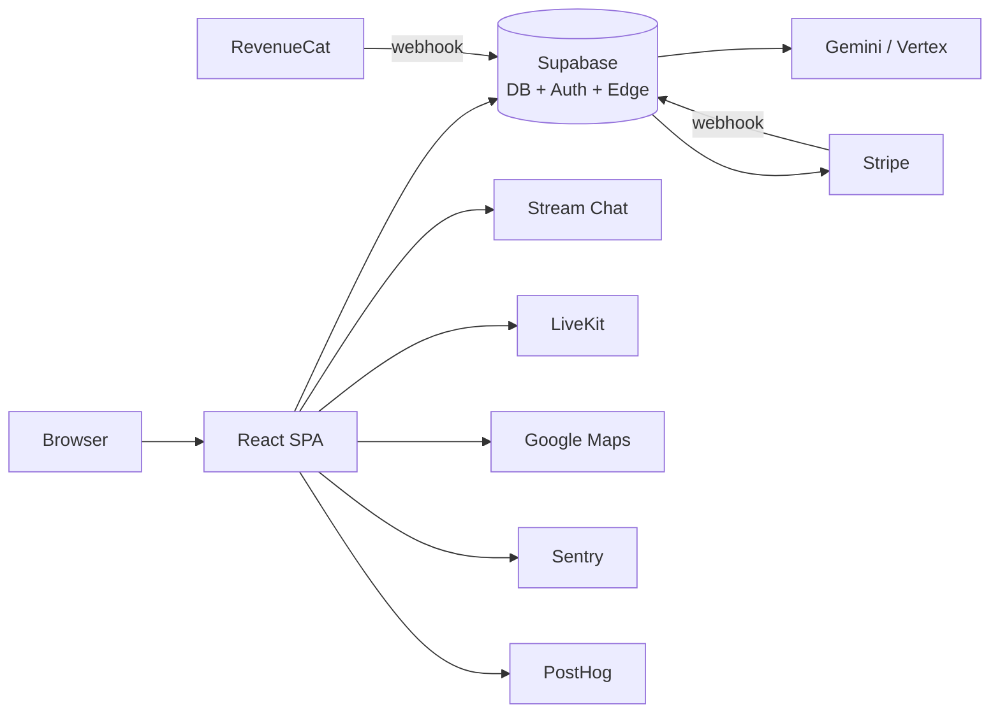
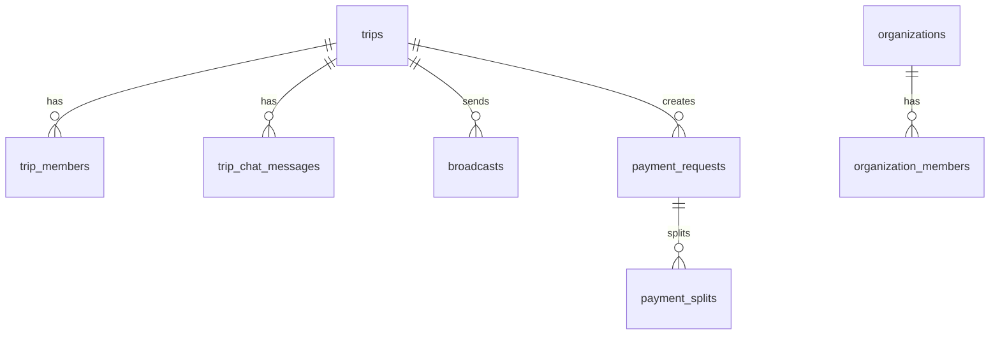

# Chravel Codebase Wiki

**Auto-generated • 2026-05-12 • git SHA `1e833665` • branch `claude/code-wiki-generator-YIV8v`**

- File-grounded knowledge layer over `chravel-web`
- Every claim cites a real path with line numbers
- Regen-driven: re-run the prompt, diff, commit

---

# Executive Summary

- Group-trip coordination layer — chat, calendar, places, concierge, polls, tasks, payments, media
- Three tiers: Consumer (Free/Explorer/Frequent Chraveler), Pro/Enterprise, Event organizer
- **NOT** a booking/OTA engine — coordinates trips already planned elsewhere
- Viral loop: public event link → guest → conversion to authenticated user
- Web/PWA shell here; native iOS/Android in `chravel-mobile` sister repo

---

# Stack at a Glance

- React 18.3 · TypeScript 5.9 (strict OFF) · Vite 5.4 (SWC)
- TanStack Query 5.56 · Zustand 5.0 · Tailwind 3.4 + Radix · shadcn/ui
- Supabase JS 2.53 (Postgres + Auth + Realtime + Storage + Edge)
- Stream Chat 9.40 · LiveKit Client 2.18 · RevenueCat 1.23
- Sentry 10.43 · PostHog 1.36 · Vitest 4.0 · Playwright 1.58
- Node `>=20.0.0` · 13 GitHub Actions workflows · Vercel + Render hosting

---

# Repo Map

- **1,105** `.ts/.tsx` files under `src/`
- **88** edge functions, **40** `_shared/` utilities
- **358** SQL migrations, **215** tables, **824** RLS policies
- **107** custom hooks, **80** services, **6** Zustand stores
- **6** feature modules: `broadcasts`, `calendar`, `chat`, `concierge`, `smart-import`, `trips`
- **33** lazy routes + 1 catch-all + 1 dev-only

---

# System Architecture

- Vercel SPA + Supabase backend + 10+ SaaS
- One canonical Supabase client (`src/integrations/supabase/client.ts:35-52`)
- Edge functions follow: auth → CORS → secrets → work (`_shared/`)

---

# Routing Map

- All 33 routes in `src/App.tsx:322-608`, all `React.lazy` + `retryImport`
- Guards: `<ProtectedRoute>`, `<InternalAdminRoute>`, `<LazyRoute>` Suspense
- Public surface: `/`, `/auth`, `/join`, `/event/:id`, `/t/:id`, `/teams`, `/recs`
- Mobile variants: `MobileTripDetail`, `MobileProTripDetail`, `MobileEventDetail`
- Trip routes are public-routable, auth-gated inside — known regression vector (memory #3)

---

# State Architecture

- **TanStack Query 5** with single client (`src/lib/queryClient.ts`)
- `tripKeys` factory at `src/lib/queryKeys.ts:12-63` — 21 keys
- `QUERY_CACHE_CONFIG` per-domain stale/gc tuning (10s chat → 2m places/media)
- 6 Zustand stores: demo, demoTripMembers, onboarding, notifications, entitlements, conciergeSession
- Sign-out clears: queryClient + Supabase channels + concierge cache + notif store + onboarding

---

# Auth & RLS

- `useAuth.tsx` is **1,383 lines** — single source for email/Google/Apple/phone + OAuth installed-shell path
- Two-stage user hydration: `buildSessionDerivedUser` (sync) → `transformUser` (async, parallel DB queries)
- 10s safety timeout prevents infinite hydration spinners
- **824 RLS policies** across 358 migrations
- `_shared/requireAuth.ts` validates JWT on every authed edge function
- `switchRole` is dev-only — hardened against client-side privilege escalation

---

# Data Model

- **215 tables** → grouped into 8 clusters: Trip core, Chat, Calendar, Payments, Media, Notifications, AI, Orgs
- Anchor tables: `trips`, `trip_chat_messages`, `payment_splits`, `kb_documents`, `organizations`
- Auto-generated TS types at `src/integrations/supabase/types.ts`
- Migrations append-only; lint via `scripts/lint-migrations.ts`
- Mock tables (`mock_messages`, `mock_broadcasts`) live in prod schema — demo path reads, production never writes

---

# Edge Functions Inventory

- **88 functions**, **16 public** (`verify_jwt = false`): webhooks + voice + previews + image-proxy
- `lovable-concierge` — 2,155-line monolith; main concierge brain
- `functionExecutor` — 143 KB tool dispatcher
- `contextBuilder` — 30 KB context assembly
- Validation: `_shared/validateSecrets.ts` `requireSecrets()` at startup
- Deploy: `.github/workflows/deploy-functions.yml` on push-to-main when `supabase/functions/**` changes

---

# Subsystem: Chat & Broadcasts

- **Stream Chat 9.40** owns chat surface; **Supabase Realtime** owns adjacent state (reactions, system msgs)
- System messages: `Stream channel.sendMessage({silent: true, skip_push: true})` (memory #29)
- Custom Stream fields require **both adapter paths** to forward (memory #28)
- Broadcasts via `broadcasts-create` edge function → `broadcasts` table → fan-out
- Memory #13: backfill on WebSocket reconnect (mobile background/foreground)

---

# Subsystem: Calendar

- Google Calendar bi-directional sync via `calendar-sync` edge function
- Idempotent dedupe by external event ID (memory #9, #15)
- Sync tokens + etags handle recurring events
- `event-reminders` cron-fired (`verify_jwt = false` — must use `cronGuard`)
- Offline mutation queue (`calendarOfflineQueue.ts`)

---

# Subsystem: Places & Links

- Google Maps + new Places API via `googlePlacesNew.ts`
- Server-side proxy: `google-maps-proxy` (key protection)
- **Memory #18**: single `MapView` instance per page, debounced events, null-checked `mapRef`
- OG link previews via `fetch-og-metadata` + Render-hosted `p.chravel.app` unfurl proxy
- Place cache: `google_places_cache` table + client cache

---

# Subsystem: AI Concierge

- **Single source of truth:** `_shared/concierge/toolRegistry.ts` (memory #23)
- 38 tools, 18 query classes, conditional loading via `queryClassifier.ts` (memory #24)
- **5-file sync** when adding a tool (memory #26): registry + executor + confirm-handler + voice-decls + UI renderer
- Pending actions buffer: `trip_pending_actions` (memory #7)
- Idempotency: `concierge_tool_idempotency` (memory #25)
- Voice: Vertex AI Live (`gemini-live-2.5-flash-native-audio`) + LiveKit; prereqs: agent + room metadata (memory #14)

---

# Subsystem: Polls

- DB tables (poll definition + votes) + Supabase Realtime tally
- Poll close → `systemMessageService.emit({type: 'poll_close'})` → Stream silent system message
- Demo polls are mocked, local-only
- Mobile: 44px+ tap targets, debounced re-render on bulk vote

---

# Subsystem: Tasks

- Trip tasks (`trip_tasks`) + event tasks (`event_tasks`)
- **Permission model varies by trip type** (memory #8): consumer open, pro role-based, event organizer-only
- Assignment via `task_assignments`; status in `task_status` / `trip_task_status`
- Lineup "replace import" can hard-delete on transient insert failure (`DEBUG_PATTERNS.md`)

---

# Subsystem: Payments

- Stripe (web) + RevenueCat (iOS) — strict SDK boundary (memory #6)
- Single source of truth: `entitlementsStore` (`src/store/entitlementsStore.ts`)
- Trip payment splits = state machine with optimistic locking (memory #16)
- Webhooks: `stripe-webhook` + `revenuecat-webhook` (both `verify_jwt = false`, signature-gated)
- Reconciliation: `check-subscription` on every app boot

---

# Subsystem: Media

- Compression before upload via `browser-image-compression` (memory #12)
- Server-side validation + signed URL via `file-upload` / `image-upload` (memory #17)
- AI tagging populates `trip_media_index` for gallery search
- `image-proxy` (`verify_jwt = false`) — must enforce capability tokens (DEBUG_PATTERNS #1)
- Virtualization for large galleries via `@tanstack/react-virtual`

---

# Subsystem: Events & Viral Loop

- Public event page: `/event/:eventId` (no auth required)
- Invite tokens: `/join/:token`, `/j/:token`, `/accept-invite/:token`
- **Existence ≠ access** (memory #21): always RLS-gate trip membership separately
- Preview surfaces: `/t/:tripId`, `/trip/:tripId/preview`
- Conversion path: guest → /auth → returnTo → join trip

---

# Mobile / PWA / Capacitor

- Native shell in `chravel-mobile` sister repo (Capacitor v8)
- This repo = web + PWA shell only
- OAuth via system browser on installed shells (Google rejects WebView OAuth)
- Universal Link: `chravel.app/auth-callback`
- PWA workbox SW built post-build (`scripts/build-sw.cjs`)
- Offline queue via IndexedDB (`idb` 8.0)
- `isInstalledApp()` detection in `src/utils/platformDetection.ts`

---

# Third-Party Integrations Matrix

| Service | Purpose | Migration cost |
|---|---|---|
| Supabase | DB + Auth + Realtime + Storage + Edge | 9 (deep lock-in) |
| Stream Chat | Chat transport | 6 |
| LiveKit | Voice rooms | 5 |
| Gemini/Vertex | AI text + voice | 5 (gateway-abstracted) |
| Stripe | Web subscriptions | 5 |
| RevenueCat | iOS subscriptions | 4 |
| Google Maps | Places + Maps | 7 |
| Firebase FCM | Push notifications | 3 |
| Sentry / PostHog | Observability | 2 |
| Vercel | SPA hosting | 2 |

---

# Performance Hotspots

- 1,105 src files → 33 lazy routes for code splitting
- Manual chunks: react-vendor, ui-vendor, supabase, charts, pdf, **revenuecat-web** (808 KB at paywall)
- Realtime rate cap: 40 events/sec/client
- TanStack stale/gc per-domain: chat 10s, payments 30s, media 120s
- 1,293 ESLint warning baseline — budget-tracked
- Concierge tech debt: `lovable-concierge` 2,155 LOC, `functionExecutor` 143 KB
- Read-receipt write amplification + reaction refetch storm (both in `DEBUG_PATTERNS.md`)

---

# Test Coverage Map

- **217** test files / **1,105** source files (~12%)
- Vitest 4.0 + Playwright 1.58
- E2E specs: auth, chat, invite links, offline resilience, settings, trip creation, trip flow
- **17** tracked gaps in `TEST_GAPS.md`
- Critical-path order: Auth > Trips > Chat > Payments > AI Concierge > Calendar > Permissions > Notifications
- CI: `npm run lint && npm run typecheck && npm run build` must pass

---

# Risk Register (top entries)

- **P0** — Field drift sweep on top-10 entities (Trip / TripMember / Message / Broadcast / CalendarEvent / Payment / Receipt / Profile / Task / Poll)
- **P0** — Mock tables in production schema (`mock_messages`, `mock_broadcasts`)
- **P1** — Concierge tool 5-file sync requirement (memory #26)
- **P1** — Capability token default secret fallback (DEBUG_PATTERNS #1)
- **P1** — CronGuard fail-open on missing secret (DEBUG_PATTERNS #4)
- **P1** — Unfiltered realtime subscriptions (memory #20)
- **P2** — Inline query keys vs factory
- See `RISKS.md` for paste-ready follow-up prompts

---

# Day-1 Contributor Path

1. `git clone` → `npm install` (Node ≥ 20)
2. `cp .env.example .env`, fill Supabase URL + publishable key
3. `npm run dev` → `http://localhost:8080`
4. Read [`CLAUDE.md`](../../../CLAUDE.md) (manifesto)
5. Read the relevant `docs/wiki/subsystems/*.md` before touching code
6. Build gate: `npm run lint && npm run typecheck && npm run build`
7. Open PR; CI runs validation; review-bot threads into the PR

---

# Roadmap Hooks

- `src/features/` is the modularization target — only 6 of ~12 domains use it; expand
- Feature flags via `public.feature_flags` table + `_shared/featureFlags.ts` — runtime kill switches, no redeploy
- Pro/Enterprise extension points: `user_trip_roles`, `role_channels`, `pro_trip_organizations`
- AI tools: add via `_shared/concierge/toolRegistry.ts` + the 5-file sync checklist
- Concierge monolith (`lovable-concierge` 2,155 LOC) — gradual extraction to `_shared/concierge/`

---

# Regeneration Protocol

- Triggered by: migration changes, new edge functions, type changes, dependency changes, new feature modules
- How: paste original prompt into Claude Code in a fresh branch
- Diff `docs/wiki/`, resolve drift, append to `CHANGELOG.md`
- Preserved across regens: `RISKS.md` entries marked `Status: accepted`, `<!-- HUMAN -->...<!-- /HUMAN -->` blocks
- Deck regeneration: paste `deck.md` into [gamma.app/create](https://gamma.app/create) — slide separators are `---`
- See `REGEN.md` for the full contract
